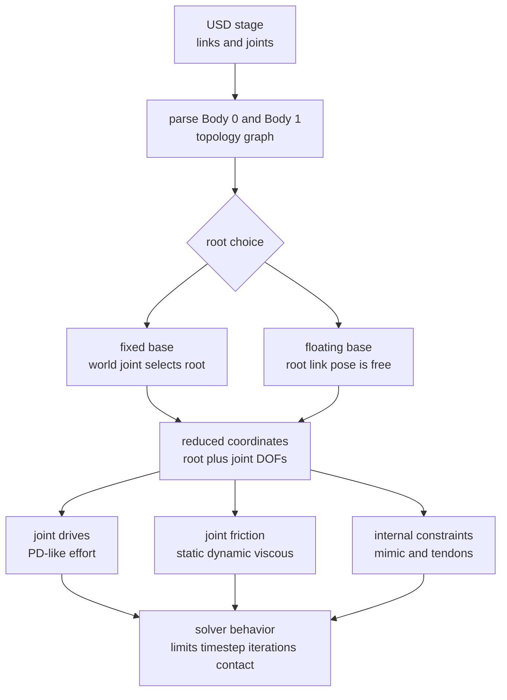

# Reduced-Coordinate Articulations

Reduced-coordinate articulation（约化坐标 articulation）是 [[omniverse-omni-physics-articulations|Omni Physics Articulations]] source 中描述的 PhysX robot / mechanism representation：mechanism 的 state 不再由每个 link 的独立 world pose 表达，而由 root link pose 与 joint coordinates 表达。它适合 robot arms、ragdolls、grippers 和 tendon-driven mechanisms，因为 joints 可以被结构性地保持一致，而不是靠 ordinary rigid-body joints 在 solver 中不断纠正 drift。

核心 tradeoff 是：articulation 用 topology 和 reduced coordinates 换取 higher fidelity、zero joint error by design 和 larger mass-ratio handling；代价是 topology 必须基本是 tree、closed loops 要被特殊处理、non-root link state 不能随意设置，而且 USD hierarchy 与 PhysX articulation topology 需要保持清楚边界。

## 数学结构

把 articulation 看作一个 graph：

$$
G=(V,E)
$$

其中 $V$ 是 articulation links（rigid bodies），$E$ 是 joints。PhysX source 强调，$E$ 由 USD joints 的 `Body 0` / `Body 1` relationships 决定；stage hierarchy 不是 physics topology，只在 parsing 与 root selection 时介入。

Fixed-base articulation 的 generalized coordinates 可以近似写成：

$$
q = [q_1,\ldots,q_n]
$$

其中 $q_i$ 是第 $i$ 个 joint DOF 的 position。Floating-base articulation 还需要 root body pose：

$$
q = [x_r, q_1,\ldots,q_n], \qquad x_r \in SE(3)
$$

其中 $x_r$ 是 root link 在 world 中的 pose。其他 link 的 transform 不是独立 state，而是由 forward kinematics 决定：

$$
T_i = FK_i(x_r, q)
$$

这就是 source 所说 reduced coordinates 的关键：configuration 由 root body 和 joint angles 决定，而不是由每个 involved body 的 world pose 决定。因此 non-root link 的 pose / velocity 不能直接 set；要 set joint state，应通过 `PhysxSchema.JointStateAPI` 或在 Fabric / RL workloads 中用 Tensor API `ArticulationView` 访问 PhysX data。

Root selection 有两种路径。显式路径是由 author 决定：fixed-base articulation 把 `UsdPhysics.ArticulationRootAPI` 放到 world fixed joint 或 ancestor；floating-base articulation 放到 intended root link 或 ancestor。自动路径是 simulator 遍历 articulation root 下的 bodies / joints，构造 topology graph；若存在 joint-to-world，则视为 fixed-base 并把 connected body 作为 root link；否则视为 floating-base，并选择 minimal eccentricity 的 graph node：

$$
e(v)=\max_{u\in V} d(v,u)
$$

其中 $d(v,u)$ 是 graph distance。选择较小 $e(v)$ 的 root 可以减少到 leaf links 的 traversal distance，但如果 controller 以 quadruped torso 等特定 link 为 state convention，最好显式指定 root。

Articulation drive 的 source-backed abstraction 是 per-axis PD-like drive。更细一层，performance envelope 约束 drive effort $d$ 与 joint velocity $\dot{q}$：

$$
|d| \leq d_{\max} - r_v |\dot{q}|
$$

$$
|\dot{q}| \leq v_{\max} - g_e |d|
$$

其中 $d_{\max}$ 对应 `DriveAPI.maxForce`，linear joint 中是 force，rotational joint 中是 torque；$r_v$ 是 velocity-dependent resistance；$g_e$ 是 speed-effort gradient；$v_{\max}$ 是 `maxActuatorVelocity`。这不是单纯的 controller gain，而是 actuator feasible region。

Mimic joint 约束两个 articulation DOF：

$$
q_A + Gq_B + \gamma = 0
$$

其中 $q_A$ 和 $q_B$ 是两个 joint positions，$G$ 是 gear ratio，$\gamma$ 是 offset。Hard mimic constraint 会 instantaneously enforce 这个 equation；在 gripper fingertip contact 中，它可能和 hard contact 互相竞争。Compliance 用 natural frequency $f_n$ 与 damping ratio $\zeta$ 建模成 spring-damper；source 给出的 tuning metric 是 simulation timestep $\Delta t$ 与 natural frequency 的乘积 $\Delta t f_n$。

Fixed tendon 把多个 joint positions 合成 tendon length：

$$
\ell = \sum_i a_i q_i + b
$$

其中 $a_i$ 是 gear ratio，$b$ 是 offset。Tendon speed 是 $\dot{\ell}=\sum_i a_i\dot{q}_i$，source snippet 中的 tendon force 形如：

$$
F = k(\ell-\ell_0) - c\dot{\ell}
$$

其中 $k$ 是 stiffness，$c$ 是 damping，$\ell_0$ 是 rest length。Spatial tendon 则把 length 定义为 attachment path 上 line-of-sight distances 的 weighted sum，用于 hydraulic actuator、artificial muscle 或 elastic-string-like mechanical components。

这张图强调 articulation 是从 USD stage 到 PhysX topology 再到 solver behavior 的 pipeline。核心 state 是 root + joint DOFs；drive、friction、mimic 和 tendon constraints 都在这个 reduced-coordinate representation 上工作。

## 直觉

普通 jointed rigid bodies 更像“多个独立 bodies 被 constraints 拉在一起”。Articulation 更像“一个有 internal coordinates 的 mechanism”。前者可能出现 joint drift，后者把 joint consistency 编进坐标选择里，因此 source 才说 articulation 有 zero joint error by design，并且能处理更大的 mass ratios。

Root 不是纯命名问题。Floating-base articulation 的 root link 决定哪个 link 的 pose / velocity 可以直接 set，也影响 traversal distance 和 control convention。Fixed-base articulation 则需要一个 joint-to-world 来表达 base 被固定到 world frame；source 建议用 fixed joint，因为它最清楚地表达 intention。

USD hierarchy 和 physics topology 的分离也很重要。你可以按 authoring convenience 组织 prim tree，但 PhysX articulation tree 只看 joints 的 body relationships。若 USD order、`Body 0` / `Body 1`、controller convention 和 PhysX parent-child topology 不一致，Tensor API 或 lower-level PhysX access 可能出现 limit swap、drive target negation 或 one-to-one mapping loss。

Drive envelope 的直觉是 motor datasheet-style feasible region：速度越高，可用 effort 越低；effort 越大，可达速度越低。`maxForce` 不只是安全上限，而是 articulation drive behavior 的一等参数。`maxActuatorVelocity` 限制的是 drive effort envelope；`maxJointVelocity` 限制的是 joint velocity 本身，两者不能混用。

Mimic joints、fixed tendons 和 spatial tendons 都是在 articulation 内加入额外 constraints。它们能表达 gear、rack-and-pinion、passive finger coupling、hydraulic actuator 和 biomimetic muscle，但也会让 solver 面对更硬的 coupled constraints。Gripper contact 是典型风险：stiff driven joint、light finger inertia、hard mimic constraint 和 hard object contact 可能互相争夺同一个 motion。

## Failure Modes

- Non-root state write：在 reduced-coordinate articulation 中直接 set non-root link pose / velocity 不被支持，会触发 warning；应 set root 或 joint DOF state。
- Implicit root surprise：Root API 放在 ancestor 上时，自动 topology selection 可能选出 author 没预期的 root，导致 initialization 和 control convention 失配。
- USD / PhysX topology mismatch：USD joint order 不必等于 PhysX parent-child order；下游 extension 访问 PhysX articulation data 时，limit 或 drive target 可能被 swap / negated。
- Closed-loop instability：Pure articulation joints 不支持 closed loops；用 excluded regular joint 闭环后，solver 更困难，可能需要更小 timestep 或 stability-guide tuning。
- Hard mimic vs hard contact：Gripper fingertip contact 中，hard mimic constraint 与 hard contact constraint 竞争，尤其在 driven joint 高 stiffness、finger inertia 小时容易不稳定。
- Compliance mistuning：$\Delta t f_n$ 太大时 compliance 没有效果或引入 instability；$\Delta t f_n$ 太小时 behavior 可能 sluggish。
- Envelope / velocity confusion：把 `maxActuatorVelocity` 当作 `maxJointVelocity`，或忽略 `driveEffort` 包含 internal PD effort 与 user-defined joint effort，会误判 actuator saturation。
- Limit modeling surprise：Articulation joint limits 是 hard constraints，不支持 `PhysxSchema.PhysxLimitAPI` 的 stiffness / damping；某些 joint type、distance limit、break force、instancing 和 runtime removal 也不支持。

## 实践含义

在 Isaac Sim / PhysX robot asset 中，应该显式 author articulation root，并把 controller convention、USD `Body 0` / `Body 1` relationships 和 Tensor API expectations 对齐。Fixed-base robot arm 通常用 fixed joint-to-world 表达 root；floating-base robot 或 ragdoll 应明确选择 torso/head 等 control-relevant link。

对 RL、MPC 和 large-scale simulation，Fabric / Tensor API access 很重要：source 明确说 Fabric 启用后，USD attribute access 不能再用于 joint state，应该用 `ArticulationView` 直接访问 PhysX data。这意味着 training code 的 state/control path 不应依赖 slow USD reads。

对 control tuning，先区分三层：drive gain、drive envelope、solver / timestep。Drive 可以按 PD-like controller 理解；performance envelope 决定 feasible velocity-effort region；closed loops、mimic compliance、contacts 和 TGS position iterations 决定 solver 能否稳定满足这些 constraints。把这些都写进同一个“stiffness/damping”心智模型会漏掉关键 failure modes。

对 asset authoring，PhysX-only articulation details 适合放进 [[IsaacSimAssetStructure|PhysX-specific tuning layer]]，而不是污染 shared geometry、materials 或 neutral physics。这样同一个 robot asset 在 PhysX、[[MuJoCo]] 或其他 runtime 中比较时，至少可以定位 behavior change 是 topology、neutral dynamics 还是 runtime-specific tuning 引起的。

相关页面：[[PhysX]]、[[IsaacSim]]、[[ContactSolvers]]、[[SimulationRealityGap]]、[[IsaacSimAssetStructure]]、[[isaac-sim-mujoco-control-tuning-notes]]。
