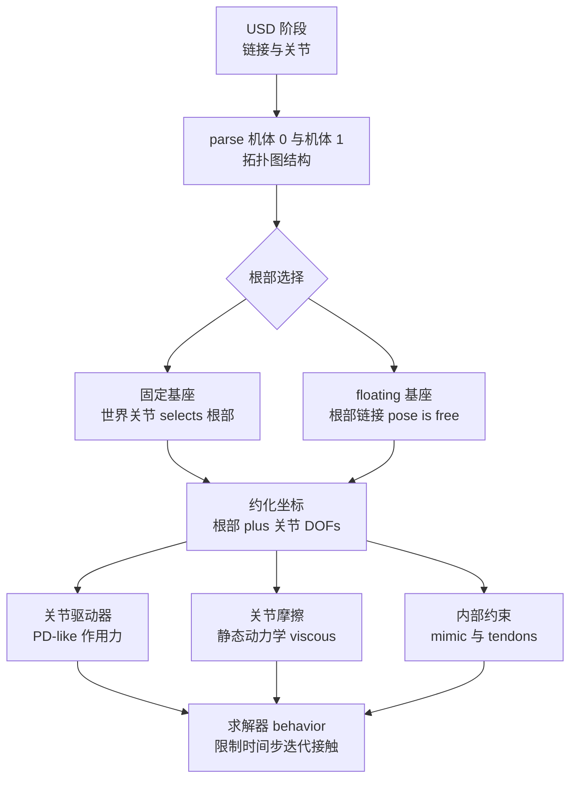

# 约化坐标关节系统

约化坐标关节系统（约化坐标关节系统）是 [[omniverse-omni-physics-articulations|Omni 物理关节系统]] 来源中描述的 PhysX 机器人 / 机制表示：机制的状态不再由每个链接的独立世界位姿表达，而由根连杆位姿与关节坐标表达。它适合机器人 arms、ragdolls、grippers 和 tendon-驱动的机制，因为关节可以被结构性地保持一致，而不是靠普通刚体关节在求解器中不断纠正漂移。

核心取舍是：关节系统用拓扑和约化坐标换取更高的保真度、zero 关节错误由设计和 larger 质量比率处理；代价是拓扑必须基本是树、闭环s 要被特殊处理、non-根连杆状态不能随意设置，而且 USD 层级与 PhysX 关节系统拓扑需要保持清楚边界。

## 数学结构

把关节系统看作一个图结构：

$$
G=(V,E)
$$

其中 $V$ 是关节系统链接（刚性刚体），$E$ 是关节。PhysX 来源强调，$E$ 由 USD 关节的 `Body 0` / `Body 1` 关系决定；阶段层级不是物理拓扑，只在解析与根部选择时介入。

固定基座关节系统的广义的坐标可以近似写成：

$$
q = [q_1,\ldots,q_n]
$$

其中 $q_i$ 是第 $i$ 个关节 DOF 的位置。浮动基座关节系统还需要根部刚体位姿：

$$
q = [x_r, q_1,\ldots,q_n], \qquad x_r \in SE(3)
$$

其中 $x_r$ 是根连杆在世界中的位姿。其他链接的变换不是独立状态，而是由正向运动学决定：

$$
T_i = FK_i(x_r, q)
$$

这就是来源所说约化坐标的关键：配置由根部刚体和关节角度决定，而不是由每个涉及的刚体的世界位姿决定。因此 non-根连杆的位姿 / 速度不能直接设置；要设置关节状态，应通过 `PhysxSchema.JointStateAPI` 或在 Fabric / RL 工作负载中用张量 API `ArticulationView` 访问 PhysX 数据。

根部选择有两种路径。显式路径是由作者决定：固定基座关节系统把 `UsdPhysics.ArticulationRootAPI` 放到世界固定关节或 ancestor；浮动基座关节系统放到 intended 根连杆或 ancestor。自动路径是仿真器遍历关节系统根部下的刚体 / 关节，构造拓扑图结构；若存在关节到世界，则视为固定基座并把 connected 刚体作为根连杆；否则视为浮动基座，并选择 minimal eccentricity 的图结构节点：

$$
e(v)=\max_{u\in V} d(v,u)
$$

其中 $d(v,u)$ 是图结构距离。选择较小 $e(v)$ 的根部可以减少到 leaf 链接的遍历距离，但如果控制器以四足机器人 torso 等特定链接为状态约定，最好显式指定根部。

关节系统驱动的有来源支持的抽象是 per-轴类 PD 驱动。更细一层，性能外包络约束驱动作用力 $d$ 与关节速度 $\dot{q}$：

$$
|d| \leq d_{\max} - r_v |\dot{q}|
$$

$$
|\dot{q}| \leq v_{\max} - g_e |d|
$$

其中 $d_{\max}$ 对应 `DriveAPI.maxForce`，linear 关节中是力，rotational 关节中是力矩；$r_v$ 是速度-依赖的 resistance；$g_e$ 是速度作用力梯度；$v_{\max}$ 是 `maxActuatorVelocity`。这不是单纯的控制器 gain，而是执行器可行区域。

Mimic 关节约束两个关节系统 DOF：

$$
q_A + Gq_B + \gamma = 0
$$

其中 $q_A$ 和 $q_B$ 是两个关节位置，$G$ 是传动比，$\gamma$ 是偏移。硬 mimic 约束会瞬时地强制满足这个方程；在夹爪 fingertip 接触中，它可能和硬接触互相竞争。柔顺性用固有频率 $f_n$ 与阻尼比率 $\zeta$ 建模成弹簧—阻尼器；来源给出的调优指标是仿真时间步 $\Delta t$ 与固有频率的乘积 $\Delta t f_n$。

固定 tendon 把多个关节位置合成 tendon 长度：

$$
\ell = \sum_i a_i q_i + b
$$

其中 $a_i$ 是传动比，$b$ 是偏移。Tendon 速度是 $\dot{\ell}=\sum_i a_i\dot{q}_i$，来源代码片段中的 tendon 力形如：

$$
F = k(\ell-\ell_0) - c\dot{\ell}
$$

其中 $k$ 是刚度，$c$ 是阻尼，$\ell_0$ 是静止长度。空间肌腱则把长度定义为附着点路径上各段视线距离的加权和，用于液压执行器、人工肌肉或弹性绳索类机械组件。

```mermaid
flowchart TD
  A["USD 阶段<br/>链接与关节"] --> B["parse 机体 0 与机体 1<br/>拓扑图结构"]
  B --> C{"根部选择"}
  C --> D["固定基座<br/>世界关节 selects 根部"]
  C --> E["floating 基座<br/>根部链接 pose is free"]
  D --> F["约化坐标<br/>根部 plus 关节 DOFs"]
  E --> F
  F --> G["关节驱动器<br/>PD-like 作用力"]
  F --> H["关节摩擦<br/>静态动力学 viscous"]
  F --> I["内部约束<br/>mimic 与 tendons"]
  G --> J["求解器 behavior<br/>限制时间步迭代接触"]
  H --> J
  I --> J
```

这张图强调关节系统是从 USD 阶段到 PhysX 拓扑再到求解器行为的流程。核心状态是根部 + 关节 DOFs；驱动、摩擦、mimic 和 tendon 约束都在这个约化坐标表示上工作。

## 直觉

普通 jointed 刚性刚体更像“多个独立刚体被约束拉在一起”。关节系统更像“一个有内部坐标的机制”。前者可能出现关节漂移，后者把关节一致性编进坐标选择里，因此来源才说关节系统有 zero 关节错误由设计，并且能处理更大的质量 ratios。

根部不是纯命名问题。浮动基座关节系统的根连杆决定哪个链接的位姿 / 速度可以直接设置，也影响遍历距离和控制约定。固定基座关节系统则需要一个关节到世界来表达基座被固定到世界帧；来源建议用固定关节，因为它最清楚地表达意图。

USD 层级和物理拓扑的分离也很重要。你可以按制作便捷方法组织图元树，但 PhysX 关节系统树只看关节的刚体关系。若 USD 顺序、`Body 0` / `Body 1`、控制器约定和 PhysX 父子拓扑不一致，张量 API 或较低-层级 PhysX 访问可能出现限制 swap、驱动目标 negation 或 one-到-one 映射损失。

驱动器外包络的直觉是 motor 数据手册-风格可行区域：速度越高，可用作用力越低；作用力越大，可达速度越低。`maxForce` 不只是安全上限，而是关节系统驱动行为的一等参数。`maxActuatorVelocity` 限制的是驱动作用力外包络；`maxJointVelocity` 限制的是关节速度本身，两者不能混用。

Mimic 关节、固定肌腱和空间肌腱都是在关节系统内加入额外约束。它们能表达 gear、rack-与-pinion、手指被动耦合、液压执行器和 biomimetic muscle，但也会让求解器面对更硬的耦合的约束。夹爪接触是典型风险：高刚度的驱动的关节、轻量的手指惯量、硬 mimic 约束和硬物体接触可能互相争夺同一个运动。

## 失效情形

- Non-根部状态 write：在约化坐标关节系统中直接设置 non-根连杆位姿 / 速度不被支持，会触发 warning；应设置根部或关节 DOF 状态。
- 隐式根部 surprise：根部 API 放在 ancestor 上时，自动拓扑选择可能选出作者没预期的根部，导致 initialization 和控制约定失配。
- USD / PhysX 拓扑不匹配：USD 关节顺序不必等于 PhysX 父子顺序；下游 extension 访问 PhysX 关节系统数据时，限制或驱动目标可能被 swap / negated。
- 闭环循环不稳定：Pure 关节系统关节不支持闭环s；用 excluded regular 关节闭环后，求解器更困难，可能需要更小时间步或稳定性-指南调优。
- 硬 mimic 与硬接触：夹爪 fingertip 接触中，硬 mimic 约束与硬接触约束竞争，尤其在驱动的关节高刚度、手指惯量小时容易不稳定。
- 柔顺性 mistuning：$\Delta t f_n$ 太大时柔顺性没有效果或引入不稳定；$\Delta t f_n$ 太小时行为可能 sluggish。
- 外包络 / 速度 confusion：把 `maxActuatorVelocity` 当作 `maxJointVelocity`，或忽略 `driveEffort` 包含内部 PD 作用力与用户-定义的关节作用力，会误判执行器饱和。
- 限制建模 surprise：关节系统关节限制是硬约束，不支持 `PhysxSchema.PhysxLimitAPI` 的刚度 / 阻尼；某些关节类型、距离限制、break 力、实例化和运行时 removal 也不支持。

## 实践含义

在 Isaac Sim / PhysX 机器人资产中，应该显式作者关节系统根部，并把控制器约定、USD `Body 0` / `Body 1` 关系和张量 API expectations 对齐。固定基座机器人机械臂通常用固定关节到世界表达根部；浮动基座机器人或 ragdoll 应明确选择 torso/输出头等控制相关的链接。

对 RL、MPC 和大规模仿真，Fabric / 张量 API 访问很重要：来源明确说 Fabric 启用后，USD 属性访问不能再用于关节状态，应该用 `ArticulationView` 直接访问 PhysX 数据。这意味着训练代码的状态/控制路径不应依赖缓慢的 USD 读取。

对控制调优，先区分三层：驱动 gain、驱动外包络、求解器 / 时间步。驱动器可以按类 PD 控制器理解；性能外包络决定可行速度作用力区域；闭环s、mimic 柔顺性、接触和 TGS 位置迭代决定求解器能否稳定满足这些约束。把这些都写进同一个“刚度/阻尼”心智模型会漏掉关键失效情形。

对资产制作，PhysX 专用关节系统细节适合放进 [[IsaacSimAssetStructure|PhysX-特定的调优层]]，而不是污染共享几何、材质或中性物理。这样同一个机器人资产在 PhysX、[[MuJoCo]] 或其他运行时中比较时，至少可以定位行为变更是拓扑、中性动力学还是运行时特定的调优引起的。

相关页面：[[PhysX]]、[[IsaacSim]]、[[ContactSolvers]]、[[SimulationRealityGap]]、[[IsaacSimAssetStructure]]、[[isaac-sim-mujoco-control-tuning-notes]]。
