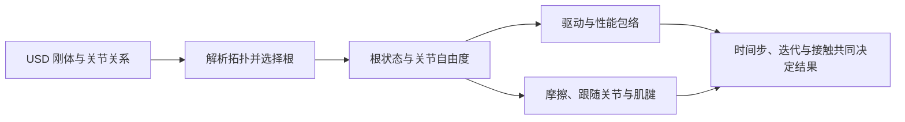

# 约化坐标关节系统

约化坐标关节系统（Reduced-coordinate Articulation）以根连杆位姿和关节坐标表示机构，其他连杆的位姿由运动学关系决定。[[omniverse-omni-physics-articulations|Omni Physics 关节系统文档]] 用它解释 PhysX 中的机器人、夹爪、布娃娃与肌腱驱动机构。

坐标选择在结构上保持关节连接关系，不需要让每个连杆独立运动后再纠正全部关节漂移。代价是树形拓扑、根连杆选择、闭环处理和状态写入方式都有约束。本页限定于已收录文档及其来源页；此次为编辑整理，没有重新核验完整 PhysX SDK。

## 状态与拓扑

记关节坐标为 $q_J=[q_1,\ldots,q_n]$，$n$ 为关节自由度数。固定基座的配置由 $q_J$ 表达；浮动基座还需要根连杆位姿 $x_r\in SE(3)$。第 $i$ 个连杆的位姿由正运动学计算：

$$
T_i=\operatorname{FK}_i(x_r,q_J).
$$

因此非根连杆位姿和速度不能独立任意设置。来源给出的关节状态接口为 `PhysxSchema.JointStateAPI`；Fabric／强化学习场景应使用张量接口 `ArticulationView` 访问 PhysX 数据，不能继续依赖 USD 属性作为实时关节状态。

物理拓扑由关节的 `Body 0`／`Body 1` 关系形成，USD 图元层级只参与解析和根部检测。固定基座可把 `UsdPhysics.ArticulationRootAPI` 放在连接世界的固定关节或其祖先；浮动基座则放在指定根连杆或其祖先。若需自动选根，来源描述有世界关节时以相连刚体为根，否则按图的最小偏心率选择：

$$
e(v)=\max_{u\in V}d(v,u).
$$

$V$ 为连杆集合，$d(v,u)$ 为拓扑图距离。若控制器约定某个躯干为根，应显式指定并检查实际解析结果。USD 的关节顺序不必等于 PhysX 父子顺序；低层接口中的限位方向、驱动目标符号和索引映射应相应核对。[[omniverse-omni-physics-articulations|关节系统来源页]]

## 驱动增益与执行器能力是两层约束

来源将逐轴驱动描述为类 PD 控制器，同时用性能包络限制作用力与速度。以下保留现有笔记对该包络的表达：

$$
|d|\le d_{\max}-r_v|\dot q|,
\qquad |\dot q|\le v_{\max}-g_e|d|.
$$

$d$ 是驱动力或力矩，$d_{\max}$ 对应 `DriveAPI.maxForce`，$r_v$ 为速度相关阻力系数，$g_e$ 为速度—作用力梯度，$v_{\max}$ 对应 `maxActuatorVelocity`。它描述可行工作区，不能简化成一个增益。`maxActuatorVelocity` 属于驱动包络，`maxJointVelocity` 则限制关节本身的速度，两者不可互换。

关节摩擦另含静态／动态 Coulomb 摩擦与黏性摩擦；`staticFrictionEffort` 不小于 `dynamicFrictionEffort`。`driveEffort` 包括内部驱动作用力与用户施加的关节作用力。具体驱动离散化、加速度驱动语义和默认迭代数不在本页已核验范围。[[omniverse-omni-physics-articulations|关节系统来源页]]

## 耦合约束：跟随关节与肌腱

跟随关节（Mimic Joint）约束两个自由度：

$$
q_A+Gq_B+\gamma=0.
$$

$q_A,q_B$ 为关节位置，$G$ 为传动比，$\gamma$ 为偏移。硬约束可表达齿轮或齿条耦合，但在夹爪指尖接触中可能与硬接触竞争。来源用固有频率 $f_n$ 与阻尼比 $\zeta$ 描述柔顺性，并要求结合仿真步长 $\Delta t$ 考察 $\Delta t f_n$；高刚度、轻指节和接触同时存在时尤其需要检查。

固定肌腱将关节位置加权为长度：

$$
\ell=\sum_i a_iq_i+b,\qquad
\dot\ell=\sum_i a_i\dot q_i.
$$

$a_i$ 为传动比，$b$ 为偏移。现有笔记记录的来源代码形式为：

$$
F=k(\ell-\ell_0)-c\dot\ell,
$$

其中 $k,c,\ell_0$ 分别为刚度、阻尼和静止长度；符号需沿用具体肌腱坐标与作用力方向，不能脱离接口照搬成一般弹簧公式。空间肌腱则按附着点路径计算长度，表达液压执行器、人工肌肉或弹性绳索等机构。[[omniverse-omni-physics-articulations|关节系统来源页]]

## 闭环与求解边界

关节系统自身的关节组成树。闭合运动链需要用普通关节并设置 `excludeFromArticulation`；这会增加求解难度，来源建议减小时间步并参考稳定性指南。关节系统限位为硬约束，不支持用 `PhysxSchema.PhysxLimitAPI` 的刚度／阻尼把它改成软限位。具体关节类型、断裂力、实例化和运行期间删除的支持范围仍应查对应版本。

```mermaid
flowchart LR
  U[USD 刚体与关节关系] --> T[解析拓扑并选择根]
  T --> Q[根状态与关节自由度]
  Q --> D[驱动与性能包络]
  Q --> C[摩擦、跟随关节与肌腱]
  D --> S[时间步、迭代与接触共同决定结果]
  C --> S
```

调试时分开检查坐标与索引、驱动增益、执行器包络、接触及求解预算；不要将所有不稳定都归为“刚度不合适”。这是对既有机制的工程整理。PhysX 专用设置的资产归属见 [[IsaacSimAssetStructure|资产结构3.0]]，尚待验证的调参讨论见 [[isaac-sim-mujoco-control-tuning-notes|物理与控制笔记]]。

## 研究归属

[[topics/physics-simulation|物理仿真]] · [[topics/contact-modeling|接触建模]]。
