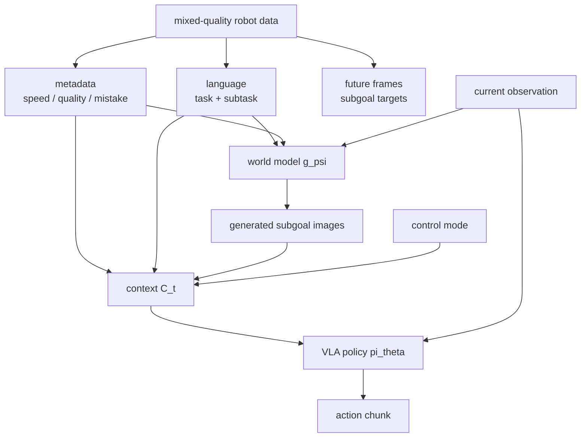

# Robot Context Conditioning

Robot context conditioning（机器人上下文条件化）是在 robot policy 的 prompt/context 中加入足够信息，让同一个 model 区分 task、subtask、strategy、quality、speed、mistakes、control mode 和 desired visual outcome。[[pi07-steerable-generalist-robotic-foundation-model|π0.7 paper]] 的核心贡献可以理解为：把 robot data heterogeneity 从 nuisance 变成 controllable condition。

## 数学结构

π0.7 把 VLA context 写成一个 richer prompt $C_t$。可以抽象为：

$$
C_t = (\ell_t,\hat{\ell}_t,g_t,m,c),
$$

其中 $\ell_t$ 是 overall task instruction，$\hat{\ell}_t$ 是当前 semantic subtask instruction，$g_t=[G_t^1,\dots,G_t^n]$ 是 multi-view subgoal images，$m$ 是 episode metadata，$c\in\{\mathrm{joint},\mathrm{ee}\}$ 是 control mode。Policy 使用：

$$
\pi_\theta(a_{t:t+H}\mid o_{t-T:t}, C_t).
$$

Episode metadata $m$ 在 source 中主要包含三类：overall speed（episode length，被离散到 500-step bins）、overall quality（1 到 5 的人工评分）和 mistake label（动作片段中是否出现 mistake）。Test time 通常把 quality 设为最高、mistake 设为 false，并为每个 task 选择 fast speed prompt。

Subgoal images 由 world model $g_\psi$ 生成。它接收当前 observation $o_t$、subtask instruction $\hat{\ell}_t$ 和 metadata $m$，产生 near-future visual goal：

$$
g^\star \sim p_\psi(g^\star \mid o_t,\hat{\ell}_t,m).
$$

论文用 flow matching loss $L_{\mathrm{CFM}}$ 训练这个 generator，使目标 future image $g_t^\star$ 与 $g_\psi(o_t,\hat{\ell}_t,m)$ 对齐。这里 $g_t^\star$ 来自 segment end frame 或 sampled future frame。

## 直觉

如果只给 task language，两个 demonstrations 可能都标成“fold the shirt”，但一个很慢、一个很快，一个失败、一个成功，一个适合小型 bimanual robot、另一个适合 UR5e。Context conditioning 把这些 hidden modes 显式化，让 model 学到 conditional distribution，而不是在 modes 之间平均。

Subgoal image 的作用是把 language 难以表达的 spatial details 变成 visual target。比如“open the fridge door”没有说明怎么抓 handle；multi-view subgoal image 可以同时表达 object-centric outcome、gripper pose 和 scene layout。

## Failure Modes

- Metadata mislabeling：quality、mistake 或 speed labels 是 coarse human annotations；错误标签会把 bad trajectories 包装成 desired mode。
- Prompt overconfidence：test time 要求 high quality/no mistake 不保证当前 state 可恢复；policy 可能输出看似 confident 但不可执行的 action sequence。
- Subgoal hallucination：world model 可能生成 visually plausible 但 robot kinematics、contacts 或 object dynamics 不可达的 goal images。
- Train-test prompt mismatch：training 中只有一部分 examples 带 subgoal images，runtime 若依赖 generated subgoals，image quality 和 latency 都可能影响 policy。
- Novelty ambiguity：大规模数据中很难证明某个 task 真正 unseen；context conditioning 可能是在 remix seen fragments，而不是学习可组合 causal program。
- Lower zero-shot reliability：source 明确说 seen tasks often exceed 90% success，而 unseen tasks 或 unseen task-robot combinations 通常只有 60-80% success range。

## Evidence Boundary

π0.7 source 支持的是一个 empirical system claim：rich context + diverse data 在该团队的 robot stack、data mixture 和 evaluation tasks 上显著改善 out-of-the-box performance。它不证明 metadata prompting 在任意 robot platform 上都 calibrated，也不证明 subgoal images 总是 physically reachable。后续 ingest 如果包含 independent reproduction、model card、open benchmark 或 failure report，应优先回到本页更新 failure modes，而不是只把 π0.7 的 positive results 加进 overview。

## 实践含义

对数据收集，π0.7 的经验反对“只保留完美 demonstrations”的单一路径。Mixed-quality data 可以有价值，但需要记录足够的 metadata，让 training objective 能区分 desired behavior 与 failure behavior。

对 evaluation，context conditioning 需要 ablation：去掉 metadata、去掉 autonomous evaluation data、去掉 generated subgoal images，才能判断性能来自哪些 context components。π0.7 paper 中 throughput gap 最大的 ablation 正是 no-metadata 和 no-eval-data。

对系统设计，world model 可以不直接做 MPC rollout，而是作为 visual prompt generator 参与 closed-loop control。这个设计把 [[WorldModelsForEmbodiedAI|world model]] 的作用从“预测整个未来”缩小到“产生可执行的 near-future visual target”，更适合实时机器人系统。

相关页面：[[VisionLanguageActionModels]]、[[Pi07]]、[[CompositionalGeneralizationInRobotics]]、[[WorldModelsForEmbodiedAI]]。
