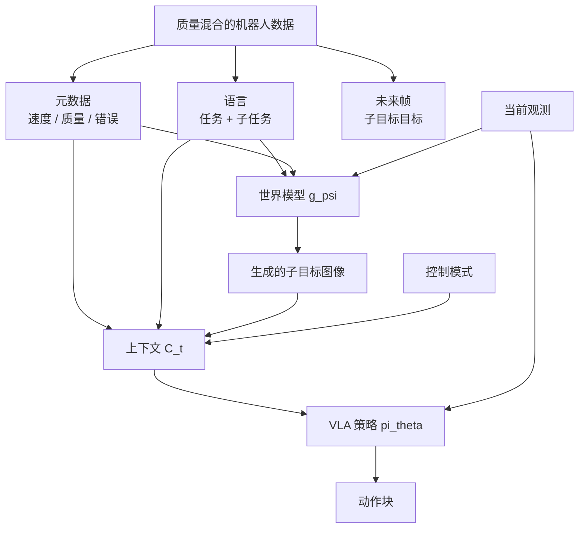

# 机器人上下文条件化

机器人上下文条件化（机器人上下文条件化）是在机器人策略的提示/上下文中加入足够信息，让同一个模型区分任务、子任务、策略、质量、速度、mistakes、控制模式和期望视觉结果。[[pi07-steerable-generalist-robotic-foundation-model|π0.7 论文]] 的核心贡献可以理解为：把机器人数据异构性从 nuisance 变成可控的条件。

## 数学结构

π0.7 把 VLA 上下文写成一个更丰富的提示 $C_t$。可以抽象为：

$$
C_t = (\ell_t,\hat{\ell}_t,g_t,m,c),
$$

其中 $\ell_t$ 是总体任务指令，$\hat{\ell}_t$ 是当前语义子任务指令，$g_t=[G_t^1,\dots,G_t^n]$ 是多视角子目标图像，$m$ 是回合元数据，$c\in\{\mathrm{joint},\mathrm{ee}\}$ 是控制模式。策略使用：

$$
\pi_\theta(a_{t:t+H}\mid o_{t-T:t}, C_t).
$$

回合元数据 $m$ 在来源中主要包含三类：总体速度（回合长度，被离散到 500-步骤 bins）、总体质量（1 到 5 的人工评分）和错误标签（动作片段中是否出现错误）。测试时通常把质量设为最高、错误设为 false，并为每个任务选择快速速度提示。

子目标图像由世界模型 $g_\psi$ 生成。它接收当前观测 $o_t$、子任务指令 $\hat{\ell}_t$ 和元数据 $m$，产生近期未来视觉目标：

$$
g^\star \sim p_\psi(g^\star \mid o_t,\hat{\ell}_t,m).
$$

论文用流程匹配损失 $L_{\mathrm{CFM}}$ 训练这个生成器，使目标未来图像 $g_t^\star$ 与 $g_\psi(o_t,\hat{\ell}_t,m)$ 对齐。这里 $g_t^\star$ 来自 segment end 帧或采样的未来帧。

## 直觉

如果只给任务语言，两个示范数据可能都标成“fold the shirt”，但一个很慢、一个很快，一个失败、一个成功，一个适合小型 bimanual 机器人、另一个适合 UR5e。上下文条件化把这些隐藏的模式显式化，让模型学到条件分布，而不是在模式之间平均。

子目标图像的作用是把语言难以表达的空间细节变成视觉目标。比如“open the fridge door”没有说明怎么抓把手；多视角子目标图像可以同时表达物体中心化结果、夹爪位姿和场景布局。

```mermaid
flowchart TB
  D["质量混合的机器人数据"] --> M["元数据<br/>速度 / 质量 / 错误"]
  D --> L["语言<br/>任务 + 子任务"]
  D --> G["未来帧<br/>子目标目标"]
  L --> W["世界模型 g_psi"]
  M --> W
  O["当前观测"] --> W
  W --> SG["生成的子目标图像"]
  M --> C["上下文 C_t"]
  L --> C
  SG --> C
  CM["控制模式"] --> C
  C --> P["VLA 策略 pi_theta"]
  O --> P
  P --> A["动作块"]
```

## 失效情形

- 元数据 mislabeling：质量、错误或速度标签是粗略人类标注；错误标签会把不良轨迹包装成期望模式。
- 提示词 overconfidence：测试时要求高质量/no 错误不保证当前状态可恢复；策略可能输出看似 confident 但不可执行的动作序列。
- 子目标幻觉：世界模型可能生成视觉上看似合理，但按机器人运动学、接触条件或物体动力学无法到达的目标图像。
- Train-测试提示不匹配：训练中只有一部分示例带子目标图像，运行时若依赖生成的子目标，图像质量和延迟都可能影响策略。
- Novelty 歧义：大规模数据中很难证明某个任务真正未见；上下文条件化可能是在 remix 已见 fragments，而不是学习可组合因果 program。
- 较低零样本可靠性：来源明确说已见任务 often exceed 90% 成功，而未见任务或未见任务机器人 combinations 通常只有 60-80% 成功 range。

## 证据边界

[[nvlabs-robolab|RoboLab]] 2026-06 代码仓库更新增加 per-策略后端文件夹和 Cosmos 3 客户端，但当前来源主要证明后端组织与推理客户端契约，而不是证明新的上下文条件化训练方法。因此本页只把 RoboLab 作为评估/集成证据，不把它写成模型侧条件化证据。

π0.7 来源支持的是一个 empirical 系统主张：丰富上下文 + diverse 数据在该团队的机器人技术栈、数据 mixture 和评估任务上显著改善 out-的-the-盒体性能。它不证明元数据 prompting 在任意机器人平台上都 calibrated，也不证明子目标图像总是物理上 reachable。后续收录如果包含 independent reproduction、模型 card、open 基准或失败报告，应优先回到本页更新失效情形，而不是只把 π0.7 的正结果加进总览。

## 实践含义

对数据收集，π0.7 的经验反对“只保留完美示范数据”的单一路径。混合质量数据可以有价值，但需要记录足够的元数据，让训练目标能区分期望行为与失败行为。

对评估，上下文条件化需要消融实验：去掉元数据、去掉自主评估数据、去掉生成的子目标图像，才能判断性能来自哪些上下文组件。π0.7 论文中吞吐量差距最大的消融实验正是 no-元数据和 no-eval-数据。

对系统设计，世界模型可以不直接做 MPC 轨迹采样，而是作为视觉提示生成器参与闭环控制。这个设计把 [[WorldModelsForEmbodiedAI|世界模型]] 的作用从“预测整个未来”缩小到“产生可执行的近期未来视觉目标”，更适合实时机器人系统。

相关页面：[[VisionLanguageActionModels]]、[[Pi07]]、[[CompositionalGeneralizationInRobotics]]、[[WorldModelsForEmbodiedAI]]。
