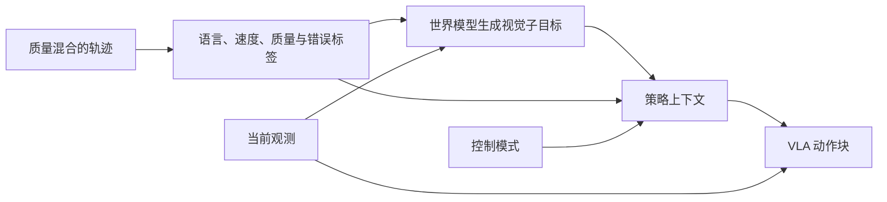

# 机器人上下文条件化

上下文条件化让同一个策略区分任务、子任务、质量、速度、错误、控制模式与期望视觉结果。[[pi07-steerable-generalist-robotic-foundation-model|π0.7]] 将这些信息纳入提示，以处理异构机器人数据中的行为歧义。

## 数学结构

用教学记号汇总来源中的上下文：

$$
C_t=(\ell_t,\hat\ell_t,g_t,m,c),\qquad
\pi_\theta(A_t\mid O_t,C_t).
$$

$\ell_t$ 为总体任务语言，$\hat\ell_t$ 为当前子任务语言，$g_t$ 为多视角视觉子目标，$m$ 为回合元数据，$c$ 为关节或末端控制模式；$O_t$ 为观测历史，$A_t$ 为动作块，$\theta$ 为策略参数。动作块长度的明确记法见 [[VisionLanguageActionModels|VLA]]。

来源中的元数据包括速度（回合长度按 500 步分箱）、质量（1 至 5 人工评分）和错误标签。测试通常选择最高质量、无错误与较快的速度提示；这是一组来源设置，不是任意系统的通用最优值。[[pi07-steerable-generalist-robotic-foundation-model|π0.7 论文]]

视觉子目标由生成器参数 $\psi$ 决定：

$$
g^\star\sim p_\psi(g^\star\mid o_t,\hat\ell_t,m).
$$

$o_t$ 为当前观测，$g^\star$ 为目标图像。来源使用片段末帧或采样未来帧作为训练目标，并用条件流匹配训练生成器；生成结果再进入 VLA 上下文。详见 [[WorldModelsForEmbodiedAI|世界模型]]。

## 直觉

同一句“折好衣服”可以对应不同速度、质量和机器人形态的示范。把这些模式显式写入条件，模型就可以学习条件分布，而不是只拟合混合行为。视觉目标进一步表达语言难以说明的位姿或结果形状。这是依据来源机制整理的解释，不保证任意标签都能带来收益。

```mermaid
flowchart LR
  A[质量混合的轨迹] --> B[语言、速度、质量与错误标签]
  B --> C[世界模型生成视觉子目标]
  D[当前观测] --> C
  C --> E[策略上下文]
  B --> E
  F[控制模式] --> E
  E --> G[VLA 动作块]
  D --> G
```

## 失效情形与证据边界

来源报告，已见任务常超过 90% 成功，而未见任务或任务—机器人组合通常处于 60%–80% 区间；这是其评测结果，不能当作任意 VLA 的可靠性范围。[[pi07-steerable-generalist-robotic-foundation-model|π0.7 论文]]

以下是**机制推导的待验证风险**：质量或错误误标、测试提示与当前状态不匹配、生成目标不可达、子目标延迟，以及把已有片段重组误判为未见任务。当前来源没有独立验证全部风险，不将它们伪装成已观察的通用失败。

[[nvlabs-robolab|RoboLab 仓库]] 的策略后端与客户端组织支持集成语义，不是新的上下文训练方法证据。π0.7 的正结果来自发布方技术栈与评测；跨平台校准和独立复现仍需补充。

## 实践含义

数据收集要记录模式与质量，而不只保留一条任务语言。实验时分别移除元数据、评估数据和生成子目标，辨别贡献。π0.7 中无元数据与无评估数据的消融影响吞吐量，这为组件分析提供具体证据；是否适用于自己的平台仍需重做实验。[[pi07-steerable-generalist-robotic-foundation-model|π0.7 论文]]

继续读 [[RobotLearningDataComposition|数据构成]]、[[RobotLearningObjectives|学习目标]] 和 [[CompositionalGeneralizationInRobotics|组合泛化]]。
