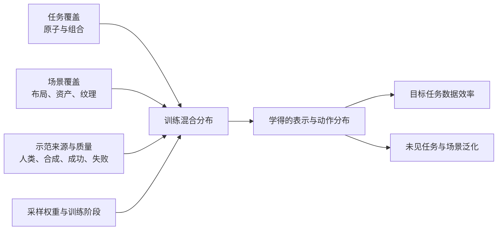

# 机器人学习数据构成

机器人学习数据构成关注的不是“总共有多少小时或多少条轨迹”，而是数据由哪些任务、场景、机器人形态、示范来源、质量层级与训练阶段组成。[[robocasa365-a-large-scale-simulation-framework-for-training-and-benchmarking-generalist-robots|RoboCasa365]] 提供直接的受控证据：扩大任务和场景覆盖可以改善下游泛化，但向高质量人类数据中加入数量更大的混合质量合成数据，并不自动提高成功率。

## 数学结构

把一条示范写成 $d_i=(\tau_i,e_i,m_i,q_i,o_{1:T}^{(i)},a_{1:T}^{(i)})$，其中 $\tau_i$ 是任务，$e_i$ 是场景，$m_i$ 是示范来源（例如人类遥操作或合成生成），$q_i$ 是质量或可执行性，$o_{1:T}$ 是观测轨迹，$a_{1:T}$ 是动作轨迹。训练集不是单一同分布样本，而是混合分布：

$$
p_D(d)=\sum_{\tau,e,m}\alpha_{\tau,e,m}\,p(d\mid \tau,e,m),
$$

其中 $\alpha_{\tau,e,m}$ 是不同任务—场景—来源组合的采样权重。若训练目标没有显式质量权重，经验风险是：

$$
\mathcal{L}(\theta)=\mathbb{E}_{d\sim p_D}\left[\ell\bigl(\pi_\theta(o_{\le t},\ell_\tau),a_t\bigr)\right].
$$

此时，增加大量低质量或分布偏斜的数据会改变 $p_D$ 和梯度占比，即使总数据量增加，也可能把模型推向错误动作、狭窄技能或不合适的场景先验。一个更一般的质量感知目标是：

$$
\mathcal{L}_w(\theta)=\frac{1}{\sum_i w_i}\sum_i w(q_i,\tau_i,e_i,m_i)\,\ell_i(\theta),
$$

其中 $w_i$ 可以编码成功、人工质量、任务稀缺性、场景覆盖或与目标域的相关性。RoboCasa365 没有提出这个加权算法，但它的 Human300 与 Human300+MG60 消融说明：当 $w_i$ 隐含为均匀采样时，更多合成数据可能稀释高价值数据。

预训练—后训练还引入阶段变量。两阶段训练可以写成：

$$
\theta_{pre}=\arg\min_\theta \mathcal{L}_{pre}(\theta),\qquad
\theta_{tar}=\arg\min_\theta \mathcal{L}_{tar}(\theta;\theta_{pre}),
$$

而单阶段联合训练直接优化 $\mathcal{L}_{joint}=\lambda\mathcal{L}_{pre}+(1-\lambda)\mathcal{L}_{tar}$。RoboCasa365 中两阶段方案平均成功率为 51.1%，单阶段联合训练为 22.5%，说明数据集合相同也不代表优化路径相同。

## 直觉

数据量回答“模型看了多少”；数据构成回答“模型反复看见了什么、以什么比例看见、哪些行为被当作正确答案，以及最后用什么数据把能力对准目标任务”。任务多样性扩大可复用技能与组合，场景多样性减少对固定布局和视觉风格的依赖，质量决定动作监督是否可靠，训练阶段决定通用表示与目标行为怎样衔接。

## RoboCasa365 的证据

| 对照 | 结果 | 支持的判断 |
| --- | --- | --- |
| Human50 → Human300，10% 目标数据 | 34.7% → 40.0% | 扩大任务覆盖有利于下游学习，未见组合任务增益尤其明显 |
| Human300 → Human300+MG60，10% 目标数据 | 40.0% → 35.9% | 大量混合质量合成轨迹不会自动带来收益 |
| 5 → 25 → 2,500 个预训练场景，零样本 | 29.6% → 39.6% → 44.7% | 场景覆盖改善目标厨房泛化 |
| 目标数据训练 → 预训练后再后训练，全量目标数据 | 43.7% → 51.1% | 预训练提高下游性能与数据效率 |
| 单阶段联合训练 → 两阶段训练 | 22.5% → 51.1% | 训练阶段和数据配比与数据本身同样重要 |

[[pi07-steerable-generalist-robotic-foundation-model|π0.7]] 从另一侧支持任务覆盖的重要性：移除最具多样性的机器人数据比随机移除同量数据更伤害未见任务。[[lda-1b-scaling-latent-dynamics-action-model|LDA-1B]] 则用策略、正向动力学、逆动力学和视觉预测目标区分不同数据作用。三者共同说明，机器人数据规模化需要“覆盖 + 质量 + 作用 + 调度”，而不是只优化总小时数。

## Failure Modes

- 数量—质量混淆：数据量增加时，轨迹成功率、接触质量、动作平滑性和任务分布也可能同时变化，无法把结果归因于规模本身。
- 任务覆盖假象：任务名称更多不等于技能、物体和接触模式更多；大量近重复任务可能只改变语言表面。
- 场景数量假象：布局、资产实例和纹理同时变化时，单一“场景数”无法解释哪个因素改善泛化。
- 采样失衡：某些来源拥有远更多轨迹时，会主导梯度；RoboCasa365 的 MG60 每任务 10,000 条，而 Human300 每任务只有 100 条。
- 合成误差放大：自动生成可以复制种子轨迹的偏差，也可能生成接触不稳、动作分布偏移或终态勉强成功的轨迹。
- 目标域稀释：把预训练与目标数据直接联合训练，可能让大量通用数据压过稀缺目标行为；两阶段后训练是缓解方式之一，但不是普遍保证。
- 组合任务误差累积：数据覆盖原子技能不等于能够在长时域中正确排序、恢复和维持状态；组合任务成功仍会随阶段数下降。
- 质量标签缺失：如果只保存成功轨迹而不记录失败、过滤比例、阶段完成和生成器置信度，训练者无法构造可靠的 $w_i$ 或审计数据偏差。

## 实践含义

- 对机器人基础模型，应按任务、场景、机器人形态、示范来源、成功/质量、时域和训练阶段报告数据，而不是只报总小时数。
- 对仿真数据生成，应同时保存尝试数、成功门控比例、首次失败阶段、轨迹质量指标和种子来源；否则合成数据量无法解释。
- 对低数据目标任务，优先增加与目标能力互补的任务覆盖和场景覆盖，再决定是否扩大同类轨迹数量。
- 对混合质量数据，可考虑质量加权、分层采样、目标路由或先预训练再后训练；具体方案必须通过相同训练预算和相同有效样本数的消融验证。
- 对 [[CompositionalGeneralizationInRobotics|组合泛化]]，任务覆盖应按技能图和阶段组合统计，而不是按任务名计数。
- 对 [[SimulationRealityGap|仿真—现实差距]]，视觉/几何覆盖和已知相机对齐可以互补，但都不能替代真实机器人闭环验证。

相关页面：[[RoboCasa365]]、[[TaskGeneralistPolicyEvaluation]]、[[CompositionalGeneralizationInRobotics]]、[[RobotContextConditioning]]、[[LatentDynamicsActionModels]]、[[RoboticsSimulationInfrastructure]]、[[SimulationRealityGap]]。
