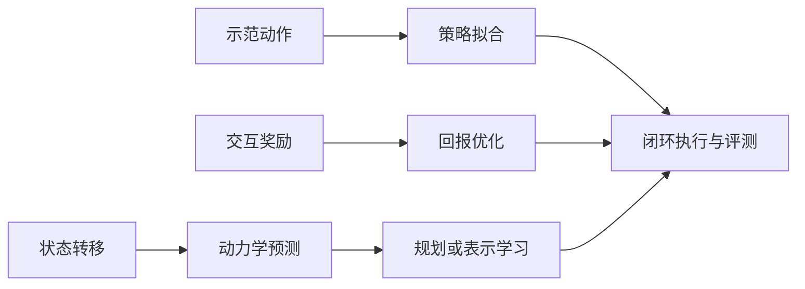

# 机器人学习目标：示范、回报与动力学

机器人学习至少有三种不同问题：**学专家怎样行动、学怎样获得回报、学动作怎样改变世界**。它们分别对应示范动作目标、RL 回报目标和动力学预测目标，可以在同一系统中组合，但衡量的对象不同。[[robocasa365-a-large-scale-simulation-framework-for-training-and-benchmarking-generalist-robots|RoboCasa365]]、[[spinning-up-rl-key-concepts|强化学习基础概念]]、[[lda-1b-scaling-latent-dynamics-action-model|LDA-1B]]

## 数学结构

以下是把已有来源统一到同一符号下的教学表达。负对数似然用于说明条件动作分布的拟合；扩散或流匹配实现使用相应训练损失，不能将下式声称为每个被比较模型实际采用的目标。设 $h_t$ 为观测与动作历史，$a_t$ 为动作，$D$ 为示范数据分布，$\pi_\theta$ 为策略：

$$
\mathcal L_{\mathrm{BC}}(\theta)=\mathbb E_{(h_t,a_t)\sim D}[-\log\pi_\theta(a_t\mid h_t)].
$$

行为克隆（BC）让数据中的动作在对应输入下更可能出现。它的评价对象是示范分布上的动作拟合；闭环时策略会改变后续输入。数据的采样权重与训练阶段会影响实际拟合重点。[[RobotLearningDataComposition|机器人学习数据构成]]

RL 的目标改为策略自身产生的轨迹上的期望回报：

$$
\max_\theta J(\theta)=\mathbb E_{\tau\sim\pi_\theta}\left[\sum_{t=0}^{H-1}\gamma^t r_t\right].
$$

$H$ 为时域，$\gamma$ 为折扣，$r_t$ 为奖励。轨迹分布随策略变化，直接照搬固定数据上的监督学习直觉并不充分。[[MarkovDecisionProcesses|MDP 与强化学习基础]]

动力学目标则学习状态或潜在状态的转移。令 $z_t$ 为状态表示，$p_\psi$ 为参数 $\psi$ 的转移模型：

$$
\mathcal L_{\mathrm{dyn}}(\psi)=\mathbb E_D[-\log p_\psi(z_{t+1}\mid z_t,a_t)].
$$

预测模型可以用于规划、产生训练经验或学习表示；“学了动力学”不等于“已经学出可执行策略”。[[spinning-up-rl-algorithm-taxonomy|强化学习算法分类]]、[[LatentDynamicsActionModels|潜在动力学动作模型]]

### 同一个失败回合，三个目标各看什么

**教学例子：** 机器人夹住杯子后抬升，杯子滑落。动作模仿问“给定这些输入，是否复现了数据中的动作”；如果把失败轨迹无差别当专家数据，模型可能学到导致滑落的动作。回报目标问“这条动作序列是否获得任务奖励”，可用失败结果区分不同策略。动力学目标问“这些动作之后杯子怎样移动”，滑落本身也是可学习的状态变化，但预测得准仍需要规划或策略把预测转成动作选择。

这也解释了训练和测试的区别：训练阶段用上述信号更新参数；普通闭环评估阶段读取固定策略并观察结果，环境里有奖励字段不等于评估时正在进行 RL。RoboCasa365的示范训练与目标适配属于前者的监督学习应用；具体算法是否再使用回报或预测目标，应另查其损失和更新步骤。

## 直觉与比较

| 目标 | 监督信号 | 优先追问 |
| --- | --- | --- |
| 示范动作 | 给定历史下的专家动作 | 示范覆盖什么，采样分布怎样影响梯度？ |
| 期望回报 | 交互中的奖励与后续收益 | 奖励对应任务目标吗，数据怎样采集与复用？ |
| 动力学预测 | 动作后的状态变化 | 预测保留了哪些决策信息，误差怎样进入控制？ |

教学例子：抓取失败轨迹不适合作为“成功专家动作”的同等示范，却仍记录了动作与状态变化。LDA-1B 正是按数据质量与动作标注情况路由策略、正向动力学、逆动力学和视觉预测目标；这不保证任意失败数据都能改善策略，具体收益仍需实验验证。[[lda-1b-scaling-latent-dynamics-action-model|LDA-1B 论文]]

图表示目标之间的分工，不要求一个系统同时采用所有目标。

## 失效情形

- **损失与能力混淆**：示范拟合改善需要闭环验证；RoboCasa365 的组合任务结果显示短任务与长任务能力不能用同一得分概括。
- **数据越多越好**：RoboCasa365 的 Human300+MG60 混合配置低于 Human300，但质量、采样权重与分布未分别控制，不能单独归因为“合成数据质量差”。[[RobotLearningDataComposition|机器人学习数据构成]]
- **模型内优化投机**：学得的预测偏差可能被规划或策略利用。[[spinning-up-rl-algorithm-taxonomy|强化学习算法分类]]
- **预测表示缺信息**：固定视觉潜在可能遗漏控制需要的变量。[[LatentDynamicsActionModels|潜在动力学动作模型]]

## 实践含义

实验记录应同时写明学习目标、采样分布、训练阶段和闭环指标。RoboCasa365 的“先仿真预训练、再目标微调”改变训练阶段与分布，不因此变成强化学习；其两阶段与联合训练对照还同时改变总步数，不能把整个性能差距归因于训练顺序。若多目标共训，还应记录哪些数据被分配给哪些目标。阅读策略机制可接 [[VisionLanguageActionModels|视觉—语言—动作模型]]，阅读数据调度可接 [[RobotLearningDataComposition|机器人学习数据构成]]，阅读模型用途可接 [[world-models-learning-path|世界模型路径]]。

## 研究归属

[[topics/evaluation-and-transfer|评测与现实迁移]] · [[topics/robot-policy-learning|机器人策略学习]] · [[topics/policy-evaluation|数据与评测怎样支撑泛化判断]]。
