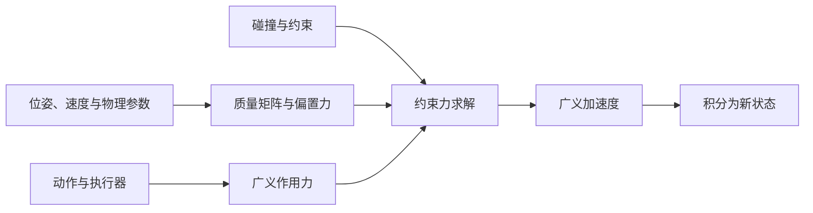

# 机器人刚体动力学

运动学回答“关节运动会把连杆带到哪里”，动力学回答“作用力会让它怎样加速”。质量、惯量、速度、重力、执行器和接触必须进入动力学，才能推进 [[RoboticsSimulationLoop|仿真循环]]。

## 数学结构

对以独立关节坐标 $q$ 表示的开链机械系统，速度为 $\dot q$、加速度为 $\ddot q$、广义力为 $\tau$。拉格朗日量 $L=K-U$ 由动能 $K$ 与势能 $U$ 组成，方程为：

$$
\tau_i=\frac{\mathrm d}{\mathrm dt}\frac{\partial L}{\partial\dot q_i}-\frac{\partial L}{\partial q_i},\qquad
\tau=M(q)\ddot q+c(q,\dot q)+g(q).
$$

$M$ 是关节空间质量矩阵，$c$ 汇总科里奥利与离心等速度乘积项，$g$ 是势能梯度；若系统还有弹簧势能，$g$ 不只含重力。关节力与速度的内积 $\tau^T\dot q$ 是功率。[[modern-robotics-lagrangian-dynamics|拉格朗日动力学课程]]

### 从开链到有接触的仿真

MuJoCo 将广义速度写成 $v$，把重力一并放进偏置力 $c_M$：

$$
M(q)\dot v+c_M(q,v)=\tau+J(q)^Tf,
\qquad \dot v=M^{-1}(\tau+J^Tf-c_M).
$$

$f$ 是接触、关节限制等约束坐标中的力，$J$ 将广义速度映射为约束速度，$J^T$ 将约束力映射为广义力；$\tau$ 包含执行器、被动力和外加力。这里 $c_M$ 与前式的 $c+g$ 对应，符号同名并不代表定义相同。含四元数时 $v$ 与 $\dot q$ 也不宜当成同维数组。[[mujoco-computation-collision-detection|MuJoCo 计算章]]

约束力未知时，不能只做一次矩阵求逆就得到完整动力学。先构造接触和约束，再求 $f$，最后推进速度与位姿；模型与求解的区别见 [[ContactModelsInRobotics|接触模型]] 和 [[ContactSolvers|Contact Solvers]]。

### 一个可手算的教学例子

考虑无摩擦、长度 $\ell$、末端点质量 $m$ 的单摆，角度 $q$ 从竖直向下量起，重力加速度为 $g_0$。动能 $K=\tfrac12m\ell^2\dot q^2$，势能 $U=-mg_0\ell\cos q$，代入上式得：

$$
\tau=m\ell^2\ddot q+mg_0\ell\sin q.
$$

这是由课程能量方法构造的简化例子；实际机器人还要加连杆转动惯量、阻尼、齿轮及执行器状态。静止不代表力矩为零：在 $q\ne0$ 时，维持姿态仍需抵消重力。

## 直觉

$M$ 把“怎样加速”转成“需要多少力”；它随姿态变化，不是把每个关节独立乘一个固定质量。速度乘积项描述连杆运动之间的耦合；约束力描述环境允许哪些运动。位置驱动器目标还要经过增益、传动与饱和，不能直接代入 $\tau$。

图是基于 MuJoCo 方程的教学拆分；函数顺序和缓存依赖应查具体版本文档。

## 失效情形

- **把位置目标当力矩**：同一目标通过不同执行器参数生成不同力；MuJoCo 区分控制、激活状态与力生成。
- **省略必要状态**：气动、肌肉等执行器具有动态激活量，仅保存位置与速度不能描述全部状态。[[mujoco-computation-collision-detection|MuJoCo]]
- **把接触逆向动力学当无条件唯一**：硬接触下，静止压墙的运动学不能恢复全部接触力；MuJoCo 可逆性建立在其软接触模型上。

## 观看并复习

下面来自 [[modern-robotics-lagrangian-dynamics|官方课程]]，不自动播放。观看双关节例子时，找出与加速度、速度乘积和势能相关的项，然后回到本页比较符号定义。

<iframe class="external-embed" src="https://www.youtube-nocookie.com/embed/1U6y_68CjeY" title="Modern Robotics 8.1：拉格朗日动力学" loading="lazy" allowfullscreen></iframe>

[打开课程文字稿](https://modernrobotics.northwestern.edu/nu-gm-book-resource/chapter-8-1-lagrangian-formulation-of-dynamics-part-1-of-2/)。

## 实践含义

RL 通过动力学获得训练轨迹；控制器用动力学预测输入后果；系统辨识调整影响这些轨迹的参数。接到计算机上需要 [[SimulationTimeStepping|积分与控制频率]]，接到硬件上需要 [[SystemIdentificationForSimulation|系统辨识]] 与 [[SimulationRealityGap|现实差距诊断]]。本页建立基础结构，完整递归算法与浮动基座推导还需继续收录。

## 研究归属

[[topics/evaluation-and-transfer|评测与 Sim-to-Real]] · [[topics/simulation-transfer|Sim-to-Real]]。
