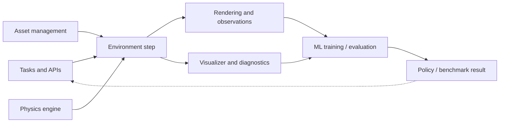

# Robotics Simulation Infrastructure

Robotics simulation infrastructure 是把 physics engine、renderer、assets、task definitions、visualization 和 ML training/evaluation loop 组合成可用 research system 的 layer。[[robotics-simulation-infrastructure|Robotics Simulation Infrastructure]] 的核心贡献不是提出新算法，而是把 simulator framework 看成一组 design decisions：什么容易表达，什么容易并行，什么容易 debug，什么会占用 GPU memory，什么能被 evaluation metrics 看见。

## 数学结构

这篇 source 没有给 formal equations；下面是 wiki 用来整理其 infrastructure stack 的 abstraction。一个 simulation framework 可以写成：

$$
\mathcal{F} = (\mathcal{T}, \mathcal{A}, \mathcal{P}, \mathcal{R}, \mathcal{V}, \mathcal{M}),
$$

其中 $\mathcal{T}$ 是 task/API layer，定义 environments、reset、step、parallelization 和 user-facing scene building；$\mathcal{A}$ 是 asset management layer，定义 geometry、materials、articulations、poses 和 serialization；$\mathcal{P}$ 是 physics engine/runtime；$\mathcal{R}$ 是 rendering engine 和 observation generation；$\mathcal{V}$ 是 visualizer/diagnostic layer；$\mathcal{M}$ 是 machine learning integration，包括 RL training、policy evaluation、replay buffer、network and rollout plumbing。

对一个 policy $\pi_\phi$，framework 的 hidden design parameters $\theta_{\mathcal{F}}$ 会进入 training objective：

$$
J(\phi; \theta_{\mathcal{F}}) = \mathbb{E}_{\tau \sim p_{\theta_{\mathcal{F}}}(\tau \mid \pi_\phi)}\left[\sum_{t=0}^{H} r_{\theta_{\mathcal{F}}}(x_t, a_t, o_t)\right],
$$

其中 $x_t$ 是 simulator state，$a_t$ 是 action，$o_t$ 是 rendered/sensor observation，$r_{\theta_{\mathcal{F}}}$ 是 reward 或 evaluation signal，$p_{\theta_{\mathcal{F}}}$ 是由 task API、asset layout、physics、rendering、parallelization 和 diagnostics 共同决定的 rollout distribution。这个式子的重点是：API 和 infrastructure choices 不只是 developer convenience，它们会选择 data distribution、resource budget、可见 diagnostics 和 failure surface。

## 直觉

Simulation infrastructure 的直觉是：robotics simulator 不是只有 physics correctness，一个 framework 还在分配人类和机器的注意力。Config-driven asset definitions 可以带来 structure、serialization 和 governance，但会降低 ad hoc hackability；direct Python APIs 更容易快速表达 scene 和 experiment，但 structure 与 reproducibility 要靠额外 convention 支撑。两者不是绝对优劣，而是把 complexity 放在不同地方。

Rendering trade-off 也不是纯视觉问题。[[robotics-simulation-infrastructure|source]] 指出，batched rendering 的 GPU memory footprint 会和 RL training 争资源：memory 可以用于 larger batch sizes、replay buffers 和 networks，也可以用于 higher-fidelity rendering。对 PPO/SAC 这类 training loop，renderer 的 design choice 可能通过 sample efficiency、throughput 和 training time 间接影响 performance。

Pose API example 说明 infrastructure 的小接口会在大系统里放大。把 position 和 quaternion 分散在多个 tensors 与 helper functions 中，可能让每个 call site 都携带更多 input variables、imports 和 frame/operation reasoning；`Pose` dataclass 把 pose storage、composition、inverse 和 heterogeneous input conversion 放进 typed object，牺牲少量 Python indirection 来降低 cognitive load。

## Failure Modes

- Framework comparison 被误读成 engine ranking：source 的判断主要是 API、visualizer、rendering 和 developer ergonomics，不是证明某个 physics engine 或 framework universally better。
- Config-driven asset schemas 过强：环境更 structured、可序列化，但 beginner 或 LLM scene building 可能更难快速 experiment。
- Direct Python APIs 过松：scene authoring 更 flexible/hackable，但如果没有明确 schema，serialization、versioning、large benchmark governance 和 review 会变困难。
- Rendering fidelity/memory mismatch：为 high-fidelity batched rendering 付出的 GPU memory 可能挤压 RL batch size、replay buffer 或 network capacity；过度追求 throughput 又可能漏掉视觉假设需要的 fidelity。
- Visualizer under-instrumentation：如果 visualizer 只显示 physics state 而不显示 reward、policy behavior、past states 或 diagnostics，evaluation 的 failure type 会变难定位。
- Pose abstraction 过薄：分散的 tensor/function API 增加 import surface、frame reasoning 和 function-call complexity；但过厚的 object abstraction 也可能引入 Python overhead 或 backend compatibility burden。
- Evidence boundary：当前 page 主要来自一篇 Substack engineering article，适合作为 design lens；framework-specific claims 需要后续 ingest official docs、repo snapshots 或 benchmark reports。

## 实践含义

- 选择 simulator framework 时，应同时审计 task API、asset authoring、physics/rendering、visualizer、ML integration 和 parallel evaluation，而不是只看 engine name 或 headline fidelity。
- 对 [[TaskGeneralistPolicyEvaluation|policy evaluation]]，infrastructure 决定 tasks 是否容易扩展、success predicates 是否可维护、diagnostics 是否能定位 wrong-object / reward / trajectory failures，以及多 policy evaluation 是否可并行。
- 对 [[SimulationRealityGap|sim-to-real]]，gap 的上游不只包括 contact law 和 rendering mismatch，也包括 framework API 能不能表达 hardware-relevant variation、visualizer 能不能暴露 failure、ML loop 能不能保留足够训练资源。
- 对 LLM-assisted scene/task generation，typed objects、clear task APIs 和 composable asset schemas 会影响 LLM 能否稳定生成可运行 scene，而不只是影响 human developer ergonomics。

相关页面：[[robotics-simulation-infrastructure]]、[[ManiSkill]]、[[IsaacSim]]、[[MuJoCo]]、[[TaskGeneralistPolicyEvaluation]]、[[SimulationRealityGap]]、[[IsaacSimAssetStructure]]。
