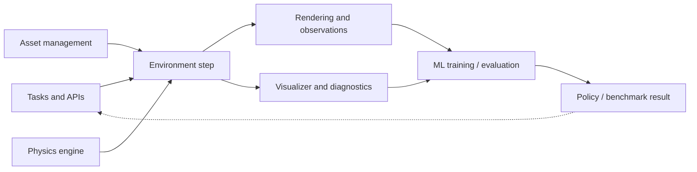

# Robotics Simulation Infrastructure

Robotics simulation infrastructure 是把 physics engine、renderer、assets、task definitions、visualization 和 ML training/evaluation loop 组合成可用 research system 的 layer。[[robotics-simulation-infrastructure|Robotics Simulation Infrastructure]] 的核心贡献不是提出新算法，而是把 simulator framework 看成一组 design decisions：什么容易表达，什么容易并行，什么容易 debug，什么会占用 GPU memory，什么能被 evaluation metrics 看见。

## 数学结构

这篇 source 没有给 formal equations；下面是 wiki 用来整理其 infrastructure stack 的 abstraction。一个 simulation framework 可以写成：

$$
\mathcal{F} = (\mathcal{T}, \mathcal{A}, \mathcal{P}, \mathcal{R}, \mathcal{V}, \mathcal{M}),
$$

其中 $\mathcal{T}$ 是 task/API layer，定义 environments、reset、step、parallelization 和 user-facing scene building；$\mathcal{A}$ 是 asset management layer，定义 geometry、materials、articulations、poses 和 serialization；$\mathcal{P}$ 是 physics engine/runtime；$\mathcal{R}$ 是 rendering engine 和 observation generation；$\mathcal{V}$ 是 visualizer/diagnostic layer；$\mathcal{M}$ 是 machine learning integration，包括 RL training、policy evaluation、replay buffer、network and rollout plumbing。

对一个 policy $\pi_\phi$，framework 的 hidden design parameters $\theta_{\mathcal{F}}$ 会进入 training objective：

$$
J(\phi; \theta_{\mathcal{F}}) = \mathbb{E}_{\tau \sim p_{\theta_{\mathcal{F}}}(\tau \mid \pi_\phi)}\left[\sum_{t=0}^{H} r_{\theta_{\mathcal{F}}}(x_t, a_t, o_t)\right],
$$

其中 $x_t$ 是 simulator state，$a_t$ 是 action，$o_t$ 是 rendered/sensor observation，$r_{\theta_{\mathcal{F}}}$ 是 reward 或 evaluation signal，$p_{\theta_{\mathcal{F}}}$ 是由 task API、asset layout、physics、rendering、parallelization 和 diagnostics 共同决定的 rollout distribution。这个式子的重点是：API 和 infrastructure choices 不只是 developer convenience，它们会选择 data distribution、resource budget、可见 diagnostics 和 failure surface。

```mermaid
flowchart LR
  T["Tasks and APIs"] --> E["Environment step"]
  A["Asset management"] --> E
  P["Physics engine"] --> E
  E --> R["Rendering and observations"]
  E --> V["Visualizer and diagnostics"]
  R --> M["ML training / evaluation"]
  V --> M
  M --> PI["Policy / benchmark result"]
  PI -.-> T
```

## 直觉

Simulation infrastructure 的直觉是：robotics simulator 不是只有 physics correctness，一个 framework 还在分配人类和机器的注意力。Config-driven asset definitions 可以带来 structure、serialization 和 governance，但会降低 ad hoc hackability；direct Python APIs 更容易快速表达 scene 和 experiment，但 structure 与 reproducibility 要靠额外 convention 支撑。两者不是绝对优劣，而是把 complexity 放在不同地方。

Rendering trade-off 也不是纯视觉问题。[[robotics-simulation-infrastructure|source]] 指出，batched rendering 的 GPU memory footprint 会和 RL training 争资源：memory 可以用于 larger batch sizes、replay buffers 和 networks，也可以用于 higher-fidelity rendering。对 PPO/SAC 这类 training loop，renderer 的 design choice 可能通过 sample efficiency、throughput 和 training time 间接影响 performance。

Pose API example 说明 infrastructure 的小接口会在大系统里放大。把 position 和 quaternion 分散在多个 tensors 与 helper functions 中，可能让每个 call site 都携带更多 input variables、imports 和 frame/operation reasoning；`Pose` dataclass 把 pose storage、composition、inverse 和 heterogeneous input conversion 放进 typed object，牺牲少量 Python indirection 来降低 cognitive load。

[[nvidia-ovrtx|NVIDIA ovrtx]] 给这个 infrastructure lens 增加了一个 official sensor-rendering case。ovrtx 把 renderer lifecycle、OpenUSD composition、RenderProduct/RenderVar configuration、DLPack outputs、stage query/read/write、GPU synchronization、warm-up、picking/selection 和 C/Python resource lifetime 都写成 API/documentation surface。也就是说，sensor simulation infrastructure 不只是“render 得像不像”，还包括 outputs 是否 schemaed、device memory 是否可控、async errors 是否可查询、debug interaction 是否能和 rendered output 对齐。

[[unilab-a-heterogeneous-architecture-for-robot-rl-beyond-gpu-dominant-paradigms|UniLab]] 给这个 infrastructure lens 增加了 training-runtime case。它把 robot RL training speed 拆成 CPU-side rollout collection、GPU learner utilization、replay boundary、H2D transfer、buffer slotting 和 parameter synchronization，而不是把 simulator env steps/s 当作唯一 bottleneck。这里的 infrastructure surface 是 [[HeterogeneousRobotRLTraining|heterogeneous robot RL training]]：task/backend contract、domain-randomization lifecycle、sample-before-transfer replay pipeline 和 hot/cold GPU batch slots 都会改变 end-to-end training efficiency。

新增 repo/docs sources 把这个 lens 变成可比较的 robot learning stack taxonomy。[[MuJoCoUni]] 暴露 stateful CPU-batched MuJoCo execution 与 reset-time randomization；[[MotrixSim]] 的 high-level docs 把 Rust CPU implementation、MJCF compatibility 和 proprietary constraint solver 列为 engine surface；[[MJWarp]] / [[MuJoCoPlayground]] / [[Mjlab|mjlab]] 代表 MuJoCo ecosystem 的 GPU-oriented training route；[[IsaacLab]] 代表 NVIDIA Isaac Sim 上的 manager-based RL/IL/motion-planning framework；[[ManiSkill]] 代表 SAPIEN-powered manipulation and visual-data route。它们说明 simulation infrastructure 的 comparison 需要同时看 physics semantics、batching model、rendering/sensor path、task API、RL integration、platform constraints 和 licensing/dependency boundary。

[[embodiedgen-towards-a-generative-3d-world-engine-for-embodied-intelligence|EmbodiedGen]] 与 [[embodiedgen-v2-an-agentic-simulation-ready-3d-world-engine-for-embodied-ai|EmbodiedGen V2]] 增加了 generative asset/world infrastructure case。V1 把 image/text-to-3D、texture、articulation、scene generation 和 layout 组织成 modular services；V2 则明确要求 metric geometry、collision assets、physical parameters、task affordances、standardized URDF/MJCF/USD interfaces 和 executable scene validation。它们共同说明 generation model 只是 infrastructure 的入口：robot learning 真正消费的是经过 repair、decomposition、parameter recovery、semantic annotation、constraint solving 和 simulator import/settling 检查的 artifact contract。

## RoboLab as infrastructure case study

[[nvlabs-robolab|RoboLab]] 的 updated repository 是这个 concept 的 concrete case：它把 simulator framework 拆成 task dataclasses、USD scene/assets、environment registration、policy backend adapters、evaluation runner、analysis scripts、dashboard、diagnostic tests、known issues 和 agentic authoring workflows。这里的 infrastructure value 不只在 Isaac Lab/Sim fidelity，而在每层是否形成可复查 contract：policy backend 有 `InferenceClient` hooks，tasks 有 predicates/subtasks，dashboard 有 scene/task/result APIs，analysis 有 confidence intervals，debug docs 有 WorldState inspection 和 pytest diagnostics。

RoboLab 也展示了 infrastructure 的 governance side。Apache-2.0 code license、third-party notices、`uv run pytest tests/` install verification、`docs/known_issues.md`、L40 `num_envs` guide 和 `_wip` asset removal 都不是 algorithmic novelty，却会影响 benchmark reproducibility、maintainability 和 reviewer trust。[[AgenticSceneTaskGeneration|agentic scene/task generation]] 降低 authoring cost，但必须接入 catalog、solver、task metadata、registration and health checks，才能避免把 LLM-generated artifacts 变成 ungoverned benchmark churn。

## Failure Modes

- Framework comparison 被误读成 engine ranking：source 的判断主要是 API、visualizer、rendering 和 developer ergonomics，不是证明某个 physics engine 或 framework universally better。
- Config-driven asset schemas 过强：环境更 structured、可序列化，但 beginner 或 LLM scene building 可能更难快速 experiment。
- Direct Python APIs 过松：scene authoring 更 flexible/hackable，但如果没有明确 schema，serialization、versioning、large benchmark governance 和 review 会变困难。
- Rendering fidelity/memory mismatch：为 high-fidelity batched rendering 付出的 GPU memory 可能挤压 RL batch size、replay buffer 或 network capacity；过度追求 throughput 又可能漏掉视觉假设需要的 fidelity。
- Visualizer under-instrumentation：如果 visualizer 只显示 physics state 而不显示 reward、policy behavior、past states 或 diagnostics，evaluation 的 failure type 会变难定位。
- Pose abstraction 过薄：分散的 tensor/function API 增加 import surface、frame reasoning 和 function-call complexity；但过厚的 object abstraction 也可能引入 Python overhead 或 backend compatibility burden。
- Sensor output contract 过隐式：如果 camera/lidar/radar output 只是 opaque buffer，ML loop 很难稳定处理 device、shape、valid counts、params、semantic labels 和 synchronization。[[RTXSensorSimulationPipeline]] 中的 `RenderVar` / DLPack contract 是 ovrtx 对这个问题的 source-backed answer。
- Training runtime contract 过隐式：如果只报告 simulator throughput，而不记录 learner wait、replay sampling、H2D transfer、buffer residency 和 weight sync，robot RL system comparison 可能测到的是 runtime placement，而不是 algorithm 或 physics backend 本身。
- Evidence boundary：当前 page 已从一篇 engineering article 扩展到 official docs / repo snapshots，但多数 repo README 仍是 moving target；framework-specific benchmark、release tag、paper-level architecture 和 code-level semantics 需要按版本继续 ingest。

## 实践含义

- 选择 simulator framework 时，应同时审计 task API、asset authoring、physics/rendering、visualizer、ML integration 和 parallel evaluation，而不是只看 engine name 或 headline fidelity。
- 对 [[TaskGeneralistPolicyEvaluation|policy evaluation]]，infrastructure 决定 tasks 是否容易扩展、success predicates 是否可维护、diagnostics 是否能定位 wrong-object / reward / trajectory failures，以及多 policy evaluation 是否可并行。
- 对 [[SimulationRealityGap|sim-to-real]]，gap 的上游不只包括 contact law 和 rendering mismatch，也包括 framework API 能不能表达 hardware-relevant variation、visualizer 能不能暴露 failure、ML loop 能不能保留足够训练资源。
- 对 LLM-assisted scene/task generation，typed objects、clear task APIs 和 composable asset schemas 会影响 LLM 能否稳定生成可运行 scene，而不只是影响 human developer ergonomics。
- 对 sensor-heavy robotics workflows，应该审计 RenderProduct/RenderVar schema、output channels、validity flags、warm-up policy、GPU mapping lifetime 和 multi-GPU behavior，因为这些决定 observation tensor 是否可复现、可调试、可接到 ML pipeline。
- 对 simulation-based robot RL training，应该审计 full learner cycle：collection、packing、H2D、learner update、replay hot path、boundary wait 和 parameter publication。UniLab 的 source-backed lesson 是，GPU-resident physics 是有效路线，但不是唯一能形成高效 training loop 的路线。
- 对 framework comparison，应显式记录 route 类型：CPU-batched stateful execution、GPU-resident physics、GPU rendering/data generation、manager-based task composition、manipulation-focused visual data collection。不同 route 的 failure surface 不同，不能被一个 aggregate throughput number 代表。
- 对 generative world engine，应分别审计 appearance generation 与 simulation readiness：metric scale、watertightness、collision decomposition、mass/friction/inertia provenance、joint semantics、affordance quality、format conversion 和 simulator-side execution evidence 不能被一个 visual-quality score 合并。

相关页面：[[robotics-simulation-infrastructure]]、[[nvidia-ovrtx]]、[[unilab-a-heterogeneous-architecture-for-robot-rl-beyond-gpu-dominant-paradigms]]、[[nvlabs-robolab]]、[[EmbodiedGen]]、[[SimulationReady3DWorldGeneration]]、[[RTXSensorSimulationPipeline]]、[[HeterogeneousRobotRLTraining]]、[[AgenticSceneTaskGeneration]]、[[SimulationBenchmarkReportingPipeline]]、[[RoboLab]]、[[UniLab]]、[[MuJoCoUni]]、[[MotrixSim]]、[[MJWarp]]、[[Mjlab|mjlab]]、[[MuJoCoPlayground]]、[[IsaacLab]]、[[ManiSkill]]、[[IsaacSim]]、[[Ovrtx]]、[[MuJoCo]]、[[TaskGeneralistPolicyEvaluation]]、[[SimulationRealityGap]]、[[IsaacSimAssetStructure]]。
