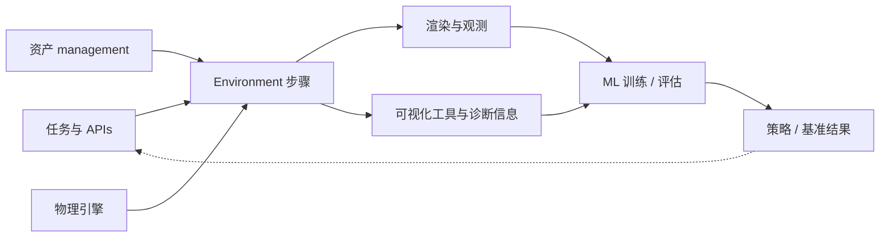

# 机器人仿真基础设施

机器人学仿真基础设施是把物理引擎、渲染器、资产、任务 definitions、可视化和 ML 训练/评估循环组合成可用研究系统的层。[[robotics-simulation-infrastructure|机器人学仿真基础设施]] 的核心贡献不是提出新算法，而是把仿真器框架看成一组设计决策：什么容易表达，什么容易并行，什么容易调试，什么会占用 GPU 内存，什么能被评估指标看见。

## 数学结构

这篇来源没有给 formal equations；下面是知识库用来整理其基础设施技术栈的抽象。一个仿真框架可以写成：

$$
\mathcal{F} = (\mathcal{T}, \mathcal{A}, \mathcal{P}, \mathcal{R}, \mathcal{V}, \mathcal{M}),
$$

其中 $\mathcal{T}$ 是任务/API 层，定义环境、重置、步骤、并行化和用户-facing 场景 building；$\mathcal{A}$ 是资产 management 层，定义几何、材质、关节系统、poses 和序列化；$\mathcal{P}$ 是物理引擎/运行时；$\mathcal{R}$ 是渲染引擎和观测生成；$\mathcal{V}$ 是可视化工具/诊断层；$\mathcal{M}$ 是机器学习集成，包括 RL 训练、策略评估、重放缓冲区、网络与轨迹采样 plumbing。

对一个策略 $\pi_\phi$，框架的隐藏的设计参数 $\theta_{\mathcal{F}}$ 会进入训练目标：

$$
J(\phi; \theta_{\mathcal{F}}) = \mathbb{E}_{\tau \sim p_{\theta_{\mathcal{F}}}(\tau \mid \pi_\phi)}\left[\sum_{t=0}^{H} r_{\theta_{\mathcal{F}}}(x_t, a_t, o_t)\right],
$$

其中 $x_t$ 是仿真器状态，$a_t$ 是动作，$o_t$ 是渲染的/传感器观测，$r_{\theta_{\mathcal{F}}}$ 是奖励或评估 signal，$p_{\theta_{\mathcal{F}}}$ 是由任务 API、资产布局、物理、渲染、并行化和诊断信息共同决定的轨迹采样分布。这个式子的重点是：API 和基础设施选择不只是开发者便捷方法，它们会选择数据分布、资源预算、可见诊断信息和失败表面。

```mermaid
flowchart LR
  T["任务与 APIs"] --> E["Environment 步骤"]
  A["资产 management"] --> E
  P["物理引擎"] --> E
  E --> R["渲染与观测"]
  E --> V["可视化工具与诊断信息"]
  R --> M["ML 训练 / 评估"]
  V --> M
  M --> PI["策略 / 基准结果"]
  PI -.-> T
```

## 直觉

仿真基础设施的直觉是：机器人学仿真器不是只有物理正确性，一个框架还在分配人类和机器的注意力。配置驱动的资产 definitions 可以带来结构、序列化和治理，但会降低 ad hoc 可修改性；直接使用 Python 的 APIs 更容易快速表达场景和实验，但结构与 reproducibility 要靠额外约定支撑。两者不是绝对优劣，而是把复杂度放在不同地方。

渲染取舍也不是纯视觉问题。[[robotics-simulation-infrastructure|来源]] 指出，批处理的渲染的 GPU 内存 footprint 会和 RL 训练争资源：内存可以用于 larger 批次大小、重放缓冲区和神经网络，也可以用于更高的保真度渲染。对 PPO/SAC 这类训练循环，渲染器的设计选择可能通过样本效率、吞吐量和训练时间间接影响性能。

`Pose` API 示例说明，基础设施中的小接口会在大系统里被放大。把位置和四元数分散在多个张量与辅助函数中，可能迫使每个调用位置携带更多输入变量、导入和坐标帧/操作推理；`Pose` 数据类则把位姿存储、组合、求逆和异构输入转换放进类型化对象，以少量 Python 间接访问开销换取更低的认知负担。

[[nvidia-ovrtx|NVIDIA ovrtx]] 给这个基础设施视角增加了一个官方传感器渲染情形。ovrtx 把渲染器生命周期、OpenUSD 组合、RenderProduct/RenderVar 配置、DLPack 输出、阶段查询/read/write、GPU 同步、warm-up、picking/选择和 C/Python 资源生命周期都写成 API/文档表面。也就是说，传感器仿真基础设施不只是“渲染得像不像”，还包括输出是否 schemaed、设备内存是否可控、异步错误是否可查询、调试交互是否能和渲染的输出对齐。

[[unilab-a-heterogeneous-architecture-for-robot-rl-beyond-gpu-dominant-paradigms|UniLab]] 给这个基础设施视角增加了训练运行时情形。它把机器人 RL 训练速度拆成 CPU 侧轨迹采样采集、GPU 学习器利用率、重放边界、H2D 迁移、缓冲区 slotting 和参数同步，而不是把仿真器 env 步骤/s 当作唯一瓶颈。这里的基础设施表面是 [[HeterogeneousRobotRLTraining|异构机器人 RL 训练]]：任务/后端契约、域随机化生命周期、样本-before-迁移重放流程和 hot/cold GPU 批次槽都会改变端到端训练效率。

新增代码仓库/文档来源把这个视角变成可比较的机器人学习技术栈分类体系。[[MuJoCoUni]] 暴露有状态的 CPU-批处理的 MuJoCo 执行与重置时间随机化；[[MotrixSim]] 的高层文档把 Rust CPU 实现、MJCF 兼容性和专有的约束求解器列为引擎表面；[[MJWarp]] / [[MuJoCoPlayground]] / [[Mjlab|mjlab]] 代表 MuJoCo 生态的面向 GPU 的训练路线；[[IsaacLab]] 代表 NVIDIA Isaac Sim 上的基于管理器的 RL/IL/运动规划框架；[[ManiSkill]] 代表 SAPIEN-powered 操作与视觉数据路线。它们说明仿真基础设施的比较需要同时看物理语义、batching 模型、渲染/传感器路径、任务 API、RL 集成、平台约束和许可/依赖边界。

[[embodiedgen-towards-a-generative-3d-world-engine-for-embodied-intelligence|EmbodiedGen]] 与 [[embodiedgen-v2-an-agentic-simulation-ready-3d-world-engine-for-embodied-ai|EmbodiedGen V2]] 增加了生成式资产与世界基础设施案例。V1 把图像/文本到三维、纹理、关节系统、场景生成和布局组织成模块化服务；V2 则明确要求公制几何、碰撞资产、物理参数、任务可供性、标准化 URDF/MJCF/USD 接口和可执行场景验证。它们共同说明生成模型只是基础设施的入口：机器人学习真正消费的是经过修复、分解、参数恢复、语义标注、约束求解和仿真器导入/沉降检查的产物契约。

[[magicsim-a-unified-infrastructure-for-executable-embodied-interaction|MagicSim]] 把基础设施视角推进到可执行回合：一个初态、任务 MDP、命令 / 技能 / 规划状态、机器人动作、观测、语言、终态与记录门控必须在同一运行时中对齐。它在单个 Isaac Sim 进程内同步物理步骤、按环境异步推进语义状态，并让同一任务被 RL、自动采集和智能体接口复用。这个案例的重点不是新的物理求解器，而是 [[ExecutableEmbodiedInteractionInfrastructure|可执行具身交互基础设施]] 如何把评测和数据生成放在同一因果轨迹上。

## 作为训练—评测基础设施案例的 RoboCasa365

[[robocasa365-a-large-scale-simulation-framework-for-training-and-benchmarking-generalist-robots|RoboCasa365]] 展示了另一类基础设施：它不只提供可执行任务，而是让资产、场景、任务、示范生成、策略训练和评测分组形成同一实验表面。底层使用 RoboSuite 与 MuJoCo，物理主要在 CPU 上运行、渲染在 GPU 上运行，单环境与操作空间控制器均为 20 Hz；多个环境异步并行。Franka Panda 加 Omron 底盘使用 12 维动作，其中七维控制机械臂与夹爪，五维控制底盘、躯干高度和底盘门控。

它的基础设施贡献体现在可改变的数据生成轴：50 种布局与 50 种风格组合出 2,500 个预训练厨房，任务分成 65 个原子任务与 300 个组合任务，人类遥操作示范与 MimicGen 合成示范共用任务/场景定义，评测再分成原子、已见组合和未见组合。由此，任务覆盖、场景覆盖、示范来源与训练阶段可以成为受控变量，而不只是静态数据集元数据。

这个案例也说明“支持大规模数据生成”不等于“生成数据必然有效”。Human300+MG60 比 Human300 数据更多，但下游成功率略低；基础设施若没有轨迹质量、失败类型、过滤比例和采样权重契约，就只能扩大数据量，不能保证扩大有效监督。见 [[RobotLearningDataComposition|机器人学习数据构成]]。

## 作为基础设施案例的 RoboLab

[[nvlabs-robolab|RoboLab]] 的 updated 代码仓库是这个概念的具体的情形：它把仿真器框架拆成任务数据类、USD 场景/资产、环境 registration、策略后端 adapters、评估运行器、分析脚本、看板、诊断测试、已知问题和智能体式制作流程。这里的基础设施价值不只在 Isaac Lab/Sim 保真度，而在每层是否形成可复查契约：策略后端有 `InferenceClient` hooks，任务有判定条件/子任务，看板有场景/任务/结果 APIs，分析有置信区间，调试文档有 WorldState 检查和 pytest 诊断信息。

RoboLab 也展示了基础设施的治理侧。Apache-2.0 代码许可证、third-party notices、`uv run pytest tests/` 安装验证、`docs/known_issues.md`、L40 `num_envs` 指南和 `_wip` 资产 removal 都不是算法创新，却会影响基准 reproducibility、可维护性和 reviewer trust。[[AgenticSceneTaskGeneration|智能体式场景/任务生成]] 降低制作成本，但必须接入目录、求解器、任务元数据、registration 与健康检查，才能避免把 LLM 生成的产物变成 ungoverned 基准 churn。

## 失效情形

- 框架比较被误读成引擎 ranking：来源的判断主要是 API、可视化工具、渲染和开发者 ergonomics，不是证明某个物理引擎或框架 universally 更好的。
- 配置驱动的资产模式过强：环境更结构化的、可序列化，但 beginner 或 LLM 场景 building 可能更难快速实验。
- 直接 Python APIs 过松：场景制作更灵活/便于修改，但如果没有明确模式，序列化、versioning、大规模基准治理和审查会变困难。
- 渲染保真度/内存不匹配：为高保真度批处理的渲染付出的 GPU 内存可能挤压 RL 批次尺寸、重放缓冲区或网络 capacity；过度追求吞吐量又可能漏掉视觉假设需要的保真度。
- 可视化工具 under-诊断工具：如果可视化工具只显示物理状态而不显示奖励、策略行为、past 状态或诊断信息，评估的失败类型会变难定位。
- Pose 抽象过薄：分散的张量/函数 API 增加导入表面、帧推理和函数-调用复杂度；但过厚的物体抽象也可能引入 Python 开销或后端兼容性负担。
- Sensor 输出契约过隐式：如果相机/lidar/radar 输出只是不透明的缓冲区，ML 循环很难稳定处理设备、形状、valid counts、参数、语义标签和同步。[[RTXSensorSimulationPipeline]] 中的 `RenderVar` / DLPack 契约是 ovrtx 对这个问题的有来源支持的 answer。
- 训练运行时契约过隐式：如果只报告仿真器吞吐量，而不记录学习器等待、重放采样、H2D 迁移、缓冲区 residency 和权重同步，机器人 RL 系统比较可能测到的是运行时放置，而不是算法或物理后端本身。
- 证据边界：当前页面已从一篇工程 article 扩展到官方文档 / 代码仓库 snapshots，但多数代码仓库 README 仍是 moving 目标；框架特定的基准、发布 tag、论文层级架构和代码层级语义需要按版本继续收录。
- 可执行能力与实验结果混淆：共享 MDP、任务注册表、技能词表和智能体接口说明系统可表达什么，不等于已经测量策略质量、吞吐量、物理准确性或硬件迁移效果。MagicSim 论文中的当前 / 计划能力必须分开阅读。
- 数据生成能力与数据价值混淆：能批量生成大量成功轨迹不等于这些轨迹在接触质量、动作分布、任务覆盖和目标域相关性上适合训练；需要把生成尝试、过滤和下游消融纳入基础设施契约。

## 实践含义

- 选择仿真器框架时，应同时审计任务 API、资产制作、物理/渲染、可视化工具、ML 集成和并行评估，而不是只看引擎名称或 headline 保真度。
- 对 [[TaskGeneralistPolicyEvaluation|策略评估]]，基础设施决定任务是否容易扩展、成功判定条件是否可维护、诊断信息是否能定位错误物体 / 奖励 / 轨迹失败，以及多策略评估是否可并行。
- 对 [[SimulationRealityGap|仿真到现实迁移]]，差距的上游不只包括接触定律和渲染不匹配，也包括框架 API 能不能表达硬件相关的变化、可视化工具能不能暴露失败、ML 循环能不能保留足够训练资源。
- 对 LLM 辅助的场景/任务生成，类型化的物体、clear 任务 APIs 和 composable 资产模式会影响 LLM 能否稳定生成可运行场景，而不只是影响人类开发者 ergonomics。
- 对传感器-密集型机器人学流程，应该审计 RenderProduct/RenderVar 模式、输出通道、有效性 flags、warm-up 策略、GPU 映射生命周期和多-GPU 行为，因为这些决定观测张量是否可复现、可调试、可接到 ML 流程。
- 对基于仿真的机器人 RL 训练，应该审计完整学习器周期：采集、打包、H2D、学习器更新、重放 hot 路径、边界等待和参数 publication。UniLab 的有来源支持的 lesson 是，驻留 GPU 的物理是有效路线，但不是唯一能形成高效训练循环的路线。
- 对框架比较，应显式记录路线类型：CPU-批处理的有状态的执行、驻留 GPU 的物理、GPU 渲染/数据生成、基于管理器的任务组合、操作-focused 视觉数据采集。不同路线的失败表面不同，不能被一个汇总吞吐量数值代表。
- 对 generative 世界引擎，应分别审计外观生成与仿真可用性：公制尺度、watertightness、碰撞分解、质量/摩擦/惯量 provenance、关节语义、可供性质量、格式转换和仿真器侧执行证据不能被一个视觉质量得分合并。
- 对可执行数据基础设施，应把初态快照、随机流隔离、规划 future、技能阶段、任务谓词、失败类型和成功门控比例纳入数据质量报告；只统计最终保存轨迹会隐藏尝试分布和恢复能力。
- 对大规模模仿学习基础设施，应同时版本化任务/场景划分、示范来源、质量标签、采样权重和预训练—后训练顺序；这些因素会像物理/渲染配置一样改变结果。

相关页面：[[robotics-simulation-infrastructure]]、[[nvidia-ovrtx]]、[[unilab-a-heterogeneous-architecture-for-robot-rl-beyond-gpu-dominant-paradigms]]、[[nvlabs-robolab]]、[[MagicSim]]、[[ExecutableEmbodiedInteractionInfrastructure]]、[[RoboCasa365]]、[[RobotLearningDataComposition]]、[[EmbodiedGen]]、[[SimulationReady3DWorldGeneration]]、[[RTXSensorSimulationPipeline]]、[[HeterogeneousRobotRLTraining]]、[[AgenticSceneTaskGeneration]]、[[SimulationBenchmarkReportingPipeline]]、[[RoboLab]]、[[UniLab]]、[[MuJoCoUni]]、[[MotrixSim]]、[[MJWarp]]、[[Mjlab|mjlab]]、[[MuJoCoPlayground]]、[[IsaacLab]]、[[ManiSkill]]、[[IsaacSim]]、[[Ovrtx]]、[[MuJoCo]]、[[TaskGeneralistPolicyEvaluation]]、[[SimulationRealityGap]]、[[IsaacSimAssetStructure]]。
