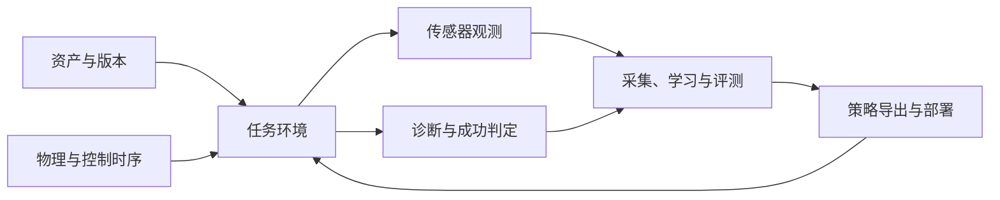

# 机器人仿真基础设施

仿真基础设施把物理、渲染、资产、任务和学习系统接成可运行实验。它的质量不只取决于引擎名称，还取决于数据能否正确流动、任务能否复现、失败能否诊断。[[robotics-simulation-infrastructure|原始工程文章]] 提供接口设计观点，后续官方文档与系统论文补充具体契约。

## 数学结构

下面是知识库的组织抽象，不是来源提出的新算法：

$$
\mathcal F=(\mathcal T,\mathcal A,\mathcal P,\mathcal R,\mathcal V,\mathcal M).
$$

$\mathcal T$ 是任务与环境接口，$\mathcal A$ 是资产，$\mathcal P$ 是物理运行时，$\mathcal R$ 是渲染与观测，$\mathcal V$ 是可视化及诊断，$\mathcal M$ 是学习与评测集成。任务、资产、动力学和观测共同定义轨迹分布及奖励；运行资源又限制能采多少有效轨迹。因此“环境步数每秒”只覆盖实验成本的一部分。

```mermaid
flowchart LR
  A["资产与版本"] --> E["任务环境"]
  P["物理与控制时序"] --> E
  E --> R["传感器观测"]
  E --> V["诊断与成功判定"]
  R --> M["采集、学习与评测"]
  V --> M
  M --> D["策略导出与部署"]
  D --> E
```

图强调每条连接都需接口与版本记录，不能只把组件名单写在一起。

## 六个接口需要回答的问题

| 接口 | 必须明确 | 阅读入口 |
| --- | --- | --- |
| 资产 → 物理 | 尺度、惯量、碰撞、关节和驱动归属 | [[IsaacSimAssetStructure|资产分层]]、[[RobotRigidBodyDynamics|动力学]] |
| 环境 → 策略 | 观测顺序、形状、单位、动作含义与历史 | [[PolicyDeploymentContract|部署契约]] |
| 物理 → 观测 | 采样阶段、时间戳与同步 | [[RoboticsSimulationLoop|仿真循环]]、[[RTXSensorSimulationPipeline|传感器输出]] |
| 环境 → 采集 | 重置、随机化、终止与记录条件 | [[ExecutableEmbodiedInteractionInfrastructure|可执行交互]] |
| 采集 → 学习 | 设备、缓冲区、打包、传输与权重同步 | [[HeterogeneousRobotRLTraining|异构训练]] |
| 评测 → 结论 | 任务／场景划分、试验量、失败分类与版本 | [[SimulationBenchmarkReportingPipeline|基准报告]] |

## 接口和资源怎样影响体验

配置驱动接口便于序列化和治理，直接 Python 接口便于快速修改；原始文章提出的是开发取舍，不是物理准确性排名。它的 `Pose` 对象例子将位姿组合、求逆和转换集中表达，降低到处手工推理坐标的负担；这种抽象也有间接调用开销。[[RobotCoordinateFrames|坐标语义]] 仍需保持明确。

高保真批量渲染占用的 GPU 内存会与策略网络、批次和经验回放竞争。[[nvidia-ovrtx|ovrtx 官方文档]] 把 `RenderProduct`／`RenderVar`、DLPack、预热、输出有效性和同步写成具体接口；画面正确不等于观测张量可直接消费。[[unilab-a-heterogeneous-architecture-for-robot-rl-beyond-gpu-dominant-paradigms|UniLab]] 则拆开 CPU 采集、GPU 学习、主机到设备传输、缓冲区与参数同步，提醒端到端瓶颈可能位于学习运行时。

### 近期部署接口变化

[[isaac-sim-policy-deployment|Isaac Sim 6.1 指南]]（页面更新 2026-09-18）用 `RobotPolicyRunner` 连接模型、`IO_descriptors.yaml` 与 `env.yaml`：分别记录推理、实际张量／关节语义和物理／执行器配置。运行器内部管理策略降频，外部每个物理步调用一次；自定义历史或观测项仍需实现绑定。

这是一项版本限定的接口改进，不是无需真实验证的保证。已有 [[IsaacSimLegacyAssetStructure|旧版资产结构]] 和跨引擎笔记保留原适用版本；升级时先核对产物来源、资产、物理、驱动和周期。

## 不同系统提供什么证据

| 路线或实例 | 观察到的基础设施能力 | 解释边界 |
| --- | --- | --- |
| [[mujocouni-persistent-batched-runtime-primitives-for-mujoco|MuJoCoUni]] | 有状态 CPU 批处理、重置时随机化 | 不能把该接口等同所有 MuJoCo 后端 |
| [[motrixsim-documentation|MotrixSim]] | Rust CPU、MJCF 导入与自身求解器 | 格式兼容不证明逐步动力学等价 |
| [[mujoco-warp-mjwarp-documentation|MJWarp]]、[[mujoco-playground-repository|Playground]]、[[mjlab-repository|mjlab]] | MuJoCo 生态 GPU 与训练路线 | 比较需固定版本和支持的物理／传感器特性 |
| [[isaac-lab-repository|Isaac Lab]]、[[maniskill-repository|ManiSkill]] | 任务组合与操作／视觉学习 | 框架 API 取舍不能直接成为引擎精度排名 |
| [[embodiedgen-towards-a-generative-3d-world-engine-for-embodied-intelligence|EmbodiedGen]]／[[embodiedgen-v2-an-agentic-simulation-ready-3d-world-engine-for-embodied-ai|V2]] | 从生成到修复、碰撞、参数与接口验证 | 可执行资产不等于真实物理参数 |
| [[magicsim-a-unified-infrastructure-for-executable-embodied-interaction|MagicSim]] | 同一运行时对齐初态、任务、技能、动作、终态和记录门控 | 已实现与计划能力分开，接口存在不代表任务效果已测量 |
| [[nvlabs-robolab|RoboLab]] | 任务数据类、策略适配、诊断、结果分析和场景制作 | 代码快照能力与可复现基准结果分开 |

RoboLab 的许可证、第三方声明、已知问题、安装测试和资产治理同样影响可复现性；智能体生成场景必须接入任务注册与验证。[[AgenticSceneTaskGeneration|场景与任务生成]] 的低制作成本，不能替代任务语义和成功条件检查。

### RoboCasa365：数据与评测共享定义

[[robocasa365-a-large-scale-simulation-framework-for-training-and-benchmarking-generalist-robots|RoboCasa365]] 将 50 种布局与 50 种风格组合为 2,500 个预训练厨房，65 个原子任务与 300 个组合任务共用示范生成、训练和评测定义。它的 12 维动作包含机械臂／夹爪与移动底盘控制，任务控制周期为 20 Hz；这不意味着底层物理积分也只有 20 Hz。

人类遥操作与 MimicGen 合成示范共用实验表面，使场景、任务、来源与训练阶段可作为变量；但 Human300+MG60 数据更多而下游表现略低，说明数据生成规模不能代替质量、过滤与采样权重。具体实验与统计范围见来源页和 [[RobotLearningDataComposition|数据构成]]。

## 失效情形

- **只展示物理画面**：缺少奖励、成功谓词、历史状态和失败分类，容易看见动作却解释不了结果。
- **输出缓冲区语义隐式**：形状、设备、有效计数、语义标签和同步未说明，学习系统无法可靠读取。ovrtx 提供对应契约。
- **只报仿真吞吐量**：忽略渲染、采样、传输、学习器等待和权重同步，比较的可能是运行时放置而非算法。
- **接口存在就宣称能力完成**：可执行任务、批量生成或部署 API，不等于已有硬件成功或独立评测。
- **版本与后端被省略**：MuJoCo 官方只保证同版本、同体系结构下的精确重放；跨版本和跨引擎需分别验证。

## 实践含义

比较技术栈时，先描述 CPU／GPU 物理、渲染、任务组织和学习运行时路线，再比较具体能力与成本。记录任务／资产划分、随机化时刻、控制周期、观测接口、生成尝试与过滤比例、训练采样权重和部署产物；这些建议来自上述机制与案例，不构成统一框架排名。问题队列统一见 [[research-questions|研究问题与缺口]]，硬件迁移诊断见 [[SimulationRealityGap|现实差距]]。
