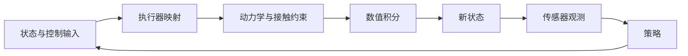

# 机器人仿真循环

机器人仿真把当前状态和控制输入推进为下一状态，再生成策略可读取的观测。学习它时先分清四件事：**模型描述系统、状态描述当下、控制作用于执行器、观测描述可见信息**。这组分工在 [[mujoco-overview|MuJoCo 官方总览]] 中对应 `mjModel`、`mjData`、执行器与传感器。

## 从一个抓取动作理解

教学例子：策略输出“夹爪闭合到目标位置”，驱动器根据位置误差与速度计算作用力；碰撞检测找到手指与杯子的接触，约束求解决定接触响应，积分器更新关节与杯子状态。下一张图像来自更新后的场景。目标位置、实际位置、驱动力和接触力分别处在不同环节，不能用一个“动作值”替代。位置驱动的具体语义见 [[ReducedCoordinateArticulations|关节系统与驱动]]。

## 数学结构

以下是教学抽象，不是某个引擎的逐函数调用顺序。设 $\eta$ 为质量、惯量、几何和执行器等模型参数，$x_t=(q_t,v_t,w_t)$ 为动态状态：$q_t$ 是广义位置，$v_t$ 是广义速度，$w_t$ 是必要的执行器内部状态。控制输入为 $u_t$，时间步为 $\Delta t$，观测为 $o_t$，相机或传感器配置为 $c$：

$$
x_{t+1}=F_{\Delta t}(x_t,u_t;\eta),\qquad o_{t+1}=G(x_{t+1};\eta,c).
$$

这里 $F$ 包含执行器、力与约束计算及积分，$G$ 表示观测生成。MuJoCo 的 `mj_step` 负责状态推进，RGB／深度渲染需要程序另行调用；ovrtx 的渲染输出又有自己的产品、张量映射与同步契约。[[mujoco-overview|MuJoCo 总览]]、[[RTXSensorSimulationPipeline|RTX 传感器仿真流程]]

不能默认 $v_t=\dot q_t$ 是同维数组：自由关节的位姿包含 3 个平移数值与 4 个四元数数值，而速度只有 3 个线速度与 3 个角速度。位姿需要符合其几何结构的积分方式，见 [[RobotCoordinateFrames|坐标与位姿]]。状态推进中的加速度来自 [[RobotRigidBodyDynamics|刚体动力学]]，推进方式见 [[SimulationTimeStepping|积分与控制频率]]。

### 观测在哪个时刻生效

上面的 $o_{t+1}$ 是教学约定，不能直接当成所有引擎缓存的时间语义。MuJoCo 3.8 的 `mj_step` 最后才积分状态，位置相关传感器与雅可比等派生量可能仍对应之前的位置；改写 `qpos` 后也须显式调用相应计算阶段。读取观测时，应同时记录采样时间和派生计算阶段。[[mujoco-computation-collision-detection|MuJoCo 数据一致性章节]]

策略也未必每个物理步更新。Isaac Sim 6.1 的运行器每个物理步调用一次，但内部按导出配置降低策略更新频率，期间保持上一条命令。这个运行条件属于 [[PolicyDeploymentContract|部署契约]]，不能与显示帧率混用。

## 直觉：模型与状态分开看

| 对象 | 例子 | 检查的问题 |
| --- | --- | --- |
| 模型 | 质量、惯量、几何、关节轴、执行器定义 | 系统究竟被建模成什么？ |
| 状态 | 关节位置、速度、执行器激活量 | 系统现在在哪里、怎样运动？ |
| 控制 | 力矩命令、位置目标、其他执行器输入 | 输入经过什么映射才成为作用力？ |
| 观测 | 编码器、相机、IMU、力传感器 | 策略实际能知道什么？ |

MuJoCo 中 `body`、`geom`、`site` 也各有职责：刚体持有惯性，几何体用于外观与碰撞，参考点用于标记位置和传感器等用途。画面可见的几何不一定参与碰撞，传感器参考位置也不一定有质量。[[mujoco-overview|MuJoCo 总览]]

这张图省略了引擎的内部缓存与计算重排，只用于追踪因果关系。具体接触模型见 [[ContactModelsInRobotics|机器人学中的接触模型]]，计算出的接触响应见 [[ContactSolvers|Contact Solvers]]。

## 失效情形

- **时间步不合适**：MuJoCo 总览指出发散可能与时间步、积分器或初始穿透有关；不要只归因于策略。
- **单位不自洽**：长度、质量、时间需要构成一致单位制；XML 角度配置与运行时弧度也应区分。
- **动作语义误读**：控制量需要通过执行器；跨系统迁移时必须核对驱动与动作映射。[[omniverse-omni-physics-articulations|Omni 物理关节文档]]
- **观测不同步**：渲染预热、GPU 映射和输出完成时间需要遵循传感器接口规则。[[nvidia-ovrtx|NVIDIA ovrtx 文档]]

## 实践含义

检查一个仿真环境时，先记录模型、初态、控制量、物理时间步和观测接口，再解释奖励和成功条件。这是基于上述结构提出的工程检查顺序，不是经过比较实验验证的最优流程。接到学习侧时，继续读 [[MarkovDecisionProcesses|Markov Decision Process (MDP)]]；排查现实迁移时，继续读 [[SimulationRealityGap|Sim-to-Real Gap]]。

## 自测

同一条位置目标命令为什么可能产生不同力矩？为什么一张 RGB 图像通常不足以完整描述机器人状态？前者需要考虑当前位置、速度与执行器定义，后者需要考虑观测遗漏的信息。用上表逐项说明，就抓住了本页的主要区别。

## 研究归属

[[topics/evaluation-and-transfer|评测与 Sim-to-Real]] · [[topics/simulation-transfer|Sim-to-Real]]。
