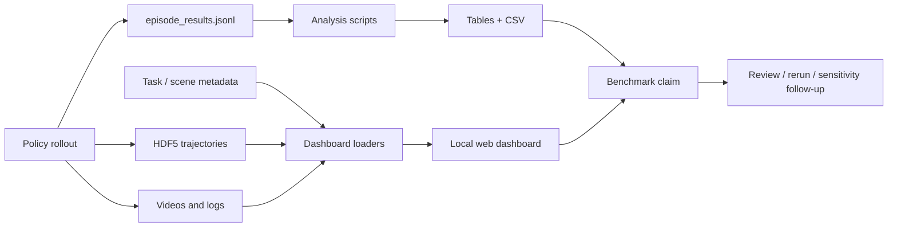

# Simulation Benchmark Reporting Pipeline

Simulation benchmark reporting pipeline（仿真 benchmark 报告流水线）指从 episode rollout 到可审计结果报告之间的 infrastructure layer：它把 raw trajectories、event logs、subtask scores、videos、task metadata、policy metadata 和 statistical uncertainty 转成可比较、可浏览、可复查的 benchmark evidence。[[RoboLab]] 的 2026-06 repo refresh 把这个 layer 从 scripts 升级为 first-class design surface：`analysis/read_results.py`、`docs/statistical_significance.md`、`dashboard/`、`episode_results.jsonl`、HDF5 episode data 和 `robolab-dashboard` CLI 共同形成 reporting contract。

## 数学结构

一次 evaluation run 可以写成 episode set：

$$
D = \{(T_i, \pi_j, e_k, y_{ijk}, s_{ijk}, m_{ijk}, v_{ijk})\},
$$

其中 $T_i$ 是 task，$\pi_j$ 是 policy/backend，$e_k$ 是 episode index，$y_{ijk}\in\{0,1\}$ 是 success indicator，$s_{ijk}\in[0,1]$ 是 subtask/graded score，$m_{ijk}$ 是 metrics（duration、trajectory smoothness、path length、wrong-object events 等），$v_{ijk}$ 是 video/HDF5/log artifact references。

对某个 task-policy pair，success rate posterior 使用 uniform prior：

$$
p_i \mid k,n \sim \mathrm{Beta}(k+1,n-k+1),
$$

其中 $k=\sum_e y_{i,e}$，$n$ 是 episodes 数。95% credible interval 是：

$$
[\mathrm{BetaPPF}(0.025;k+1,n-k+1),\;\mathrm{BetaPPF}(0.975;k+1,n-k+1)].
$$

RoboLab 的 adaptive sampling rule 可以抽象成：

$$
\mathrm{continue}(k,n)=\left[(u(k,n)-l(k,n)) > \epsilon\right] \land (n<N_{max}),
$$

其中 $u-l$ 是 credible interval width，$\epsilon$ 对应 CLI `--ci-pp-width`，$N_{max}$ 对应 `--num-episodes-adaptive`。Score 类 continuous metric 则用均值、std 和 Student-t interval 报告。

## 直觉

Reporting pipeline 的作用是防止 benchmark result 退化成一个不可复查的平均成功率。一个 policy 的 success rate 只有在能追溯到 task list、episode count、instruction type、subtask progress、wrong-object events、video evidence、HDF5 trajectory 和 uncertainty interval 时，才适合作为 debugging 或比较依据。RoboLab 的 dashboard 把 scene/task catalog、result folders、episode videos、events 和 timeseries 放到同一个 local UI 中；analysis scripts 则把同一 evidence 编译成 tables、CSV 和 grouped summaries。

这也是 [[RoboticsSimulationInfrastructure|simulation infrastructure]] 的一部分：dashboard 不改变 physics，但改变 failure diagnosis 的 bandwidth。一个 wrong-object grasp 如果只记录为 failure，就难以判断是 language grounding、visual similarity、gripper/contact、trajectory planning 还是 timeout 问题；如果同一 pipeline 保留 video、event log、subtask score 和 task metadata，失败类型就能被复查。

## Failure Modes

- Small-N overconfidence：少量 episodes 的 point estimate 会误导；RoboLab 用 Beta credible interval 暴露 uncertainty，但读者仍可能只看中间值。
- Adaptive sampling comparability：如果不同 policy/task 使用不同 stopping outcomes，必须报告 $n$、interval width 和 stopping rule，否则 compute-saving protocol 可能影响可比性。
- Dashboard locality：local dashboard 提升可审计性，但不等于 public leaderboard governance；路径、source folders 和 video availability 仍需记录。
- Metadata drift：task metadata、scene metadata 和 result folders 如果不同步，dashboard 可能展示 stale task attributes 或 scene links。
- Metric overload：success、score、trajectory smoothness、wrong-object events、confidence intervals 和 videos 同时存在时，必须明确 primary claim，否则报告容易变成 metric shopping。

## 实践含义

- 对 policy evaluation，报告应同时包含 success count、episode count、confidence interval、score、failure diagnostics 和 artifact paths，而不是只报 mean success。
- 对 benchmark infrastructure，dashboard/API endpoints 应被视为 evidence access layer；它们决定 human reviewer 能否快速复查 policy failure。
- 对 [[SimulationSensitivityAnalysis|sensitivity analysis]]，reporting pipeline 提供 posterior inference 需要的 structured outcomes；如果 outcomes 只有 binary success，posterior 解释会变粗。
- 对 [[TaskGeneralistPolicyEvaluation|task-generalist policy evaluation]]，adaptive sampling 提供了 compute-aware protocol，但 leaderboard/论文比较必须固定或充分披露 stopping rule。

相关页面：[[nvlabs-robolab]]、[[RoboLab]]、[[TaskGeneralistPolicyEvaluation]]、[[RoboticsSimulationInfrastructure]]、[[SimulationSensitivityAnalysis]]、[[SimulationRealityGap]]。
