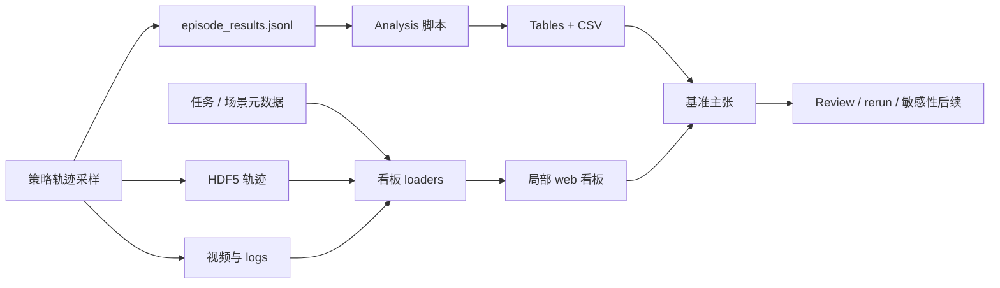

# 仿真基准报告流程

仿真基准报告流程（仿真基准报告流水线）指从回合轨迹采样到可审计结果报告之间的基础设施层：它把原始轨迹、event logs、子任务得分、视频、任务元数据、策略元数据和 statistical 不确定性转成可比较、可浏览、可复查的基准证据。[[RoboLab]] 的 2026-06 代码仓库更新把这个层从脚本升级为一等的设计表面：`analysis/read_results.py`、`docs/statistical_significance.md`、`dashboard/`、`episode_results.jsonl`、HDF5 回合数据和 `robolab-dashboard` CLI 共同形成报告契约。

## 数学结构

一次评估运行可以写成回合设置：

$$
D = \{(T_i, \pi_j, e_k, y_{ijk}, s_{ijk}, m_{ijk}, v_{ijk})\},
$$

其中 $T_i$ 是任务，$\pi_j$ 是策略/后端，$e_k$ 是回合索引，$y_{ijk}\in\{0,1\}$ 是成功 indicator，$s_{ijk}\in[0,1]$ 是子任务/graded 得分，$m_{ijk}$ 是指标（持续时间、轨迹平滑性、路径长度、错误物体 events 等），$v_{ijk}$ 是视频/HDF5/日志产物引用。

对某个任务策略配对，成功率后验使用均匀先验：

$$
p_i \mid k,n \sim \mathrm{Beta}(k+1,n-k+1),
$$

其中 $k=\sum_e y_{i,e}$，$n$ 是回合数。95% 可信区间是：

$$
[\mathrm{BetaPPF}(0.025;k+1,n-k+1),\;\mathrm{BetaPPF}(0.975;k+1,n-k+1)].
$$

RoboLab 的自适应采样 rule 可以抽象成：

$$
\mathrm{continue}(k,n)=\left[(u(k,n)-l(k,n)) > \epsilon\right] \land (n<N_{max}),
$$

其中 $u-l$ 是可信区间 width，$\epsilon$ 对应 CLI `--ci-pp-width`，$N_{max}$ 对应 `--num-episodes-adaptive`。得分类连续指标则用均值、std 和学生 t 分布区间报告。

## 直觉

报告流程的作用是防止基准结果退化成一个不可复查的平均成功率。策略成功率只有在能追溯到任务列表、回合数量、指令类型、子任务进度、错误物体事件、视频证据、HDF5 轨迹和不确定性区间时，才适合作为调试或比较依据。RoboLab 看板把场景/任务目录、结果文件夹、回合视频、事件和时间序列放到同一个本地界面中；分析脚本则把同一证据编译成表格、CSV 和分组摘要。

这也是 [[RoboticsSimulationInfrastructure|仿真基础设施]] 的一部分：看板不改变物理，但改变失败 diagnosis 的带宽。一个错误物体抓取如果只记录为失败，就难以判断是语言语义落地、视觉 similarity、夹爪/接触、轨迹规划还是 timeout 问题；如果同一流程保留视频、event 日志、子任务得分和任务元数据，失败类型就能被复查。

## 失效情形

- 小-N overconfidence：少量回合的点估计值会误导；RoboLab 用 Beta 可信区间暴露不确定性，但读者仍可能只看中间值。
- 自适应采样 comparability：如果不同策略/任务使用不同 stopping 结果，必须报告 $n$、区间 width 和 stopping rule，否则计算-saving 规程可能影响可比性。
- 看板 locality：局部看板提升可审计性，但不等于公开 leaderboard 治理；路径、来源文件夹和视频可用性仍需记录。
- 元数据漂移：任务元数据、场景元数据和结果文件夹如果不同步，看板可能展示 stale 任务属性或场景链接。
- 指标 overload：成功、得分、轨迹平滑性、错误物体 events、置信区间和视频同时存在时，必须明确 primary 主张，否则报告容易变成指标 shopping。

## 实践含义

- 对策略评估，报告应同时包含成功数量、回合数量、置信区间、得分、失败诊断信息和产物路径，而不是只报 mean 成功。
- 对基准基础设施，看板/API endpoints 应被视为证据访问层；它们决定人类 reviewer 能否快速复查策略失败。
- 对 [[SimulationSensitivityAnalysis|敏感性 analysis]]，报告流程提供后验推理需要的结构化的结果；如果结果只有二元成功结果，后验解释会变粗。
- 对 [[TaskGeneralistPolicyEvaluation|任务泛化策略评估]]，自适应采样提供了计算感知规程，但 leaderboard/论文比较必须固定或充分披露 stopping rule。

相关页面：[[nvlabs-robolab]]、[[RoboLab]]、[[TaskGeneralistPolicyEvaluation]]、[[RoboticsSimulationInfrastructure]]、[[SimulationSensitivityAnalysis]]、[[SimulationRealityGap]]。
