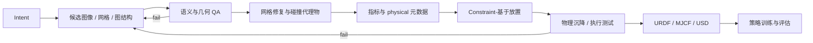

# 可用于仿真的三维世界生成

仿真就绪的 3D 世界生成，不是让输出“看起来像 3D”，而是把自然语言、图像或任务意图编译成具身智能体可以在物理仿真器中直接执行、交互、编辑和复用的世界产物。[[embodiedgen-towards-a-generative-3d-world-engine-for-embodied-intelligence|EmbodiedGen V1]] 建立资产层级的“生成—检查—修复—打包”流程；[[embodiedgen-v2-an-agentic-simulation-ready-3d-world-engine-for-embodied-ai|V2]] 把契约扩展到场景语义、可供性、基于约束的放置、持久编辑和策略循环。

## 数学结构

一个物体层级的可用于仿真的资产可以写成：

$$
A_i=(M_i^{vis},M_i^{col},T_i,s_i,m_i,\mu_i,\phi_i,F_i),
$$

其中 $M_i^{vis}$ 是视觉网格，$M_i^{col}$ 是碰撞几何，$T_i$ 是纹理/材质，$s_i$ 是公制尺度，$m_i$ 是质量，$\mu_i$ 是摩擦元数据，$\phi_i$ 是部件/可供性标注，$F_i$ 是 URDF、MJCF、USD 等标准化接口。

Scene-层级世界可以写成：

$$
W=(G,\mathcal{A},P,C,H),
$$

其中 $G$ 是类型化的场景图，$\mathcal{A}=\{A_i\}$ 是资产，$P=\{p_i\}$ 是六自由度位姿，$C$ 是支撑、包含、碰撞、可达性、导航等约束，$H$ 是编辑与验证历史。生成过程是受约束的综合：

$$
\hat W=\arg\max_W P_\theta(W\mid u)\quad\text{s.t.}\quad V_{geom}(W)V_{phys}(W)V_{task}(W)V_{iface}(W)=1,
$$

$u$ 是文本/图像/任务意图；$V_{geom}$ 检查几何/碰撞体，$V_{phys}$ 检查沉降/接触，$V_{task}$ 检查关系、可达性与语义，$V_{iface}$ 检查仿真器 packaging。概率模型生成候选，确定性工具与仿真器验证决定是否提交。

## 直觉

Generative 3D 模型通常优化外观分布；机器人仿真器消费的却是几何、接触、惯量、帧、约束和任务语义。两者之间需要一个 compiler-like 层。它既不是让 LLM 直接负责所有数值细节，也不是在生成结束后追加一次格式转换，而是在多个阶段插入契约检查：输入语义检查、网格 integrity、视觉/碰撞分离、物理元数据恢复、空间求解器、重力沉降、抓取执行与导出验证。

V1 的经验是：模块化流程能把图形资产推向仿真器可用状态，但自动质量检查和全景背景仍会限制整体世界质量。V2 的经验是：可执行环境需要双层表示——物体状态必须携带物理与交互语义，场景状态必须携带类型化关系、位姿、历史与后端接口。只有这种表示才能支持保留状态的局部编辑，而不是每轮提示都重建整张场景。

## 失效情形

- 视觉到物理类别错误：网格看起来完整，但 non-流形、open 表面、细薄 shell 或 wrong 规模使碰撞体/惯量不可靠。
- 视觉/碰撞 conflation：直接把高分辨率非凸视觉网格当碰撞体，增加接触不稳定、运行时成本或任务关键 false 接触。见 [[CollisionGeometryForRobotSimulation]]。
- VLM 物理属性 overconfidence：类别先验能给看似合理规模/质量/摩擦，却不能替代测量、系统辨识或不确定性感知随机化。
- 语义 QA circularity：VLM 生成或解释属性，再由相似 VLM checker 验证，可能共享盲点；manual 跨验证与执行测试仍重要。
- 可供性 cascade attrition：部件分割、语义标注、抓取生成任一阶段失败都会降低端到端 yield；V2 的完整可供性 pass 比率只有 50%。
- Relation 约束不足：无碰撞的放置仍可能违反任务初始状态语义，例如目标已经位于目标 receptacle 内。
- 规模/可达性不匹配：物体单独合理，但相对机器人本体太大、太远或朝向错误。
- 跨仿真器语义漂移：URDF/MJCF/USD 转换能统一资产交付，不会统一引擎特定的接触定律、求解器、关节默认值或材质语义。
- 生成成本瓶颈：完全在线世界生成的背景/资产综合整理很慢；离线 libraries 提高吞吐量，但降低 open-ended novelty。
- 闭环循环 attribution 歧义：策略增益同时受生成的场景 diversity、RL 算法、域随机化、预训练与评估分布影响，不能把全部 improvement 归因于生成器。

## 实践含义

- 资产基准至少分开记录视觉验收、网格有效性、碰撞体尺寸/接触成功、物理元数据错误与 loadability。
- 世界基准至少记录任务 relation 正确性、稳定性、可达性、导航可行性、manual-fix 比率和生成延迟。
- 跨仿真器主张应加入同一场景的沉降位姿、接触数量、抓取结果、轨迹 divergence 与策略成功比较。
- 有状态的编辑应使用类型化的实例 identifiers、受限增量、no-mutation-在失败、编辑日志与 rollback/versioning，而不只保存 dialogue 文本。
- 策略证据要把 “场景可以加载” 与 “场景能训练出 transferable 策略” 分开；后者需要 [[SimulationRealityGap]]、域随机化与真实机器人验证。

相关页面：[[EmbodiedGen]]、[[AgenticSceneTaskGeneration]]、[[RoboticsSimulationInfrastructure]]、[[CollisionGeometryForRobotSimulation]]、[[ApproximateConvexDecomposition]]、[[OpenUSDSceneComposition]]、[[SimulationRealityGap]]。
