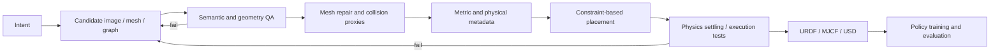

# Simulation-Ready 3D World Generation

Simulation-ready 3D world generation（仿真就绪的 3D 世界生成）不是让 output “看起来像 3D”，而是把 natural-language/image/task intent 编译成 embodied agent 可以在 physics simulator 中直接执行、交互、编辑和复用的 world artifact。[[embodiedgen-towards-a-generative-3d-world-engine-for-embodied-intelligence|EmbodiedGen V1]] 建立 asset-level generate–inspect–repair–package pipeline；[[embodiedgen-v2-an-agentic-simulation-ready-3d-world-engine-for-embodied-ai|V2]] 把 contract 扩展到 scene semantics、affordance、constraint-based placement、persistent editing 和 policy loop。

## 数学结构

一个 object-level sim-ready asset 可以写成：

$$
A_i=(M_i^{vis},M_i^{col},T_i,s_i,m_i,\mu_i,\phi_i,F_i),
$$

其中 $M_i^{vis}$ 是 visual mesh，$M_i^{col}$ 是 collision geometry，$T_i$ 是 texture/material，$s_i$ 是 metric scale，$m_i$ 是 mass，$\mu_i$ 是 friction metadata，$\phi_i$ 是 part/affordance annotations，$F_i$ 是 URDF、MJCF、USD 等 standardized interface。

Scene-level world 可以写成：

$$
W=(G,\mathcal{A},P,C,H),
$$

其中 $G$ 是 typed Scene Graph，$\mathcal{A}=\{A_i\}$ 是 assets，$P=\{p_i\}$ 是 6-DoF poses，$C$ 是 support、containment、collision、reachability、navigation 等 constraints，$H$ 是 edit/validation history。生成过程是 constrained synthesis：

$$
\hat W=\arg\max_W P_\theta(W\mid u)\quad\text{s.t.}\quad V_{geom}(W)V_{phys}(W)V_{task}(W)V_{iface}(W)=1,
$$

$u$ 是 text/image/task intent；$V_{geom}$ 检查 geometry/collider，$V_{phys}$ 检查 settling/contact，$V_{task}$ 检查 relations、reachability 与 semantics，$V_{iface}$ 检查 simulator packaging。概率模型生成 candidates，deterministic tools 与 simulator validation 决定是否 commit。

## 直觉

Generative 3D model 通常优化 appearance distribution；robot simulator 消费的却是 geometry、contacts、inertia、frames、constraints 和 task semantics。两者之间需要一个 compiler-like layer。它既不是让 LLM 直接负责所有数值细节，也不是在生成结束后追加一次格式转换，而是在多个 stages 插入 contract checks：input semantic check、mesh integrity、visual/collision separation、physical metadata recovery、spatial solver、gravity settling、grasp execution 与 export validation。

V1 的 lesson 是 modular pipeline 能把 graphics assets 推向 simulator usability，但自动 QA 和 panorama backgrounds 仍限制整体 world quality。V2 的 lesson 是 executable environment 需要 two-level representation：object state 必须携带 physical/interaction semantics，scene state 必须携带 typed relations、poses、history 与 backend interfaces。这个 representation 才能支持 state-preserving local edits，而不是每轮 prompt 重建整张 scene。

## Failure Modes

- Visual-to-physical category error：mesh 看起来完整，但 non-manifold、open surface、thin shell 或 wrong scale 使 collider/inertia 不可靠。
- Visual/collision conflation：直接把高分辨率 non-convex visual mesh 当 collider，增加 contact instability、runtime cost 或 task-critical false contacts。见 [[CollisionGeometryForRobotSimulation]]。
- VLM physical-property overconfidence：category prior 能给 plausible scale/mass/friction，却不能替代 measurement、system identification 或 uncertainty-aware randomization。
- Semantic QA circularity：VLM 生成或解释属性，再由相似 VLM checker 验证，可能共享 blind spots；manual cross-validation 与 execution tests 仍重要。
- Affordance cascade attrition：part segmentation、semantic annotation、grasp generation 任一 stage 失败都会降低 end-to-end yield；V2 的 full affordance pass rate 只有 50%。
- Relation under-specification：collision-free placement 仍可能违反 task initial-state semantics，例如 target 已经位于 goal receptacle 内。
- Scale/reachability mismatch：object 单独合理，但相对 robot embodiment 太大、太远或朝向错误。
- Cross-simulator semantic drift：URDF/MJCF/USD conversion 能统一 asset delivery，不会统一 engine-specific contact law、solver、joint defaults 或 material semantics。
- Generation cost bottleneck：fully online world generation 的 background/asset synthesis 很慢；offline libraries 提高 throughput，但降低 open-ended novelty。
- Closed-loop attribution ambiguity：policy gains 同时受 generated scene diversity、RL algorithm、domain randomization、pretraining 与 evaluation distribution 影响，不能把全部 improvement 归因于 generator。

## 实践含义

- Asset benchmark 至少分开记录 visual acceptance、mesh validity、collider size/contact success、physical metadata error 与 loadability。
- World benchmark 至少记录 task relation correctness、stability、reachability、navigation feasibility、manual-fix rate 和 generation latency。
- Cross-simulator claim 应加入同一 scene 的 settling pose、contact count、grasp outcome、trajectory divergence 与 policy success comparison。
- Stateful editing 应使用 typed instance identifiers、bounded delta、no-mutation-on-failure、edit log 与 rollback/versioning，而不只保存 dialogue text。
- Policy evidence 要把 “scene 可以加载” 与 “scene 能训练出 transferable policy” 分开；后者需要 [[SimulationRealityGap]]、domain randomization 与 real-robot validation。

相关页面：[[EmbodiedGen]]、[[AgenticSceneTaskGeneration]]、[[RoboticsSimulationInfrastructure]]、[[CollisionGeometryForRobotSimulation]]、[[ApproximateConvexDecomposition]]、[[OpenUSDSceneComposition]]、[[SimulationRealityGap]]。
