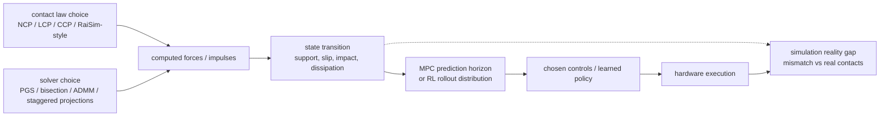

# Simulation Reality Gap（仿真现实差距）

Simulation reality gap 是 simulated behavior 与 real robot behavior 之间的 mismatch。[[contact-models-in-robotics-a-comparative-analysis|Contact Models in Robotics: a Comparative Analysis]] 提供了一个 low-level contact-modeling lens：这个 gap 不只来自 randomized masses、frictions、delays 或 sensors，也来自 physics engine 的 contact law 与 solver。

用 transition model 看，simulator 实际提供的是：

```text
x_{t+1}^{sim} = T_body(x_t, u_t, lambda_hat_m)
lambda_hat_m = S_m(contact law, solver, geometry, velocity)
```

real robot 则由真实接触产生 `lambda_real`。当 `lambda_hat_m` 因 LCP/CCP relaxation、RaiSim-style heuristics、PGS residual、artificial compliance 或 failed convergence 偏离 `lambda_real`，差异会进入下一步 state，再进入 controller 或 policy 的训练分布。



论文显示 contact artifacts 具有 task-dependent 特征。Flat、high-friction 的 quadruped MPC 可能在不同 simulators 中追踪出相似的 base velocities；但 bumpy 与 slippery terrain 会暴露 NCP、CCP 和 RaiSim-like behavior 之间的显著差异。这意味着 simulator 在 easy validation tests 下看起来可接受，却仍可能在更困难的 contact regimes 中误导 controller。

对 MPC，这个 gap 表现为 horizon 内预测的 support、slip 和 dissipation 与 hardware 不一致：optimizer 可能选择在 simulated terrain 上稳定、但在真实接触条件下失效的 controls。对 RL，同样的问题会改变 rollout distribution：policy 在 simulation 中反复见到的是 solver/model 生成的 contact outcomes，而不是 hardware 上的 contact outcomes。

对 RL 和 MPC 来说，这提示 simulator choice 应该围绕 hardware 上预期出现的 contact regime 来审计：sliding、impacts、redundant contacts、rough terrain，以及 ill-conditioned mass/contact layouts。

## Visual sim-to-real lens

[[viral-visual-sim-to-real-at-scale-for-humanoid-loco-manipulation|VIRAL]] 把 reality gap 放进 RGB-based humanoid loco-manipulation setting：policy 在 simulation 中通过 privileged teacher 和 visual student distillation 获得 behavior，再 zero-shot 部署到 Unitree G1。这里的 gap 不只来自 rigid-body physics，也来自 visual appearance、camera geometry、sensor delay、dexterous hand dynamics 和 long-horizon policy distribution。

这个 source 支持一个更细的 transfer decomposition：visual domain randomization 扩大 lighting、materials、camera parameters、image quality 和 delay 的 coverage；finger SysID 与 FOV alignment 则减少已知 hardware mismatch。换言之，randomization 处理 unknown variation，alignment 处理 known bias。页面的 failure cases 也提醒：即使有 randomization 和 alignment，unreliable deployment、hand stuck、accidental drop 与 OOD object failures 仍可能暴露未覆盖的 mechanics 或 perception states。

## Learned world model lens

[[a-comprehensive-survey-on-world-models-for-embodied-ai|A Comprehensive Survey on World Models for Embodied AI]] 给 simulation reality gap 增加了 learned-simulator lens。[[WorldModelsForEmbodiedAI|World models]] 用 latent dynamics、tokens、spatial grids 或 renderable primitives rollout future states；这些 rollouts 可能帮助 policy optimization、MPC 和 counterfactual reasoning，但也可能把 dataset bias、temporal drift、weak physical consistency 或 pixel-level artifacts 转换成新的 model-reality mismatch。

这个 source 支持一个更一般的判断：sim-to-real gap 不只是 physics engine 参数错了，也可能是 learned dynamics 的 objective 错了。若 [[WorldModelEvaluation|evaluation]] 主要依赖 FID/FVD 这类 pixel fidelity metrics，而没有检查 state-level dynamics、causality、collision、task success 或 real-time closed-loop behavior，model 可能生成视觉上 plausible 但控制上 misleading 的 futures。

## Prompt-conditioned policy lens

[[pi07-steerable-generalist-robotic-foundation-model|π0.7]] 增加了第三种 gap：policy 不是只受 physics simulator 或 learned dynamics 影响，也受 prompt/context 所选择的 behavior mode 影响。[[RobotContextConditioning|context conditioning]] 可以让 model 从 mixed-quality data 中选择 high-quality/no-mistake/fast mode；但如果 metadata label、subgoal image 或 subtask instruction 与真实 scene state 不匹配，policy 可能执行的是 dataset 中被 prompt 出来的 idealized mode，而不是当前硬件可恢复的 behavior。

这类 gap 不一定表现为 state prediction error，而可能表现为 decision distribution error：同一 observation 下，prompt 改变了 action distribution。对 deployment 来说，这要求同时验证 physical consistency、world-model subgoal quality 和 prompt-conditioned closed-loop success。

相关页面：[[ContactModelsInRobotics]]、[[ContactSolvers]]、[[ContactComplementarity]]、[[VisualSimToReal]]、[[WorldModelsForEmbodiedAI]]、[[WorldModelEvaluation]]、[[RobotContextConditioning]]、[[VisionLanguageActionModels]]、[[MuJoCo]]、[[RaiSim]]。
