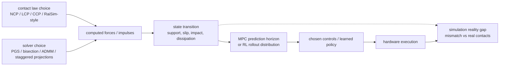

# Simulation Reality Gap（仿真现实差距）

Simulation reality gap 是 simulated behavior 与 real robot behavior 之间的 mismatch。[[contact-models-in-robotics-a-comparative-analysis|Contact Models in Robotics: a Comparative Analysis]] 提供了一个 low-level contact-modeling lens：这个 gap 不只来自 randomized masses、frictions、delays 或 sensors，也来自 physics engine 的 contact law 与 solver。

用 transition model 看，simulator 实际提供的是：

```text
x_{t+1}^{sim} = T_body(x_t, u_t, lambda_hat_m)
lambda_hat_m = S_m(contact law, solver, geometry, velocity)
```

real robot 则由真实接触产生 `lambda_real`。当 `lambda_hat_m` 因 LCP/CCP relaxation、RaiSim-style heuristics、PGS residual、artificial compliance 或 failed convergence 偏离 `lambda_real`，差异会进入下一步 state，再进入 controller 或 policy 的训练分布。



论文显示 contact artifacts 具有 task-dependent 特征。Flat、high-friction 的 quadruped MPC 可能在不同 simulators 中追踪出相似的 base velocities；但 bumpy 与 slippery terrain 会暴露 NCP、CCP 和 RaiSim-like behavior 之间的显著差异。这意味着 simulator 在 easy validation tests 下看起来可接受，却仍可能在更困难的 contact regimes 中误导 controller。

对 MPC，这个 gap 表现为 horizon 内预测的 support、slip 和 dissipation 与 hardware 不一致：optimizer 可能选择在 simulated terrain 上稳定、但在真实接触条件下失效的 controls。对 RL，同样的问题会改变 rollout distribution：policy 在 simulation 中反复见到的是 solver/model 生成的 contact outcomes，而不是 hardware 上的 contact outcomes。

对 RL 和 MPC 来说，这提示 simulator choice 应该围绕 hardware 上预期出现的 contact regime 来审计：sliding、impacts、redundant contacts、rough terrain，以及 ill-conditioned mass/contact layouts。

相关页面：[[ContactModelsInRobotics]]、[[ContactSolvers]]、[[ContactComplementarity]]、[[MuJoCo]]、[[RaiSim]]。
