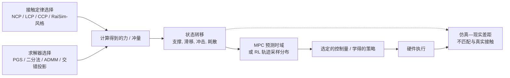

# 仿真—现实差距

仿真现实差距是仿真的行为与真实机器人行为之间的不匹配。[[contact-models-in-robotics-a-comparative-analysis|Contact Models in Robotics: a Comparative Analysis]] 提供了一个低层接触建模视角：这个差距不只来自随机化的 masses、frictions、delays 或传感器，也来自物理引擎的接触定律与求解器。

用转移模型看，仿真器实际提供的是：

```text
x_{t+1}^{sim} = T_body(x_t, u_t, lambda_hat_m)
lambda_hat_m = S_m(contact law, solver, geometry, velocity)
```

真实机器人则由真实接触产生 `lambda_real`。当 `lambda_hat_m` 因 LCP/CCP 松弛、RaiSim-风格启发式规则、PGS 残差、人为柔顺性或失败的收敛偏离 `lambda_real`，差异会进入下一步状态，再进入控制器或策略的训练分布。


```mermaid
flowchart LR
  A["接触定律选择<br/>NCP / LCP / CCP / RaiSim-风格"] --> C["计算得到的力 / 冲量"]
  B["求解器选择<br/>PGS / 二分法 / ADMM / 交错投影"] --> C
  C --> D["状态转移<br/>支撑, 滑移, 冲击, 耗散"]
  D --> E["MPC 预测时域<br/>或 RL 轨迹采样分布"]
  E --> F["选定的控制量 / 学得的策略"]
  F --> G["硬件执行"]
  D -.-> H["仿真—现实差距<br/>不匹配与真实接触"]
  G --> H
```

论文显示接触产物具有任务-依赖的特征。平坦、高摩擦的四足机器人 MPC 可能在不同仿真器中追踪出相似的基座速度；但颠簸与湿滑地形会暴露 NCP、CCP 和 RaiSim-like 行为之间的显著差异。这意味着仿真器在简单验证测试下看起来可接受，却仍可能在更困难的接触 regimes 中误导控制器。

对 MPC，这个差距表现为时域长度内预测的支撑、滑移和耗散与硬件不一致：optimizer 可能选择在仿真的地形上稳定、但在真实接触条件下失效的 controls。对 RL，同样的问题会改变轨迹采样分布：策略在仿真中反复见到的是求解器/模型生成的接触结果，而不是硬件上的接触结果。

对 RL 和 MPC 来说，这提示仿真器选择应该围绕硬件上预期出现的接触工况来审计：滑动、冲击、冗余接触、崎岖地形，以及病态质量/接触布局。

## 碰撞体几何视角

[[CollisionGeometryForRobotSimulation]] 把现实差距再往接触流程上游推进：即使接触定律和求解器不变，碰撞体表示也会改变生成的接触。[[mujoco-computation-collision-detection|MuJoCo 碰撞文档]] 明确说明有效接触点由 geoms 产生，并进入约束结构；[[isaac-sim-core-api-collision-approximation|Isaac Sim Core API docs]] 列出凸包、凸分解、SDF、球体 fill、包围球体 / cube 等近似模式，并警告更高细节会带来性能冲击。

这类差距的典型形式是视觉碰撞体不匹配：单个凸包或过粗基元可能把把手、槽、孔填满，制造 false 正占用的空间；过度简化也可能漏掉真实接触面，制造 late 接触或穿透。[[coacd-approximate-convex-decomposition|CoACD 论文]] 的抽屉-opening 情形把这一点具体化：碰撞形状是否保留把手孔会改变 RL 智能体是否能形成有效交互。

## 基础设施视角

[[robotics-simulation-infrastructure|机器人学仿真基础设施]] 把现实差距的上游再提前一层：在物理/渲染不匹配进入策略之前，框架已经通过任务 APIs、资产 management、渲染器、可视化工具和 ML 集成决定了什么变化容易表达、什么诊断信息容易观察、什么资源预算留给训练。换言之，仿真到现实迁移差距不只是引擎参数的问题，也可能来自基础设施表面。

这个视角支持一个实用区分：配置驱动 API 与直接使用 Python 的 API，代表不同的结构性与可修改性取舍；批量渲染的内存/保真度选择，会和 PPO/SAC 等强化学习训练的批次、经验回放缓冲区和神经网络争用 GPU 内存；可视化工具如果只显示物理状态，而不显示奖励曲线、策略行为或历史状态，就可能让评估失败难以定位。来源是工程博客而非定量基准，因此这些判断应作为审计清单，而不是框架排名。

[[unilab-a-heterogeneous-architecture-for-robot-rl-beyond-gpu-dominant-paradigms|UniLab]] 增加了训练运行时视角：仿真到现实迁移证据的上游还包括后端契约、域随机化生命周期、sim2sim 验证和训练关键路径。它不声称异构运行时会自动减少物理现实差距；相反，它提示训练分布是由仿真器后端语义、随机化载荷、采集器/学习器 schedule 和重放边界共同生成的。若两个后端支持的随机化字段或奖励/任务默认值不同，跨后端训练速度和跨后端策略迁移都需要分开解释。

## 视觉仿真到现实迁移视角

[[viral-visual-sim-to-real-at-scale-for-humanoid-loco-manipulation|VIRAL]] 把现实差距放进 RGB-基于人形机器人移动操作场景：策略在仿真中通过特权教师策略和视觉学生策略 distillation 获得行为，再零样本部署到 Unitree G1。这里的差距不只来自刚体物理，也来自视觉外观、相机几何、传感器延迟、灵巧手部动力学和长时域策略分布。

这个来源支持一个更细的迁移分解：视觉域随机化扩大光照、材质、相机参数、图像质量和延迟的覆盖范围；手指 SysID 与 FOV 对齐则减少已知硬件不匹配。换言之，随机化处理未知变化，对齐处理已知偏差。页面的失败案例也提醒：即使有随机化和对齐，unreliable 部署、手部 stuck、accidental drop 与 OOD 物体失败仍可能暴露未覆盖的 mechanics 或感知状态。

[[grail-generating-humanoid-loco-manipulation-from-3d-assets-and-video-priors|GRAIL]] 增加了生成的数据视角。它通过先指定 3D 资产、相机、公制尺度、环境深度和机器人-proportioned 形态，减少从视频到 4D HOI 轨迹的重建差距；但它没有让仿真到现实迁移差距消失，而是把一部分风险转移到 VFM 提示 following、物体外观一致性、失败过滤、重定向质量和任务族跟踪器覆盖范围上。换言之，已知几何可以降低歧义，不能替代真实硬件接触、相机和手部动力学验证。

## 仿真数据与真实数据联合训练视角

[[robocasa365-a-large-scale-simulation-framework-for-training-and-benchmarking-generalist-robots|RoboCasa365]] 提供了一个范围有限但有定量结果的联合训练案例。真实实验使用 DROID Panda 机械臂和三个相机，覆盖关闭电热水壶盖、从烤箱取物、从台面放入柜子、把两个物体放到沥水架四项任务。纯真实数据模型使用 140 条真实示范，平均成功率为 61.8%；仿真加真实方案先在 150 个仿真高成功任务上中间训练，再用四项任务的仿真与真实数据共同微调，平均成功率为 79.8%。

这个结果不能解释为纯仿真零样本迁移。研究者先把仿真数据重新渲染到接近真实相机视角，并继续使用真实示范与联合微调；每任务只有 20 次真实试验，也只覆盖固定厨房中的四个任务。更准确的结论是：在已做相机对齐并保留少量真实监督时，大规模仿真预训练可以改善目标任务学习。它与 [[RobotLearningDataComposition|机器人学习数据构成]] 的联系是，迁移收益取决于选取哪些仿真任务、怎样对齐观测、怎样混合真实数据，以及是否保留独立的目标后训练阶段。

## 生成环境视角

[[embodiedgen-v2-an-agentic-simulation-ready-3d-world-engine-for-embodied-ai|EmbodiedGen V2]] 把现实差距的审计点提前到世界生成：公制尺度、网格修复、碰撞分解、质量/摩擦/惯量恢复、关节语义、可供性分割/抓取、场景支撑/可达性和仿真器接口都可能在策略训练前引入不匹配。论文汇总配套研究时报告，随着生成的环境数量从 $N=1$ 增加到 $N=50$，sim 成功从 9.7% 升到 79.8%、真实成功从 21.7% 升到 75.0%、OOD 成功从 53.2% 升到 77.9%；这些数字支持环境 diversity 可能改善策略鲁棒性，但不是 V2 自身独立控制实验，因此不能脱离配套研究设置解释为普遍规模扩展定律。

这个来源还明确保留两个重要边界：跨格式导出不等于不同仿真器中动力学完全一致；VLM 恢复的质量、摩擦和惯量估计也不等于系统辨识。仿真就绪是一个可执行契约，不是物理真值 certificate。

## 学习型世界模型视角

[[a-comprehensive-survey-on-world-models-for-embodied-ai|A Comprehensive Survey on World Models for Embodied AI]] 给仿真—现实差距增加了学得的仿真器视角。[[WorldModelsForEmbodiedAI|世界模型]] 用潜在动力学、标记、空间 grids 或 renderable 基元轨迹采样未来状态；这些轨迹采样可能帮助策略优化、MPC 和反事实推理，但也可能把数据集偏差、时间漂移、弱物理一致性或像素层级产物转换成新的模型现实不匹配。

这个来源支持一个更一般的判断：仿真到现实迁移差距不只是物理引擎参数错了，也可能是学得的动力学目标错了。若 [[WorldModelEvaluation|评估]] 主要依赖 FID/FVD 这类像素保真度指标，而没有检查状态层级动力学、因果性、碰撞、任务成功或实时闭环行为，模型可能生成视觉上看似合理、但会误导控制决策的未来状态。

## 提示条件化策略视角

[[pi07-steerable-generalist-robotic-foundation-model|π0.7]] 增加了第三种差距：策略不是只受物理仿真器或学得的动力学影响，也受提示/上下文所选择的行为模式影响。[[RobotContextConditioning|上下文条件化]] 可以让模型从混合质量数据中选择高质量/无错误/快速模式；但如果元数据标签、子目标图像或子任务指令与真实场景状态不匹配，策略可能执行的是数据集中被提示出来的 idealized 模式，而不是当前硬件可恢复的行为。

这类差距不一定表现为状态预测错误，而可能表现为决策分布错误：同一观测下，提示改变了动作分布。对部署来说，这要求同时验证物理一致性、世界模型子目标质量和提示条件化的闭环成功。

## 工作流与部署契约视角

[[agile-a-comprehensive-workflow-for-humanoid-loco-manipulation-learning|AGILE]] 给仿真—现实差距增加了工作流视角：真实部署失败不一定来自仿真器物理本身，也可能来自环境验证、评估规程或策略导出契约。来源中列出的工作流差距包括反向的关节轴、incorrect 奖励项、只用随机轨迹采样导致硬件关键行为被平均掉，以及部署时关节顺序、观测历史缓冲区、动作缩放不一致。

用契约形式看，训练时策略看到的是：

```text
a_t = pi_phi(assemble_train(o_{t-k:t}; joint_order, history, scaling))
```

部署时若描述文件不一致，实际执行变成：

```text
a_t = pi_phi(assemble_deploy(o_{t-k:t}; joint_order', history', scaling'))
```

即使 $T^{sim}$ 与 $T^{real}$ 很接近，$\text{assemble}_{train}\neq\text{assemble}_{deploy}$ 也会制造决策分布差距。AGILE 用 TorchScript 策略 + YAML I/O 描述文件记录关节名称、观测顺序、历史缓冲区和动作缩放，并用 MuJoCo 跨仿真器验证在硬件前复用同一推理契约。

AGILE 还说明评估差距是现实差距的前置条件：只看汇总奖励或随机轨迹采样均值，可能错过 RMS 加速度、加加速度、关节限制违反和高频能量比率等执行器相关的 signals。确定性场景测试（速度扫描、高度渐变测试）提供低方差回归测试；随机轨迹采样则估计随机指令分布下的鲁棒性。两者缺一时，仿真到现实迁移风险都可能被误估。

相关页面：[[CollisionGeometryForRobotSimulation]]、[[ApproximateConvexDecomposition]]、[[ContactModelsInRobotics]]、[[ContactSolvers]]、[[ContactComplementarity]]、[[RoboticsSimulationInfrastructure]]、[[SimulationReady3DWorldGeneration]]、[[EmbodiedGen]]、[[HeterogeneousRobotRLTraining]]、[[VisualSimToReal]]、[[AssetConditionedHOIGeneration]]、[[RobotLearningDataComposition]]、[[RoboCasa365]]、[[WorldModelsForEmbodiedAI]]、[[WorldModelEvaluation]]、[[RobotContextConditioning]]、[[VisionLanguageActionModels]]、[[HumanoidRLWorkflow]]、[[AGILE]]、[[GRAIL]]、[[UniLab]]、[[MuJoCo]]、[[RaiSim]]。
