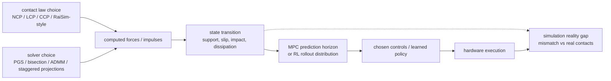

# Simulation Reality Gap（仿真现实差距）

Simulation reality gap 是 simulated behavior 与 real robot behavior 之间的 mismatch。[[contact-models-in-robotics-a-comparative-analysis|Contact Models in Robotics: a Comparative Analysis]] 提供了一个 low-level contact-modeling lens：这个 gap 不只来自 randomized masses、frictions、delays 或 sensors，也来自 physics engine 的 contact law 与 solver。

用 transition model 看，simulator 实际提供的是：

```text
x_{t+1}^{sim} = T_body(x_t, u_t, lambda_hat_m)
lambda_hat_m = S_m(contact law, solver, geometry, velocity)
```

real robot 则由真实接触产生 `lambda_real`。当 `lambda_hat_m` 因 LCP/CCP relaxation、RaiSim-style heuristics、PGS residual、artificial compliance 或 failed convergence 偏离 `lambda_real`，差异会进入下一步 state，再进入 controller 或 policy 的训练分布。


```mermaid
flowchart LR
  A["contact law choice<br/>NCP / LCP / CCP / RaiSim-style"] --> C["computed forces / impulses"]
  B["solver choice<br/>PGS / bisection / ADMM / staggered projections"] --> C
  C --> D["state transition<br/>support, slip, impact, dissipation"]
  D --> E["MPC prediction horizon<br/>or RL rollout distribution"]
  E --> F["chosen controls / learned policy"]
  F --> G["hardware execution"]
  D -.-> H["simulation reality gap<br/>mismatch vs real contacts"]
  G --> H
```

论文显示 contact artifacts 具有 task-dependent 特征。Flat、high-friction 的 quadruped MPC 可能在不同 simulators 中追踪出相似的 base velocities；但 bumpy 与 slippery terrain 会暴露 NCP、CCP 和 RaiSim-like behavior 之间的显著差异。这意味着 simulator 在 easy validation tests 下看起来可接受，却仍可能在更困难的 contact regimes 中误导 controller。

对 MPC，这个 gap 表现为 horizon 内预测的 support、slip 和 dissipation 与 hardware 不一致：optimizer 可能选择在 simulated terrain 上稳定、但在真实接触条件下失效的 controls。对 RL，同样的问题会改变 rollout distribution：policy 在 simulation 中反复见到的是 solver/model 生成的 contact outcomes，而不是 hardware 上的 contact outcomes。

对 RL 和 MPC 来说，这提示 simulator choice 应该围绕 hardware 上预期出现的 contact regime 来审计：sliding、impacts、redundant contacts、rough terrain，以及 ill-conditioned mass/contact layouts。

## Collider geometry lens

[[CollisionGeometryForRobotSimulation]] 把 reality gap 再往 contact pipeline 上游推进：即使 contact law 和 solver 不变，collider representation 也会改变 generated contacts。[[mujoco-computation-collision-detection|MuJoCo collision docs]] 明确说明 active contacts 由 geoms 产生，并进入 constraint construction；[[isaac-sim-core-api-collision-approximation|Isaac Sim Core API docs]] 列出 convex hull、convex decomposition、SDF、sphere fill、bounding sphere / cube 等 approximation modes，并警告更高 detail 会带来 performance impact。

这类 gap 的典型形式是 visual-collider mismatch：单个 convex hull 或过粗 primitive 可能把 handle、slot、hole 填满，制造 false positive occupied space；过度简化也可能漏掉真实接触面，制造 late contact 或 penetration。[[coacd-approximate-convex-decomposition|CoACD paper]] 的 drawer-opening case 把这一点具体化：collision shapes 是否保留 handle holes 会改变 RL agent 是否能形成有效 interaction。

## Infrastructure lens

[[robotics-simulation-infrastructure|Robotics Simulation Infrastructure]] 把 reality gap 的上游再提前一层：在 physics/rendering mismatch 进入 policy 之前，framework 已经通过 task APIs、asset management、renderer、visualizer 和 ML integration 决定了什么 variation 容易表达、什么 diagnostics 容易观察、什么 resource budget 留给 training。换言之，sim-to-real gap 不只是 engine parameters 的问题，也可能来自 infrastructure surface。

这个 lens 支持一个 practical distinction：config-driven APIs 与 direct Python APIs 选择的是不同的 structure/hackability trade-off；batched rendering 的 memory/fidelity choice 会和 PPO/SAC 等 RL training 的 batch sizes、replay buffers 和 networks 争 GPU memory；visualizer 如果只显示 physics state 而不显示 reward curves、policy behavior 或 past states，就可能让 evaluation failure 难以定位。source 是 engineering blog，不是 quantitative benchmark，因此这些判断应作为 audit checklist，而不是 framework ranking。

## Visual sim-to-real lens

[[viral-visual-sim-to-real-at-scale-for-humanoid-loco-manipulation|VIRAL]] 把 reality gap 放进 RGB-based humanoid loco-manipulation setting：policy 在 simulation 中通过 privileged teacher 和 visual student distillation 获得 behavior，再 zero-shot 部署到 Unitree G1。这里的 gap 不只来自 rigid-body physics，也来自 visual appearance、camera geometry、sensor delay、dexterous hand dynamics 和 long-horizon policy distribution。

这个 source 支持一个更细的 transfer decomposition：visual domain randomization 扩大 lighting、materials、camera parameters、image quality 和 delay 的 coverage；finger SysID 与 FOV alignment 则减少已知 hardware mismatch。换言之，randomization 处理 unknown variation，alignment 处理 known bias。页面的 failure cases 也提醒：即使有 randomization 和 alignment，unreliable deployment、hand stuck、accidental drop 与 OOD object failures 仍可能暴露未覆盖的 mechanics 或 perception states。

[[grail-generating-humanoid-loco-manipulation-from-3d-assets-and-video-priors|GRAIL]] 增加了 generated-data lens。它通过先指定 3D assets、camera、metric scale、environment depth 和 robot-proportioned morphology，减少从 video 到 4D HOI trajectory 的 reconstruction gap；但它没有让 sim-to-real gap 消失，而是把一部分风险转移到 VFM prompt following、object appearance consistency、failure filtering、retargeting quality 和 task-family tracker coverage 上。换言之，known geometry 可以降低 ambiguity，不能替代真实 hardware contact、camera 和 hand dynamics validation。

## Learned world model lens

[[a-comprehensive-survey-on-world-models-for-embodied-ai|A Comprehensive Survey on World Models for Embodied AI]] 给 simulation reality gap 增加了 learned-simulator lens。[[WorldModelsForEmbodiedAI|World models]] 用 latent dynamics、tokens、spatial grids 或 renderable primitives rollout future states；这些 rollouts 可能帮助 policy optimization、MPC 和 counterfactual reasoning，但也可能把 dataset bias、temporal drift、weak physical consistency 或 pixel-level artifacts 转换成新的 model-reality mismatch。

这个 source 支持一个更一般的判断：sim-to-real gap 不只是 physics engine 参数错了，也可能是 learned dynamics 的 objective 错了。若 [[WorldModelEvaluation|evaluation]] 主要依赖 FID/FVD 这类 pixel fidelity metrics，而没有检查 state-level dynamics、causality、collision、task success 或 real-time closed-loop behavior，model 可能生成视觉上 plausible 但控制上 misleading 的 futures。

## Prompt-conditioned policy lens

[[pi07-steerable-generalist-robotic-foundation-model|π0.7]] 增加了第三种 gap：policy 不是只受 physics simulator 或 learned dynamics 影响，也受 prompt/context 所选择的 behavior mode 影响。[[RobotContextConditioning|context conditioning]] 可以让 model 从 mixed-quality data 中选择 high-quality/no-mistake/fast mode；但如果 metadata label、subgoal image 或 subtask instruction 与真实 scene state 不匹配，policy 可能执行的是 dataset 中被 prompt 出来的 idealized mode，而不是当前硬件可恢复的 behavior。

这类 gap 不一定表现为 state prediction error，而可能表现为 decision distribution error：同一 observation 下，prompt 改变了 action distribution。对 deployment 来说，这要求同时验证 physical consistency、world-model subgoal quality 和 prompt-conditioned closed-loop success。

## Workflow and deployment-contract lens

[[agile-a-comprehensive-workflow-for-humanoid-loco-manipulation-learning|AGILE]] 给 simulation reality gap 增加了 workflow lens：真实部署失败不一定来自 simulator physics 本身，也可能来自 environment verification、evaluation protocol 或 policy export contract。Source 中列出的 workflow gap 包括 reversed joint axes、incorrect reward terms、只用 stochastic rollout 导致 hardware-critical behavior 被平均掉，以及 deployment 时 joint order、observation history buffer、action scaling 不一致。

用 contract 形式看，训练时 policy 看到的是：

```text
a_t = pi_phi(assemble_train(o_{t-k:t}; joint_order, history, scaling))
```

部署时若 descriptor 不一致，实际执行变成：

```text
a_t = pi_phi(assemble_deploy(o_{t-k:t}; joint_order', history', scaling'))
```

即使 $T^{sim}$ 与 $T^{real}$ 很接近，$\text{assemble}_{train}\neq\text{assemble}_{deploy}$ 也会制造 decision-distribution gap。AGILE 用 TorchScript policy + YAML I/O descriptors 记录 joint names、observation ordering、history buffers 和 action scaling，并用 MuJoCo sim-to-sim validation 在 hardware 前复用同一 inference contract。

AGILE 还说明 evaluation gap 是 reality gap 的前置条件：只看 aggregate reward 或 stochastic rollout average，可能错过 RMS acceleration、jerk、joint-limit violations 和 high-frequency energy ratio 等 actuator-relevant signals。Deterministic scenario tests（velocity sweep、height ramp）提供低方差 regression tests；stochastic rollouts 则估计随机 command distribution 下的 robustness。两者缺一时，sim-to-real risk 都可能被误估。

相关页面：[[CollisionGeometryForRobotSimulation]]、[[ApproximateConvexDecomposition]]、[[ContactModelsInRobotics]]、[[ContactSolvers]]、[[ContactComplementarity]]、[[RoboticsSimulationInfrastructure]]、[[VisualSimToReal]]、[[AssetConditionedHOIGeneration]]、[[WorldModelsForEmbodiedAI]]、[[WorldModelEvaluation]]、[[RobotContextConditioning]]、[[VisionLanguageActionModels]]、[[HumanoidRLWorkflow]]、[[AGILE]]、[[GRAIL]]、[[MuJoCo]]、[[RaiSim]]。
