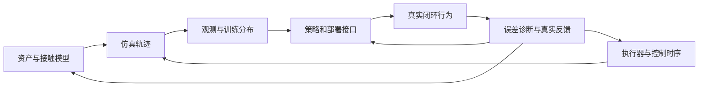

# Sim-to-Real Gap

仿真—现实差距是模型、观测或执行接口与真实系统之间的不匹配。先确定差异出现在哪一层，再选择参数对齐、[[DomainRandomization|域随机化]] 或 [[SystemIdentificationForSimulation|系统辨识]]；“仿真成功、硬件失败”本身不能指出原因。

## 数学结构

以下是组织诊断的教学抽象。状态 $x_t$ 通过动作 $u_t$ 与模型参数 $\xi$ 推进，传感器配置 $c$ 产生观测 $o_t$：

$$
x_{t+1}^{sim}=F_h(x_t^{sim},u_t;\xi),\qquad o_t^{sim}=G(x_t^{sim};c).
$$

$F_h$ 包含 [[RobotRigidBodyDynamics|动力学]]、[[ContactSolvers|约束求解]] 与 [[SimulationTimeStepping|数值积分]]。即使这些部分接近真实系统，观测组装、关节顺序、缩放或控制周期不同，也会让策略执行另一种行为。实际比较往往只能看到部分真实状态，不能假定能直接测得所有 $x_t^{real}$。[[mujoco-computation-collision-detection|MuJoCo 计算章]]、[[isaac-sim-policy-deployment|部署指南]]

### 为什么很小的单步误差也可能改变整条行为

下面是局部、平滑条件下的教学推导。设真实转移为 $F^{real}$，仿真转移为 $F^{sim}$；在共同测试区域内，同一状态动作下二者误差至多为 $\epsilon$。为隔离动力学影响，暂假设两边使用同一状态反馈策略 $u=\pi(x)$，且真实转移对状态和动作的局部 Lipschitz 常数为 $L_x,L_u$，策略常数为 $L_\pi$。记 $e_t=\|x_t^{real}-x_t^{sim}\|$，插入同一状态动作的中间项并用三角不等式得

$$
e_{t+1}\le L_x e_t+L_u\|\pi(x_t^{real})-\pi(x_t^{sim})\|+\epsilon
\le (L_x+L_uL_\pi)e_t+\epsilon.
$$

这说明误差不仅来自物理模型，还会通过策略对不同状态作出的不同动作继续传播。若系数小于 1，误差可被反馈压住；若大于 1，局部偏差可能放大。真实机器人还有观测误差、时延与接触切换，上式的平滑假设和共同测试区域可能不成立，因此不能用它给论文系统作全局稳定性保证。[[agile-a-comprehensive-workflow-for-humanoid-loco-manipulation-learning|AGILE 的局部平滑正则]] 与 [[simopt-adaptive-randomization|SimOpt 的闭环轨迹匹配]] 分别作用于这条链路的不同位置。

实验上也要分清两个问题：固定状态动作比较下一步结果，是在查模型局部响应；让同一策略分别闭环执行，则同时观察模型偏差和反馈效应。前者需要可比状态及输入，后者更接近最终任务行为，但单凭轨迹差异通常不能唯一归因于某个物理参数。SimOpt 选择后者有其部分可观测系统的理由，见 [[SystemIdentificationForSimulation|系统辨识]]。

## 六层诊断地图

| 层 | 典型不匹配 | 阅读入口与来源 |
| --- | --- | --- |
| 几何与资产 | 把手孔被凸包填平、尺度或关节轴错误 | [[CollisionGeometryForRobotSimulation|碰撞几何]]；[[coacd-approximate-convex-decomposition|CoACD]] |
| 动力学与接触 | 惯量、摩擦、驱动、接触定律及求解残差不同 | [[RobotRigidBodyDynamics|动力学]] → [[ContactModelsInRobotics|接触模型]] |
| 数值与时序 | 积分步长、动作保持时间、缓存时间不同 | [[SimulationTimeStepping|步长与频率]]；[[peng-dynamics-randomization|时序消融]] |
| 感知与观测 | 外观、相机、噪声、延迟、输出同步不同 | [[VisualSimToReal|视觉迁移]]、[[RTXSensorSimulationPipeline|传感器契约]] |
| 策略执行 | 顺序、历史、单位、动作缩放或提示条件不同 | [[PolicyDeploymentContract|部署契约]]、[[RobotContextConditioning|上下文条件化]] |
| 任务与评测 | 重置、奖励、成功判定、数据划分掩盖失败 | [[RoboticsSimulationInfrastructure|仿真基础设施]]、[[TaskGeneralistPolicyEvaluation|策略评测]] |

这些层不是独立噪声项：碰撞体改变接触点，接触点改变约束力，约束力进入轨迹，再改变策略训练分布。[[contact-models-in-robotics-a-comparative-analysis|接触比较论文]] 显示，平坦高摩擦地形上表现接近的模型，在湿滑或崎岖工况中可能明显分歧；简单测试通过不能外推到所有接触条件。

```mermaid
flowchart LR
  A["资产与接触模型"] --> B["仿真轨迹"]
  C["执行器与控制时序"] --> B
  B --> D["观测与训练分布"]
  D --> E["策略和部署接口"]
  E --> F["真实闭环行为"]
  F --> G["误差诊断与真实反馈"]
  G --> A
  G --> C
  G --> E
```

这张图表达诊断与校准回路，不意味着所有环节都已被一个算法自动修正。

## 随机化、对齐与辨识如何配合

| 方法 | 解决的核心问题 | 不能由此推出 |
| --- | --- | --- |
| 确定性对齐 | 已知坐标、关节名、动作语义与周期错误 | 参数正确就保证任务成功 |
| 域随机化 | 未知变化下的平均训练表现 | 任意真实环境或最坏情况保证 |
| 点估计／分布辨识 | 用真实观测调整参数或分布 | 轨迹匹配就恢复唯一物理真值 |
| 真实数据联合训练 | 用目标域监督校准模型行为 | 已实现纯仿真零样本迁移 |

[[tobin-domain-randomization|Tobin]] 提供视觉定位证据；[[peng-dynamics-randomization|Peng]] 提供动力学、时序和噪声消融；[[simopt-adaptive-randomization|SimOpt]] 则用真实闭环轨迹调整随机分布。它们处理不同问题，实验数字不宜直接排成统一榜单。

## 怎样读迁移结果

| 实例 | 结果的适用范围 | 必须一起保留的条件 |
| --- | --- | --- |
| Tobin 视觉随机化 | 特定抓取测试 38/40 | 已知物体形状／尺寸、固定桌高、网络负责定位，动作来自规划器 |
| Peng 动力学随机化 | LSTM 推圆盘 $0.89\pm0.06$，28 次真实试验 | 动作捕捉观测、7 cm 成功阈值、单一推动任务；多数训练预算在仿真 |
| SimOpt | 摇摆插销 18/20，抽屉 20/20 | 使用真实反馈更新分布，仿真训练使用 64 块 GPU，覆盖两类任务 |
| [[agile-a-comprehensive-workflow-for-humanoid-loco-manipulation-learning|AGILE]] | VLA 仿真抓放 90/100；硬件迁移主要定性演示 | 100 条成功专家轨迹用于微调；表 3 的定量跟踪是 MuJoCo 测试，不能写成硬件精度 |
| [[grail-generating-humanoid-loco-manipulation-from-3d-assets-and-video-priors|GRAIL]] | 已见／未见物体真实抓取 84%／80% | 各五种对象、每对象 10 次；表 1 人体逐帧跟踪和表 2 G1 操作跟踪是不同的仿真指标 |
| [[robocasa365-a-large-scale-simulation-framework-for-training-and-benchmarking-generalist-robots|RoboCasa365]] | 四项真实厨房任务平均 61.8% → 79.8% | 140 条真实示范、相机视角对齐与联合微调，每任务 20 次真实试验 |

RoboCasa365 的结果支持仿真数据帮助目标任务学习，不能解释为纯仿真零样本部署。Tobin 的视觉网络与 Peng 的动力学策略也不能互相替代。

## 与新系统的连接

[[viral-visual-sim-to-real-at-scale-for-humanoid-loco-manipulation|VIRAL]] 结合视觉随机化、相机视野对齐和手部系统辨识，仍记录卡手、掉落和分布外物体失败。[[agile-a-comprehensive-workflow-for-humanoid-loco-manipulation-learning|AGILE]] 将确定性场景、关节／动作／历史契约与跨引擎验证纳入部署流程；这些支持“先定位已知偏差、再覆盖未知变化”的工程判断。

[[embodiedgen-v2-an-agentic-simulation-ready-3d-world-engine-for-embodied-ai|EmbodiedGen V2]] 把审计提前到世界生成：网格、碰撞、公制尺度、质量／惯量／摩擦和接口都可能失真。文中汇总配套研究的环境扩展结果（$N=1\to50$，仿真 9.7%→79.8%、真实 21.7%→75.0%、分布外 53.2%→77.9%）不是 V2 独立控制实验或通用规模定律；VLM 估计物理属性也不等于真实系统辨识。[[grail-generating-humanoid-loco-manipulation-from-3d-assets-and-video-priors|GRAIL]] 用已知资产、尺度和相机减少重建歧义，但仍受视频生成、失败过滤、重定向和任务跟踪器覆盖限制。

[[WorldModelsForEmbodiedAI|学习型世界模型]] 还可能引入数据偏差、长时漂移和物理不一致。[[WorldModelEvaluation|世界模型评测]] 若只测画面质量，就不能证明闭环控制可信。[[pi07-steerable-generalist-robotic-foundation-model|π0.7]] 的上下文又会选择动作分布：提示与现场状态不一致，也可能造成行为偏差。

框架与训练执行方式影响可表达的随机化、可见诊断和采样分布；[[unilab-a-heterogeneous-architecture-for-robot-rl-beyond-gpu-dominant-paradigms|UniLab]] 的异构训练并不自动减少物理差距。[[RoboticsSimulationInfrastructure|基础设施]] 中的任务、渲染、采集与后端契约仍需分别核对。

## 失效情形与实践含义

- **只随机质量、摩擦**：遗漏控制时长和观测噪声，Peng 的消融证明这两项在其任务中很关键。
- **随机范围无限扩大**：SimOpt 显示不可解场景与保守行为；先检查任务可行性与参数关联。
- **模型加载成功就当接口正确**：Isaac Sim 指南要求核对导出物、实际绑定、执行器与时序。
- **用汇总奖励掩盖硬件行为**：AGILE 将加速度、加加速度、关节限制和高频能量等检查加入评测。
- **把同引擎或跨引擎通过当硬件证明**：它们帮助定位实现差异，仍不能替代目标真实任务的闭环证据。

本库建议按“接口 → 时序与观测 → 几何和驱动 → 接触与物理 → 数据分布与评测”组织诊断，并保存每次修改的证据。这是基于来源的检查顺序，不是比较实验确认的最优流程。具体问题与证据缺口由所属研究专题维护，汇总入口见 [[research-questions|研究问题与缺口]]。

## 研究归属

[[topics/world-models-and-representations|World Models]] · [[topics/evaluation-and-transfer|评测与 Sim-to-Real]] · [[topics/world-model-evaluation|World Model 评测]]。
