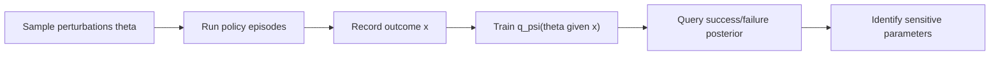

# Simulation Sensitivity Analysis

Simulation sensitivity analysis（仿真敏感度分析）用 controlled perturbations 研究 policy outcome 对环境参数的依赖。[[RoboLab]] 的例子包括 lighting、camera pose、background、textures、object pose 和 shadows；repo 中的 sensitivity script 使用 Mixed Neural Posterior Estimation（MNPE）从实验数据估计哪些参数值最可能对应 success 或 failure。

## 数学结构

令 $\theta$ 表示 controllable environment parameters，例如 camera pose、lighting intensity、object initial pose 或 background category；令 $x$ 表示 observed outcome，例如 binary success、score、duration 或 trajectory metric。Bayesian sensitivity analysis 关心 posterior：

$$
p(\theta \mid x) \propto p(x \mid \theta)p(\theta),
$$

其中 $p(\theta)$ 是 perturbation prior，$p(x\mid\theta)$ 是 policy 在参数 $\theta$ 下产生 outcome $x$ 的 likelihood。RoboLab docs/project page 使用 Neural Posterior Estimation（NPE）语言；repo 的 script 进一步使用 MNPE 来同时处理 continuous parameters 和 categorical parameters，并学习近似 posterior：

$$
q_\psi(\theta \mid x) \approx p(\theta \mid x).
$$

如果参数同时包含 continuous 与 discrete components，MNPE 可以使用 factorization：

$$
q_\psi(\theta \mid x)=q_\psi(\theta^{cont}\mid \theta^{disc},x)\,q_\psi(\theta^{disc}\mid x),
$$

其中 discrete components 通常用 softmax distributions，continuous components 用 normalizing flows。训练时最小化 negative log-likelihood：

$$
\mathcal{L}(\psi)=-\frac{1}{N}\sum_{i=1}^{N}\log q_\psi(\theta_i\mid x_i).
$$

如果参数包含 pose，可把 position $p$ 与 orientation quaternion $q$ 转成距离特征。RoboLab appendix 给出的 pose distance 是：

$$
d(T,T_{ref})=\|p-p_{ref}\|_2+\beta d_{SO(3)}(q,q_{ref}),
$$

其中 $T=(p,q)$ 是 7-DoF pose，$d_{SO(3)}(q_1,q_2)=2\arccos(\min(1,|q_1\cdot q_2|))$，$\beta$ 控制 translation/rotation weighting；repo script 暴露 `pose-distance-beta` 来调节这类权重。

## 直觉

普通 ablation 问“改变 camera 后 success 变多少”；posterior sensitivity 反过来问“如果我只看 successful episodes，哪些 camera/lighting/object parameters 更可能出现？”如果 success posterior 明显集中在某些 wrist camera poses，而 failure posterior 分散或偏到其他 poses，那么 policy 很可能依赖特定 camera geometry，而不是学到了 robust task semantics。

RoboLab appendix 的 interpretation 是：posterior tightly concentrated near reference/zero variation 表示 policy 对该参数敏感，因为成功通常要求该变量保持接近 reference；broad posterior 则表示 policy 对该参数更 robust。

## Failure Modes

- Coverage failure：如果 sampled $\theta$ 没有覆盖真实 deployment variation，posterior 只能解释已采样区域。
- Confounding：某个 camera pose 看似导致 success，可能只是与 easier task subset、object layout 或 policy timeout 分布相关。
- Coarse outcome：binary success 会丢掉 partial progress、wrong-object interactions 和 near misses；需要结合 subtask score 与 trajectory metrics。
- Mixed parameter priors：categorical lighting/background/object choices 的 prior 会影响 posterior interpretation；non-uniform data 需要 importance correction。
- Sim specificity：在 simulation 中敏感的因素不一定等同于 real-world sensitive factors，尤其当 renderer/physics/contact model 与真实系统不匹配时。

## 实践含义

- 对 robot policy debugging，sensitivity posterior 可以告诉你下一轮 data collection 或 augmentation 应该覆盖哪类 camera/object/lighting conditions。
- 对 benchmark reporting，应把 aggregate success 与 sensitivity analysis 一起看：低 success 说明 gap，大 sensitivity 说明 policy 依赖 brittle external factors。
- 对 [[SimulationRealityGap|sim-to-real]]，sensitivity analysis 提供了一个可操作接口：先在 high-fidelity sim 中定位 risk factors，再在真实系统中验证这些因素是否同样 causal。
