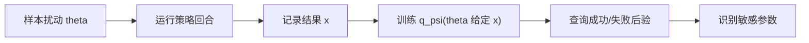

# 仿真敏感性分析

仿真敏感性分析（仿真敏感度分析）用受控扰动研究策略结果对环境参数的依赖。[[RoboLab]] 的例子包括光照、相机位姿、背景、纹理、物体位姿和 shadows；代码仓库中的敏感性脚本使用混合神经网络后验估计（MNPE）从实验数据估计哪些参数值最可能对应成功或失败。

## 数学结构

令 $\theta$ 表示可控的环境参数，例如相机位姿、光照强度、物体初始位姿或背景类别；令 $x$ 表示观测结果，例如二元成功结果、得分、持续时间或轨迹指标。Bayesian 敏感性分析关心后验：

$$
p(\theta \mid x) \propto p(x \mid \theta)p(\theta),
$$

其中 $p(\theta)$ 是扰动先验，$p(x\mid\theta)$ 是策略在参数 $\theta$ 下产生结果 $x$ 的似然。RoboLab 文档/项目页面使用神经网络后验估计（NPE）语言；代码仓库的脚本进一步使用 MNPE 来同时处理连续参数和类别参数，并学习近似后验：

$$
q_\psi(\theta \mid x) \approx p(\theta \mid x).
$$

如果参数同时包含连续与离散分量，MNPE 可以使用分解：

$$
q_\psi(\theta \mid x)=q_\psi(\theta^{cont}\mid \theta^{disc},x)\,q_\psi(\theta^{disc}\mid x),
$$

其中离散分量通常用 Softmax 分布，连续分量用归一化流。训练时最小化负对数似然：

$$
\mathcal{L}(\psi)=-\frac{1}{N}\sum_{i=1}^{N}\log q_\psi(\theta_i\mid x_i).
$$

如果参数包含位姿，可把位置 $p$ 与姿态 quaternion $q$ 转成距离特征。RoboLab 附录给出的位姿距离是：

$$
d(T,T_{ref})=\|p-p_{ref}\|_2+\beta d_{SO(3)}(q,q_{ref}),
$$

其中 $T=(p,q)$ 是 7-DoF 位姿，$d_{SO(3)}(q_1,q_2)=2\arccos(\min(1,|q_1\cdot q_2|))$，$\beta$ 控制平移/旋转加权；代码仓库脚本暴露 `pose-distance-beta` 来调节这类权重。

## 直觉

普通消融实验问“改变相机后成功变多少”；后验敏感性反过来问“如果我只看 successful 回合，哪些相机/光照/物体参数更可能出现？”如果成功后验明显集中在某些腕部相机 poses，而失败后验分散或偏到其他 poses，那么策略很可能依赖特定相机几何，而不是学到了鲁棒任务语义。

RoboLab 附录的 interpretation 是：后验 tightly concentrated near 参考基准/zero 变化表示策略对该参数敏感，因为成功通常要求该变量保持接近参考基准；broad 后验则表示策略对该参数更鲁棒。

```mermaid
flowchart LR
  A[样本扰动 theta] --> B[运行策略回合]
  B --> C[记录结果 x]
  C --> D["训练 q_psi(theta 给定 x)"]
  D --> E["查询成功/失败后验"]
  E --> F[识别敏感参数]
```

## 与统计报告的边界

RoboLab 2026-06 代码仓库更新增加了 `docs/statistical_significance.md` 与自适应采样，但这和敏感性后验不是同一个概念。Statistical 报告估计的是 $p=\Pr(y=1\mid T,\pi)$ 的不确定性，例如 Beta 可信区间；敏感性分析估计的是 $p(\theta\mid x)$，也就是在成功/失败或其他结果条件下哪些环境参数更可能出现。前者回答“这个成功率有多稳”，后者回答“成功或失败依赖哪些扰动”。

在实践上两者要连接：自适应采样可以让每个任务策略配对的二元成功结果估计值更可靠；后验敏感性需要把这些结果与采样的光照、相机位姿、背景、物体位姿等 $\theta$ 绑定。若报告流程没有保留回合层级结果和扰动元数据，MNPE 只能在粗糙数据上拟合；若只做后验而不报告区间 width，也容易把小-N 产物误读成敏感参数。

## 失效情形

- 覆盖范围失败：如果采样的 $\theta$ 没有覆盖真实部署变化，后验只能解释已采样区域。
- Confounding：某个相机位姿看似导致成功，可能只是与更易任务 subset、物体布局或策略 timeout 分布相关。
- 粗略结果：二元成功结果会丢掉 partial 进度、错误物体 interactions 和 near misses；需要结合子任务得分与轨迹指标。
- 混合参数先验：类别光照/背景/物体选择的先验会影响后验 interpretation；non-均匀数据需要 importance 校正。
- Sim specificity：在仿真中敏感的因素不一定等同于现实世界 sensitive 因素，尤其当渲染器/物理/接触模型与真实系统不匹配时。

## 实践含义

- 对机器人策略调试，敏感性后验可以告诉你下一轮数据采集或扩充应该覆盖哪类相机/物体/光照条件。
- 对基准报告，应把汇总成功与敏感性分析一起看：低成功说明差距，大敏感性说明策略依赖 brittle 外部因素。
- 对 [[SimulationRealityGap|仿真到现实迁移]]，敏感性分析提供了一个可操作接口：先在高保真度 sim 中定位风险因素，再在真实系统中验证这些因素是否同样因果。
