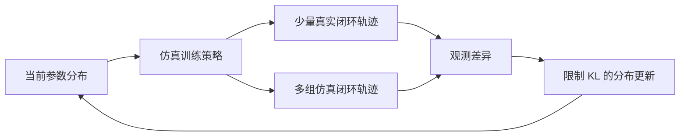

# 仿真系统辨识与闭环分布校准

系统辨识根据真实输入和观测调整模型参数。机器人仿真中既可寻找一个参数估计，也可校准一组参数的分布；后者承认未知因素与参数补偿，适合与 [[DomainRandomization|域随机化]] 配合。

## 数学结构

设 $\xi$ 为仿真参数、$u_{0:T}$ 为输入序列、$o_{0:T}^{real}$ 为真实观测。一个用于理解点估计的教学形式是：

$$
\widehat\xi=\arg\min_\xi D\big(o_{0:T}^{sim}(\xi,u_{0:T}),o_{0:T}^{real}\big).
$$

$D$ 衡量轨迹差异。这个表达不是完整辨识算法：还需确定初态、观测模型、输入与时间对齐，以及哪些参数能从这些数据被区分。

### SimOpt 为什么辨识分布

[[simopt-adaptive-randomization|SimOpt]] 采用 $p_\phi(\xi)=\mathcal N(\mu,\Sigma)$，其中 $\mu$ 为均值、$\Sigma$ 为协方差。第 $i$ 轮先在旧分布训练策略 $\pi_i$，在真实与仿真中分别运行同一闭环策略，再更新分布：

$$
\phi_{i+1}=\arg\min_\phi\mathbb E_{\xi\sim p_\phi}D(\tau^{ob}_{\xi,\pi_i},\tau^{ob}_{real,\pi_i}),
\qquad D_{KL}(p_\phi\Vert p_{\phi_i})\le\varepsilon.
$$

$\tau^{ob}$ 是观测轨迹，$\varepsilon$ 是分布更新的信赖区域限制。辨识时策略固定，下一轮再训练；该迭代是对“每个候选分布都重新训练并评估硬件”的昂贵优化的近似。

论文用加权 $L_1$ 与平方 $L_2$ 轨迹差异，并作高斯平滑缓解错位。其不可微仿真器通过采样与 REPS 更新参数分布，不需要对物理求导。[[DifferentiablePhysics|可微物理]] 是可能的替代途径，不能把它写成本实验已使用的方法。

图对应 SimOpt 的交替步骤；真实与仿真采集的输入动作可以因闭环观测不同而不同，不是简单逐步拷贝真实动作。

## 直觉

任务可能只需要模型预测“这套策略会如何接触和运动”，无需把每个材料参数恢复成物理真值。SimOpt 的附录显示顺应性与阻尼相关并可互相补偿；因此轨迹匹配成功与参数唯一正确是两个问题。Peng 的循环记忆则在策略内部适应未知动力学，与显式拟合参数分布不同。

## 失效情形

- **无法重置到完整真实状态**：SimOpt 的软绳状态不能持续观测，直接逐步复制真实状态和动作并不可行；闭环对比绕开了这项需求。
- **分布跳出已学策略的适用范围**：KL 限制用于控制更新幅度，不是硬件可靠性的证明。
- **匹配观测却夸大参数真值**：观测缺失及参数补偿限制解释；论文目标是政策行为匹配和迁移，而非所有参数的唯一恢复。
- **把少量硬件回合等同低成本**：论文每轮只采三条真实轨迹，但使用大规模仿真采样和 64 块 GPU 训练。

## 实践含义

首先固定 [[RobotCoordinateFrames|坐标]]、[[SimulationTimeStepping|时序]] 与 [[PolicyDeploymentContract|部署接口]]，再将误差归因于物理参数。记录辨识使用的观测、轨迹、初态、分布与任务，并用不同输入或任务验证泛化；这是本库提出的实验设计建议。已有证据支持分布校准改善两类操作任务，尚不能推广为所有机器人环境的通用保证。
