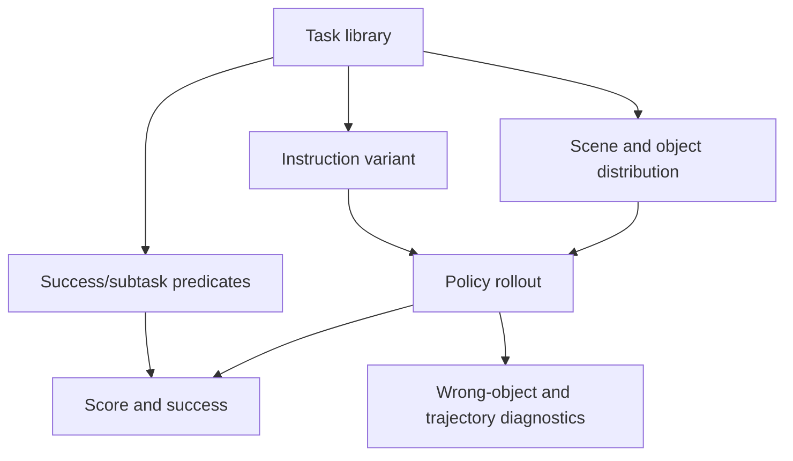

# Task-Generalist Policy Evaluation

Task-generalist policy evaluation（任务泛化策略评估）关注的不是一个 policy 能否在单个 scripted manipulation task 上成功，而是它能否在未专门 co-train 的 diverse tasks、language variants、objects、scenes 和 perturbations 上保持可解释的 performance。[[RoboLab]] 把这个问题变成可运行 benchmark：task library 定义 goals 与 predicates，environment registration 组合 robot/policy/sensors，evaluation scripts 记录 success、subtask score、trajectory metrics 和 wrong-object failures。

## 数学结构

一个 task 可以写成 $T_i=(S_i, O_i, L_i, G_i, H_i)$：$S_i$ 是 scene（USD scene 与初始布局），$O_i$ 是 objects/contact objects，$L_i=\{\ell_i^{vague},\ell_i^{default},\ell_i^{specific}\}$ 是 instruction variants，$G_i=\{g_{i1},\dots,g_{iK}\}$ 是 success/subtask predicates，$H_i$ 是 episode horizon。Policy $\pi_\phi$ 接收 observation history $o_{\le t}$ 与 instruction $\ell$，输出 action chunk $a_{t:t+h}$：

$$
a_{t:t+h} \sim \pi_\phi(a \mid o_{\le t}, \ell, c),
$$

其中 $c$ 是 optional context，例如 policy backend、robot action mode 或 metadata。对第 $e$ 个 episode，success indicator $y_{i,e}$ 可以写成：

$$
y_{i,e} = \mathbb{1}\left[\bigwedge_{g \in G_i} g(x_{0:H_i}) = \text{true}\right],
$$

其中 $x_{0:H_i}$ 是 episode trajectory。若 task 有 subtasks，RoboLab-style score 可以抽象为：

$$
s_{i,e} = \frac{\sum_{k=1}^{K} w_k z_{i,e,k}}{\sum_{k=1}^{K} w_k},
$$

其中 $z_{i,e,k}\in[0,1]$ 是第 $k$ 个 subtask/condition group 的 completion progress，$w_k$ 是 subtask weight。总体 success estimate 是 $\hat{p}_i=\frac{1}{n_i}\sum_e y_{i,e}$；language sensitivity 可以写成 $\Delta_i=\hat{p}_i(\ell^{specific})-\hat{p}_i(\ell^{vague})$。

## 直觉

这个 formalism 的重点是把“policy 能做什么”拆成多个可诊断 axes。Task predicate 决定什么算成功，instruction variant 决定语言歧义有多大，scene/object distribution 决定是否真的 OOD，perturbation parameters 决定 robustness 的测试范围。一个高分但只在 default language、seen objects、固定 camera 下成功的 policy，与一个在 vague/specific variants、视觉相似 objects、camera/lighting perturbations 下稳定的 policy，代表的能力不同。

## Failure Modes

- Domain overlap / benchmark saturation：如果 evaluation tasks 与 training data 太接近，success rate 可能高估 true generalization。
- Language ambiguity：same scene/same goal 的 vague wording 会显著降低 policy success，说明 language grounding 仍是 bottleneck。
- Wrong-object grasp：source 中报告的典型错误包括视觉相似（lime/lemon）、几何 bias（box/can）、语义混淆（measuring spoon/cup）和 proximity bias。
- Sim-proxy mismatch：RoboLab 的 six-task real/sim verification 对 π0.5 和 π0-FAST 呈现相近趋势，但 π0 是明显 outlier；因此 simulation score 需要按 policy/task family 验证。
- Predicate mismatch：predicate-based success checking 清晰且可自动化，但可能低估 recovery behavior、partial satisfaction、human preference 或工具使用中的 subtle semantics。
- Metric masking：subtask score 能显示 partial progress，但也可能掩盖 final task failure；success rate 又可能忽略 trajectory quality 和 safety margins。
- Coverage gap：rigid-body tabletop tasks 不覆盖 deformables、cables/bags、precise force control、compliant interaction 和复杂 frictional dynamics。

## 实践含义

- 对 VLA model reports，应同时给出 success、subtask score、instruction-type breakdown、attribute breakdown 和 wrong-object failures，而不是只给 aggregate success。
- 对 benchmark design，task generation 应持续加入低 overlap objects/tasks 和 controlled perturbations，避免模型在固定 benchmark 上过拟合。
- 对 [[SimulationRealityGap|sim-to-real]]，simulation benchmark 更适合作为 diagnostic instrument：它可以定位 sensitivity 和 failure type，但不能单独证明真实部署可靠。
- 对 [[CompositionalGeneralizationInRobotics|compositional generalization]]，short-horizon task success 仍需要区分 visual recognition、relational reasoning、procedural affordance 和 action execution 的贡献。
