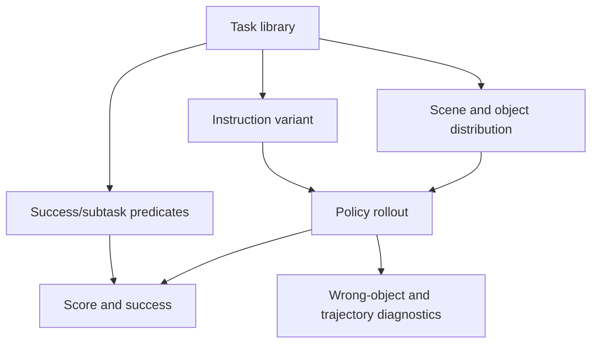

# Task-Generalist Policy Evaluation

Task-generalist policy evaluation（任务泛化策略评估）关注的不是一个 policy 能否在单个 scripted manipulation task 上成功，而是它能否在未专门 co-train 的 diverse tasks、language variants、objects、scenes 和 perturbations 上保持可解释的 performance。[[RoboLab]] 把这个问题变成可运行 benchmark：task library 定义 goals 与 predicates，environment registration 组合 robot/policy/sensors，evaluation scripts 记录 success、subtask score、trajectory metrics 和 wrong-object failures。

## 数学结构

一个 task 可以写成 $T_i=(S_i, O_i, L_i, G_i, H_i)$：$S_i$ 是 scene（USD scene 与初始布局），$O_i$ 是 objects/contact objects，$L_i=\{\ell_i^{vague},\ell_i^{default},\ell_i^{specific}\}$ 是 instruction variants，$G_i=\{g_{i1},\dots,g_{iK}\}$ 是 success/subtask predicates，$H_i$ 是 episode horizon。Policy $\pi_\phi$ 接收 observation history $o_{\le t}$ 与 instruction $\ell$，输出 action chunk $a_{t:t+h}$：

$$
a_{t:t+h} \sim \pi_\phi(a \mid o_{\le t}, \ell, c),
$$

其中 $c$ 是 optional context，例如 policy backend、robot action mode 或 metadata。对第 $e$ 个 episode，success indicator $y_{i,e}$ 可以写成：

$$
y_{i,e} = \mathbb{1}\left[\bigwedge_{g \in G_i} g(x_{0:H_i}) = \text{true}\right],
$$

其中 $x_{0:H_i}$ 是 episode trajectory。若 task 有 subtasks，RoboLab-style score 可以抽象为：

$$
s_{i,e} = \frac{\sum_{k=1}^{K} w_k z_{i,e,k}}{\sum_{k=1}^{K} w_k},
$$

其中 $z_{i,e,k}\in[0,1]$ 是第 $k$ 个 subtask/condition group 的 completion progress，$w_k$ 是 subtask weight。总体 success estimate 是 $\hat{p}_i=\frac{1}{n_i}\sum_e y_{i,e}$；language sensitivity 可以写成 $\Delta_i=\hat{p}_i(\ell^{specific})-\hat{p}_i(\ell^{vague})$。

## 直觉

这个 formalism 的重点是把“policy 能做什么”拆成多个可诊断 axes。Task predicate 决定什么算成功，instruction variant 决定语言歧义有多大，scene/object distribution 决定是否真的 OOD，perturbation parameters 决定 robustness 的测试范围。一个高分但只在 default language、seen objects、固定 camera 下成功的 policy，与一个在 vague/specific variants、视觉相似 objects、camera/lighting perturbations 下稳定的 policy，代表的能力不同。

[[robotics-simulation-infrastructure|Robotics Simulation Infrastructure]] 补充了一个 benchmark engineering 视角：evaluation 是否可扩展，不只取决于 task list，也取决于 task/API layer、asset management、rendering throughput/fidelity、visualizer diagnostics 和 ML integration。也就是说，benchmark 的 scientific value 依赖 infrastructure 能否稳定生成 scenes、并行 rollout、暴露 failure state、记录 reward/trajectory/policy behavior，并把这些数据连接到 evaluation metrics。

[[grail-generating-humanoid-loco-manipulation-from-3d-assets-and-video-priors|GRAIL]] 给这个概念增加了 data-generation / tracking lens：对 humanoid loco-manipulation，不仅要问 policy 是否在一个 task 上 replay reference，还要问 generated 4D HOI pool 能否训练 task-general trackers。它把 evaluation 分成 generated HOI quality、physics executability、task-general tracking metrics（SR、ObjPos、MPJPE-L）和 real visual deployment success，避免只用 perceptual video score 或单条 trajectory tracking 证明 robot usefulness。

```mermaid
flowchart TD
  A["Task library"] --> B["Instruction variant"]
  A --> C["Scene and object distribution"]
  A --> D["Success/subtask predicates"]
  B --> E["Policy rollout"]
  C --> E
  D --> F["Score and success"]
  E --> F
  E --> G["Wrong-object and trajectory diagnostics"]
```

## RoboLab 2026-06 repository update

[[nvlabs-robolab|RoboLab repo]] 的 2026-06 refresh 让 task-generalist evaluation 更像完整 reporting system，而不只是 rollout script。Per-policy runners now live under `policies/<backend>/run.py`，共同调用 `robolab.eval.runner.run_evaluation`；`--num-episodes-adaptive` 使用 Beta posterior credible interval width 决定是否继续采样；`analysis/read_results.py` 和 dashboard 都显示 95% success-rate interval。这意味着 evaluation protocol 的 object 不再只是 $(T_i, \pi)$ 的 mean success，而是 $(T_i, \pi, n, CI, score, events, videos, metadata)$ 的 evidence bundle。

这也改变了 benchmark comparison 的 failure surface：如果两个 policies 的 point success rate 接近，但一个有宽 interval、更多 wrong-object events 或只在 vague/default instruction 中失败，结论不同。RoboLab dashboard 把 task metadata、scene previews、episode videos、events 和 timeseries 放进 local UI，是 [[SimulationBenchmarkReportingPipeline|simulation benchmark reporting pipeline]] 的实现例子；agentic scene/task skills 则说明 task library expansion 也被纳入 infrastructure，但 generated tasks 仍需要 validation 和 metadata regeneration 才能成为 fair evaluation units。

## Failure Modes

- Domain overlap / benchmark saturation：如果 evaluation tasks 与 training data 太接近，success rate 可能高估 true generalization。
- Language ambiguity：same scene/same goal 的 vague wording 会显著降低 policy success，说明 language grounding 仍是 bottleneck。
- Wrong-object grasp：source 中报告的典型错误包括视觉相似（lime/lemon）、几何 bias（box/can）、语义混淆（measuring spoon/cup）和 proximity bias。
- Sim-proxy mismatch：RoboLab 的 six-task real/sim verification 对 π0.5 和 π0-FAST 呈现相近趋势，但 π0 是明显 outlier；因此 simulation score 需要按 policy/task family 验证。
- Predicate mismatch：predicate-based success checking 清晰且可自动化，但可能低估 recovery behavior、partial satisfaction、human preference 或工具使用中的 subtle semantics。
- Metric masking：subtask score 能显示 partial progress，但也可能掩盖 final task failure；success rate 又可能忽略 trajectory quality 和 safety margins。
- Task-family masking：GRAIL-style pooled trackers 会在 related motion families 内 amortize learning；如果 evaluation aggregate 不按 object geometry、contact mode、terrain type 或 motion family 分层，可能掩盖 out-of-family failure。
- Coverage gap：rigid-body tabletop tasks 不覆盖 deformables、cables/bags、precise force control、compliant interaction 和复杂 frictional dynamics。

## 实践含义

- 对 VLA model reports，应同时给出 success、subtask score、instruction-type breakdown、attribute breakdown 和 wrong-object failures，而不是只给 aggregate success。
- 对 benchmark design，task generation 应持续加入低 overlap objects/tasks 和 controlled perturbations，避免模型在固定 benchmark 上过拟合。
- 对 [[SimulationRealityGap|sim-to-real]]，simulation benchmark 更适合作为 diagnostic instrument：它可以定位 sensitivity 和 failure type，但不能单独证明真实部署可靠。
- 对 [[CompositionalGeneralizationInRobotics|compositional generalization]]，short-horizon task success 仍需要区分 visual recognition、relational reasoning、procedural affordance 和 action execution 的贡献。
- 对 [[RoboticsSimulationInfrastructure|simulation infrastructure]]，policy benchmark 的 maintainability 要检查 scene authoring API、asset serialization、parallel evaluation、visualizer instrumentation 和 ML loop resource budget。

[[agile-a-comprehensive-workflow-for-humanoid-loco-manipulation-learning|AGILE]] 补充了 humanoid RL 的 evaluation lens：对部署型 humanoid policies，evaluation 还需要 deterministic scenario tests 和 per-joint motion-quality diagnostics。RoboLab-style evaluation 更关注 task library、language variants、object distribution 和 wrong-object behavior；AGILE-style evaluation 更关注 velocity/height sweeps、RMS acceleration、jerk、joint-limit violations、high-frequency energy 和 sim-to-sim descriptor consistency。两者共同指向同一个原则：只看 aggregate success/reward 会掩盖实际 deployment risk。

GRAIL 进一步提示：当 training data 来自 generated trajectories，evaluation 还应把 data source 本身纳入报告。Generated HOI 的 contact distance、penetration、smoothness、tracking executability、policy-level object error 和 real-world trial success 属于不同层级；某一层成功不能替代下一层验证。
