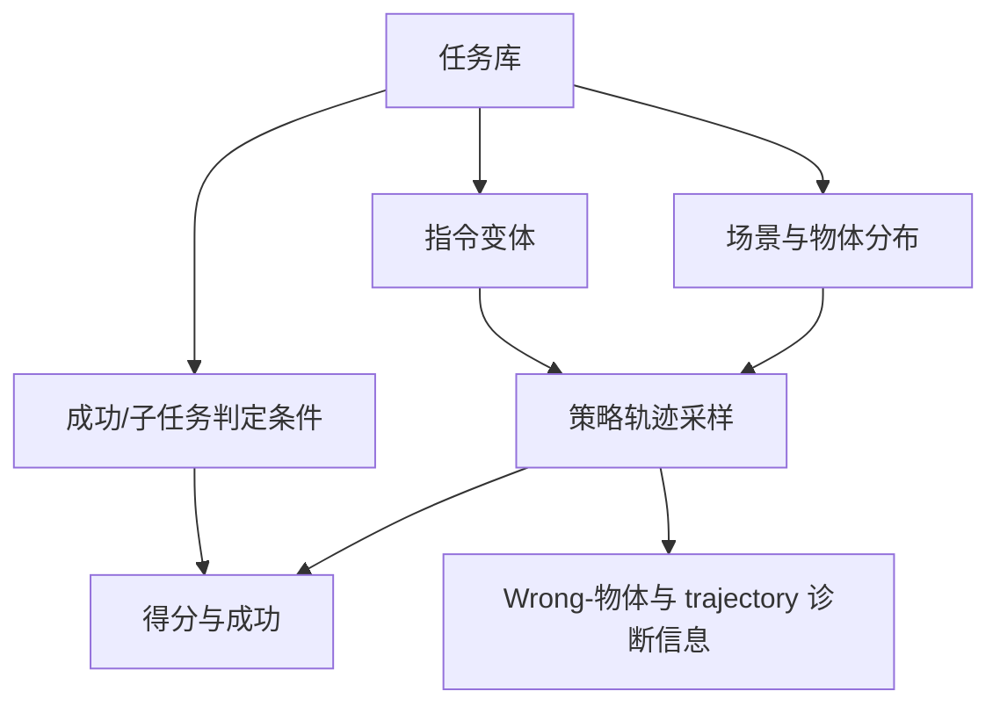

# 通用任务策略评估

任务通用策略评估（任务泛化策略评估）关注的不是一个策略能否在单个 scripted 操作任务上成功，而是它能否在未专门 co-train 的 diverse 任务、语言变体、物体、场景和扰动上保持可解释的性能。[[RoboLab]] 把这个问题变成可运行基准：任务库定义目标与判定条件，环境 registration 组合机器人/策略/传感器，评估脚本记录成功、子任务得分、轨迹指标和错误物体失败。

## 数学结构

一个任务可以写成 $T_i=(S_i, O_i, L_i, G_i, H_i)$：$S_i$ 是场景（USD 场景与初始布局），$O_i$ 是物体/接触物体，$L_i=\{\ell_i^{vague},\ell_i^{default},\ell_i^{specific}\}$ 是指令变体，$G_i=\{g_{i1},\dots,g_{iK}\}$ 是成功/子任务判定条件，$H_i$ 是回合时域长度。策略 $\pi_\phi$ 接收观测历史 $o_{\le t}$ 与指令 $\ell$，输出动作块 $a_{t:t+h}$：

$$
a_{t:t+h} \sim \pi_\phi(a \mid o_{\le t}, \ell, c),
$$

其中 $c$ 是可选上下文，例如策略后端、机器人动作模式或元数据。对第 $e$ 个回合，成功 indicator $y_{i,e}$ 可以写成：

$$
y_{i,e} = \mathbb{1}\left[\bigwedge_{g \in G_i} g(x_{0:H_i}) = \text{true}\right],
$$

其中 $x_{0:H_i}$ 是回合轨迹。若任务有子任务，RoboLab-风格得分可以抽象为：

$$
s_{i,e} = \frac{\sum_{k=1}^{K} w_k z_{i,e,k}}{\sum_{k=1}^{K} w_k},
$$

其中 $z_{i,e,k}\in[0,1]$ 是第 $k$ 个子任务/条件组的完成度进度，$w_k$ 是子任务权重。总体成功估计值是 $\hat{p}_i=\frac{1}{n_i}\sum_e y_{i,e}$；语言敏感性可以写成 $\Delta_i=\hat{p}_i(\ell^{specific})-\hat{p}_i(\ell^{vague})$。

## 直觉

这个形式化表述的重点是把“策略能做什么”拆成多个可诊断轴。任务判定条件决定什么算成功，指令变体决定语言歧义有多大，场景/物体分布决定是否真的 OOD，扰动参数决定鲁棒性的测试范围。一个高分但只在默认语言、已见物体、固定相机下成功的策略，与一个在模糊的/特定的变体、视觉相似物体、相机/光照扰动下稳定的策略，代表的能力不同。

[[robotics-simulation-infrastructure|机器人学仿真基础设施]] 补充了一个基准工程视角：评估是否可扩展，不只取决于任务列表，也取决于任务/API 层、资产 management、渲染吞吐量/保真度、可视化工具诊断信息和 ML 集成。也就是说，基准的 scientific 价值依赖基础设施能否稳定生成场景、并行轨迹采样、暴露失败状态、记录奖励/轨迹/策略行为，并把这些数据连接到评估指标。

[[grail-generating-humanoid-loco-manipulation-from-3d-assets-and-video-priors|GRAIL]] 给这个概念增加了数据生成 / 跟踪视角：对人形机器人移动操作，不仅要问策略是否在一个任务上重放参考基准，还要问生成的 4D HOI 数据池能否训练任务一般性跟踪器。它把评估分成生成的 HOI 质量、物理可执行性、任务一般性跟踪指标（SR、ObjPos、MPJPE-L）和真实视觉部署成功，避免只用 perceptual 视频得分或单条轨迹跟踪证明机器人实用价值。

```mermaid
flowchart TD
  A["任务库"] --> B["指令变体"]
  A --> C["场景与物体分布"]
  A --> D["成功/子任务判定条件"]
  B --> E["策略轨迹采样"]
  C --> E
  D --> F["得分与成功"]
  E --> F
  E --> G["Wrong-物体与 trajectory 诊断信息"]
```

## RoboLab 2026-06 代码仓库更新

[[nvlabs-robolab|RoboLab 代码仓库]] 的 2026-06 更新让任务通用评估更像完整报告系统，而不只是轨迹采样脚本。Per-策略 runners now live under `policies/<backend>/run.py`，共同调用 `robolab.eval.runner.run_evaluation`；`--num-episodes-adaptive` 使用 Beta 后验可信区间 width 决定是否继续采样；`analysis/read_results.py` 和看板都显示 95% 成功比率区间。这意味着评估规程的物体不再只是 $(T_i, \pi)$ 的 mean 成功，而是 $(T_i, \pi, n, CI, score, events, videos, metadata)$ 的证据 bundle。

这也改变了基准比较的失败表面：如果两个策略的点成功率接近，但一个置信区间更宽、错误物体事件更多，或只在模糊/默认指令中失败，结论就会不同。RoboLab 看板把任务元数据、场景预览、回合视频、事件和时间序列放进本地界面，是 [[SimulationBenchmarkReportingPipeline|仿真基准报告流程]] 的实现案例；智能体式场景/任务技能则说明任务库扩展也被纳入基础设施，但生成任务仍需通过验证并重新生成元数据，才能成为公平的评估单位。

## 失效情形

- Domain 重叠 / 基准饱和：如果评估任务与训练数据太接近，成功率可能高估真实泛化。
- 语言歧义：相同的场景/相同的目标的模糊的 wording 会显著降低策略成功，说明语言语义落地仍是瓶颈。
- 错误物体抓取：来源中报告的典型错误包括视觉相似（lime/lemon）、几何偏差（盒体/can）、语义混淆（measuring spoon/杯子）和邻近度偏差。
- Sim-代理不匹配：RoboLab 的 six-任务真实/仿真验证对 π0.5 和 π0-快速呈现相近趋势，但 π0 是明显 outlier；因此仿真得分需要按策略/任务族验证。
- 判定条件不匹配：判定条件基于成功检查清晰且可自动化，但可能低估恢复行为、partial satisfaction、人类 preference 或工具使用中的 subtle 语义。
- 指标掩盖：子任务得分能显示 partial 进度，但也可能掩盖最终任务失败；成功率又可能忽略轨迹质量和 safety margins。
- 任务族掩盖：GRAIL-风格 pooled 跟踪器会在相关的运动族内 amortize 学习；如果评估汇总不按物体几何、接触模式、地形类型或运动族分层，可能掩盖族外失败。
- 覆盖范围差距：刚体桌面任务不覆盖可变形物体、绳索与袋子、精确力控制、柔顺交互和复杂摩擦动力学。

## 实践含义

- 对 VLA 模型报告，应同时给出成功、子任务得分、指令类型 breakdown、属性 breakdown 和错误物体失败，而不是只给汇总成功。
- 对基准设计，任务生成应持续加入低重叠物体/任务和受控扰动，避免模型在固定基准上过拟合。
- 对 [[SimulationRealityGap|仿真到现实迁移]]，仿真基准更适合作为诊断 instrument：它可以定位敏感性和失败类型，但不能单独证明真实部署可靠。
- 对 [[CompositionalGeneralizationInRobotics|组合式泛化]]，短时域任务成功仍需要区分视觉 recognition、关系推理推理、过程推理可供性和动作执行的贡献。
- 对 [[RoboticsSimulationInfrastructure|仿真基础设施]]，策略基准的可维护性要检查场景制作 API、资产序列化、并行评估、可视化工具诊断工具和 ML 循环资源预算。

[[agile-a-comprehensive-workflow-for-humanoid-loco-manipulation-learning|AGILE]] 补充了人形机器人 RL 的评估视角：对部署型人形机器人策略，评估还需要确定性场景测试和逐关节运动质量诊断信息。RoboLab-风格评估更关注任务库、语言变体、物体分布和错误物体行为；AGILE-风格评估更关注速度/高度扫描、RMS 加速度、加加速度、关节限制违反、高频能量和跨仿真器验证描述文件一致性。两者共同指向同一个原则：只看汇总成功/奖励会掩盖实际部署风险。

GRAIL 进一步提示：当训练数据来自生成的轨迹，评估还应把数据来源本身纳入报告。生成的 HOI 的接触距离、穿透、平滑性、跟踪可执行性、策略层级物体错误和现实世界试验成功属于不同层级；某一层成功不能替代下一层验证。
