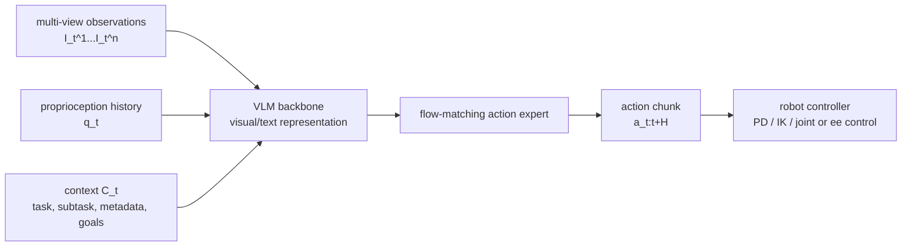

# Vision-Language-Action Models

VLA（vision-language-action model）是把 visual observations、language/context 和 robot state 直接映射到 robot actions 的 policy model family。[[pi07-steerable-generalist-robotic-foundation-model|π0.7 paper]] 把 VLA 作为 generalist robot foundation model 的低层执行核心：VLM backbone 处理视觉和文本上下文，action expert 生成 continuous action chunks。

## 数学结构

训练数据 $D$ 包含 robot trajectories。$o_t$ 是第 $t$ 步 observation，通常写作 $o_t=[I_t^1,\dots,I_t^n,q_t]$，其中 $I_t^i$ 是第 $i$ 个 camera image，$q_t$ 是 robot joint configuration。$a_t$ 是 robot action，可以是 joint command 或 end-effector command。$C_t$ 是 prompt/context，传统 VLA 常只包含 task language $\ell_t$，π0.7 把它扩展为更丰富的 multimodal context。

VLA 不只预测单步 action，而是预测 future action chunk $a_{t:t+H}$。给定 observation history $o_{t-T:t}$ 和 context $C_t$，训练目标可以写成：

$$
\max_\theta \mathbb{E}_{D}\left[\log \pi_\theta(a_{t:t+H}\mid o_{t-T:t}, C_t)\right].
$$

π0.7 的 action expert 用 flow matching 或 diffusion-style objective 学习 continuous action distribution。论文特别指出，这种 action expert 优化的是 approximate lower bound，而不是 closed-form log-likelihood；因此上式应理解为 policy-learning abstraction，而不是可精确计算的 likelihood。

[[lda-1b-scaling-latent-dynamics-action-model|LDA-1B]] 把 VLA-style action prediction 放进更宽的 [[LatentDynamicsActionModels|latent dynamics]] objective：同一个 diffusion transformer 不只拟合 $\pi_\theta(a_{t:t+H}\mid o,C)$，还学习 $p(z_{t+1:t+k}\mid o_t,a_{t+1:t+k},\ell)$、$p(a_{t+1:t+k}\mid o_t,z_{t+1:t+k},\ell)$ 和 $p(z_{t+1:t+k}\mid o_t,\ell)$。这让 action policy 从 dynamics prediction 和 visual forecasting 中获得额外 supervision。

## 直觉

VLA 的 backbone 负责把视觉、语言、history 和 proprioception 编成一个 shared representation；action expert 则像一个 fast controller head，从这个 representation 中采样接下来一段可执行动作。Action chunking 的好处是降低 inference frequency pressure，坏处是如果 context 或 observation 快速变化，chunk 可能变 stale，所以 runtime 需要 asynchronous inference 和 real-time action chunking。

## Failure Modes

- Instruction under-conditioning：如果 $C_t$ 只有短 task language，模型容易根据 scene bias 重复 training data 中最常见的行为，而不是执行用户指定的 unusual instruction。
- Mode averaging：不同 operators、robots、speeds、quality levels 和 failure trajectories 混在一起时，unconditional imitation 可能平均多个 strategy，输出 suboptimal compromise。
- Latency and stale chunks：large VLM/action expert 的 inference latency 会和 20-50 Hz control loop 冲突；action chunking 缓解频率压力，但会带来 delayed correction。
- Cross-embodiment mismatch：同一 task 在不同 robot morphology 上可能需要完全不同的 grasp angle、reach strategy 或 force profile；直接复制 source robot motion 不够。
- Approximate likelihood mismatch：flow/diffusion action experts 表达 multimodal actions，但 training objective 与 actual closed-loop success 之间仍有 gap。
- BC-only data bottleneck：LDA-1B source 强调只做 expert behavior cloning 会丢掉 low-quality trajectories 与 actionless videos 中的 dynamics signal；如果 VLA training objective 不能区分 data roles，mixed data 可能被误用或丢弃。

## 实践含义

对 generalist robot policy，VLA 的 bottleneck 不只是 action decoder，而是 $C_t$ 是否包含足够信息来 disambiguate behavior。π0.7 的结果提示：把 failures 和 autonomous rollouts 纳入训练并非一定有害，前提是用 [[RobotContextConditioning|context conditioning]] 明确标记这些数据的 quality、speed 和 mistake。

对 deployment，VLA 需要被看成实时系统的一部分：observation history、subtask generation、subgoal generation、action denoising、controller execution 和 safety checks 都会影响 final behavior。单看 offline imitation objective 无法判断 closed-loop robustness。

相关页面：[[Pi07]]、[[RobotContextConditioning]]、[[CompositionalGeneralizationInRobotics]]、[[LDA1B]]、[[LatentDynamicsActionModels]]。
