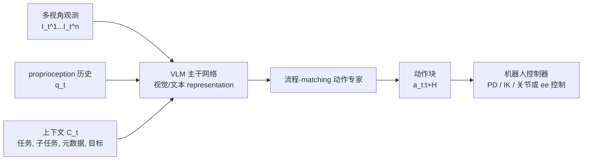

# 视觉—语言—动作模型

VLA（视觉语言动作模型）是把视觉观测、语言/上下文和机器人状态直接映射到机器人动作的策略模型族。[[pi07-steerable-generalist-robotic-foundation-model|π0.7 论文]] 把 VLA 作为通用机器人基础模型的低层执行核心：VLM 主干网络处理视觉和文本上下文，动作专家生成连续动作块。

## 数学结构

训练数据 $D$ 包含机器人轨迹。$o_t$ 是第 $t$ 步观测，通常写作 $o_t=[I_t^1,\dots,I_t^n,q_t]$，其中 $I_t^i$ 是第 $i$ 个相机图像，$q_t$ 是机器人关节配置。$a_t$ 是机器人动作，可以是关节指令或末端执行器指令。$C_t$ 是提示/上下文，传统 VLA 常只包含任务语言 $\ell_t$，π0.7 把它扩展为更丰富的 multimodal 上下文。

VLA 不只预测单步动作，而是预测未来动作块 $a_{t:t+H}$。给定观测历史 $o_{t-T:t}$ 和上下文 $C_t$，训练目标可以写成：

$$
\max_\theta \mathbb{E}_{D}\left[\log \pi_\theta(a_{t:t+H}\mid o_{t-T:t}, C_t)\right].
$$

π0.7 的动作专家用流程匹配或扩散风格目标学习连续动作分布。论文特别指出，这种动作专家优化的是近似较低边界，而不是闭环-form 日志似然；因此上式应理解为策略学习抽象，而不是可精确计算的似然。

[[lda-1b-scaling-latent-dynamics-action-model|LDA-1B]] 把 VLA-风格动作预测放进更宽的 [[LatentDynamicsActionModels|latent 动力学]] 目标：同一个扩散 transformer 不只拟合 $\pi_\theta(a_{t:t+H}\mid o,C)$，还学习 $p(z_{t+1:t+k}\mid o_t,a_{t+1:t+k},\ell)$、$p(a_{t+1:t+k}\mid o_t,z_{t+1:t+k},\ell)$ 和 $p(z_{t+1:t+k}\mid o_t,\ell)$。这让动作策略从动力学预测和视觉预测中获得额外监督。

[[DeFI]] 则把 VLA 中的未来预测和动作预测先拆开：GFDM 负责从视频学视觉正向动力学，GIDM 负责从视频转移学 [[InverseDynamicsModels|逆动力学]] 潜在动作，最后由动作 adapter 输出可执行的指令。这说明 VLA 的动作输出头可以不是单纯 BC 解码器，而是由世界模型预测和逆动作表示共同支撑。

[[Seer]] 代表另一条路线：不先拆开正向/逆模块，而是在同一个 Transformer 策略中用 [FRS] 标记预测未来图像，用 [INV] 标记在关注到 [FRS] 的条件下预测动作序列。它说明 VLA/动作策略可以在机器人动作标注的数据集上端到端学到视觉动作 synergy。

## 直觉

VLA 的主干网络负责把视觉、语言、历史和本体感知编成一个共享表示；动作专家则像一个快速控制器输出头，从这个表示中采样接下来一段可执行动作。动作 chunking 的好处是降低推理频率压力，坏处是如果上下文或观测快速变化，动作块可能变 stale，所以运行时需要 asynchronous 推理和实时动作 chunking。

```mermaid
flowchart LR
  O["多视角观测<br/>I_t^1...I_t^n"] --> B["VLM 主干网络<br/>视觉/文本 representation"]
  Q["proprioception 历史<br/>q_t"] --> B
  C["上下文 C_t<br/>任务, 子任务, 元数据, 目标"] --> B
  B --> E["流程-matching 动作专家"]
  E --> A["动作块<br/>a_t:t+H"]
  A --> R["机器人控制器<br/>PD / IK / 关节或 ee 控制"]
```

## 失效情形

- 指令 under-条件化：如果 $C_t$ 只有短任务语言，模型容易根据场景偏差重复训练数据中最常见的行为，而不是执行用户指定的 unusual 指令。
- 模式 averaging：不同 operators、机器人、速度、质量 levels 和失败轨迹混在一起时，unconditional 模仿可能平均多个策略，输出 suboptimal compromise。
- 延迟与 stale 动作块：大规模 VLM/动作专家的推理延迟会和 20-50 Hz 控制循环冲突；动作 chunking 缓解频率压力，但会带来 delayed 校正。
- 跨本体不匹配：同一任务在不同机器人形态上可能需要完全不同的抓取角度、reach 策略或力分析；直接复制来源机器人运动不够。
- 近似似然不匹配：流程/扩散动作 experts 表达 multimodal 动作，但训练目标与 actual 闭环成功之间仍有差距。
- BC-仅数据瓶颈：LDA-1B 来源强调只做专家行为克隆会丢掉低质量轨迹与无动作标注的视频中的动力学 signal；DeFI 进一步显示动作-free 视频也能通过逆动力学代理目标学潜在动作表示。如果 VLA 训练目标不能区分数据角色，混合数据可能被误用或丢弃。
- Forecast-动作 entanglement：DeFI 指出把视频预测和动作预测端到端纠缠在一个目标中会产生 2D 图像预测与 3D 动作预测的不匹配；在少量下游机器人数据上联合更新所有模块还可能造成表示漂移。
- 视觉前瞻预测损失不匹配：Seer 使用 RGB 未来图像重建作为前瞻预测目标；这种信号对动作有帮助，但仍可能把低层外观与控制相关的状态混在一起。

## 实践含义

对通用机器人策略，VLA 的瓶颈不只是动作解码器，而是 $C_t$ 是否包含足够信息来消除歧义行为。π0.7 的结果提示：把失败和自主轨迹采样纳入训练并非一定有害，前提是用 [[RobotContextConditioning|上下文条件化]] 明确标记这些数据的质量、速度和错误。

对部署，VLA 需要被看成实时系统的一部分：观测历史、子任务生成、子目标生成、动作 denoising、控制器执行和 safety 检查都会影响最终行为。单看离线模仿目标无法判断闭环鲁棒性。

相关页面：[[Pi07]]、[[RobotContextConditioning]]、[[CompositionalGeneralizationInRobotics]]、[[LDA1B]]、[[Seer]]、[[DeFI]]、[[LatentDynamicsActionModels]]、[[InverseDynamicsModels]]。
