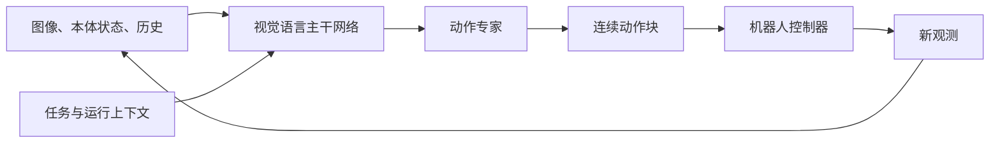

# 视觉—语言—动作模型

视觉—语言—动作模型（VLA）把图像、语言上下文和机器人状态映射到动作。[[pi07-steerable-generalist-robotic-foundation-model|π0.7]] 中，视觉语言主干网络处理观测与上下文，动作专家生成连续动作块。它是策略模型；未来预测或世界模型是否参与，要看具体结构。

## 数学结构

令 $D$ 为机器人轨迹数据，$o_t=[I_t^1,\ldots,I_t^n,q_t]$ 为当前观测，$I_t^i$ 为第 $i$ 个相机图像，$q_t$ 为关节配置。$C_t$ 为任务语言、子任务、元数据或视觉目标等上下文；$\theta$ 为策略参数。

为避免端点歧义，本文将长度为 $H$ 的动作块记作 $A_t=(a_t,\ldots,a_{t+H-1})$，观测历史记作 $O_t=(o_{t-T+1},\ldots,o_t)$，其中 $T$ 为历史长度。策略学习的抽象目标是：

$$
\max_\theta\;\mathbb E_D[\log\pi_\theta(A_t\mid O_t,C_t)].
$$

这是条件动作分布的教学表示。π0.7 的动作专家使用流匹配／扩散式训练，不能直接把上式当成实现中可精确计算的对数似然。动作 $a_t$ 的单位、坐标系和执行接口也由机器人控制设置决定。[[pi07-steerable-generalist-robotic-foundation-model|π0.7 论文]]、[[RobotLearningObjectives|机器人学习目标：示范、回报与动力学]]

## 直觉：动作块与闭环

动作块让一次推断提供多步控制，缓解大模型推理频率压力。但预测多步不意味着应把整块不加修正地执行到底：新观测、环境变化和推理延迟会影响控制。具体重规划、异步推断与动作块衔接需要实现来源支持。π0.7 的系统讨论见其 [[pi07-steerable-generalist-robotic-foundation-model|来源页]]。

```mermaid
flowchart LR
  A[图像、本体状态、历史] --> B[视觉语言主干网络]
  C[任务与运行上下文] --> B
  B --> D[动作专家]
  D --> E[连续动作块]
  E --> F[机器人控制器]
  F --> G[新观测]
  G --> A
```

图描述信息与控制循环。主干网络输出的表示和实际驱动量之间仍有控制器、动作缩放与坐标变换，不能省略这些部署语义。[[HumanoidRLWorkflow|人形机器人强化学习工作流]]

## 四条训练路线怎样区分

| 方法 | 未来与动作的关系 | 数据与监督重点 |
| --- | --- | --- |
| π0.7 | 上下文及视觉子目标引导动作专家 | 多种行为通过质量、速度、控制模式等条件区分 |
| LDA-1B | 共享模型学习策略、正向／逆动力学与视觉预测 | 按质量和动作标签路由损失 |
| Seer | 同一 Transformer 的未来图像标记支撑动作标记 | 依赖动作标注机器人轨迹，联合训练 |
| DeFI | 正向与逆动力学分开预训练，适配器输出控制 | 视频学习潜在动作，再用机器人动作数据落地 |

表格用于机制对比，不能跨不同任务与预算直接排名。各行证据分别见 [[pi07-steerable-generalist-robotic-foundation-model|π0.7 论文]]、[[lda-1b-scaling-latent-dynamics-action-model|LDA-1B 论文]]、[[predictive-inverse-dynamics-models-are-scalable-learners-for-robotic-manipulation|Seer 论文]]、[[disentangled-robot-learning-via-separate-forward-and-inverse-dynamics-pretraining|DeFI 论文]]。完整机制见 [[RobotContextConditioning|机器人上下文条件化]]、[[LatentDynamicsActionModels|潜在动力学动作模型]]、[[InverseDynamicsModels|逆动力学模型]]。

## 失效情形

- **条件不足与行为歧义**：不同质量、速度、操作者和机器人行为混合时，短任务语言未必足以选择期望行为；π0.7 用更丰富上下文处理这一问题。[[RobotContextConditioning|机器人上下文条件化]]
- **数据监督误用**：低质量动作直接进入策略模仿，不等于这些轨迹没有动力学价值。LDA-1B 与 DeFI 展示了不同的目标分配方式。[[LatentDynamicsActionModels|潜在动力学动作模型]]、[[InverseDynamicsModels|逆动力学模型]]
- **未来与动作表示不匹配**：DeFI 讨论联合视频／动作目标和微调漂移；Seer 的 RGB 未来监督与控制状态也需要区分。这里是来源提出的机制取舍，不说明一种路线普遍失败。[[InverseDynamicsModels|逆动力学模型]]
- **推理与部署时序**：动作块和计算延迟影响新观测何时生效，离线损失不能独立验证闭环表现。[[pi07-steerable-generalist-robotic-foundation-model|π0.7 论文]]

## 实践含义

部署前记录动作单位、参考坐标系、历史窗口、观测时间戳、推断延迟和实际执行的块长度；评测时把训练目标与闭环指标分开。这是基于来源机制整理的工程检查建议，不是统一算法配方。先用 [[robot-learning-and-evaluation-learning-path|学习与评测路径]] 把目标、数据与评测串起来。
