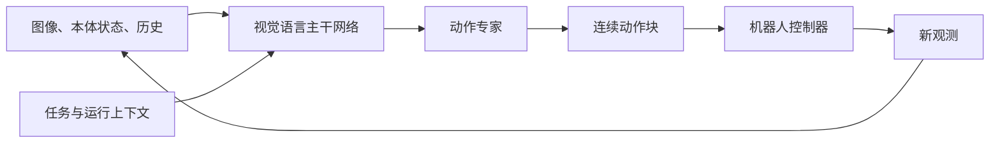

# Vision-Language-Action (VLA)

视觉—语言—动作模型（VLA）把图像、语言上下文和机器人状态映射到动作。[[pi07-steerable-generalist-robotic-foundation-model|π0.7]] 中，视觉语言主干网络处理观测与上下文，动作专家生成连续动作块。它是策略模型；未来预测或世界模型是否参与，要看具体结构。

## 数学结构

令 $D$ 为机器人轨迹数据，$o_t=[I_t^1,\ldots,I_t^n,q_t]$ 为当前观测，$I_t^i$ 为第 $i$ 个相机图像，$q_t$ 为关节配置。$C_t$ 为任务语言、子任务、元数据或视觉目标等上下文；$\theta$ 为策略参数。

为避免端点歧义，本文将长度为 $H$ 的动作块记作 $A_t=(a_t,\ldots,a_{t+H-1})$，观测历史记作 $O_t=(o_{t-T+1},\ldots,o_t)$，其中 $T$ 为历史长度。策略学习的抽象目标是：

$$
\max_\theta\;\mathbb E_D[\log\pi_\theta(A_t\mid O_t,C_t)].
$$

这是条件动作分布的教学表示。π0.7 的动作专家使用流匹配／扩散式训练，不能直接把上式当成实现中可精确计算的对数似然。动作 $a_t$ 的单位、坐标系和执行接口也由机器人控制设置决定。[[pi07-steerable-generalist-robotic-foundation-model|π0.7 论文]]、[[RobotLearningObjectives|机器人学习目标]]

## 直觉：动作块与闭环

动作块让一次推断提供多步控制，缓解大模型推理频率压力。但预测多步不意味着应把整块不加修正地执行到底：新观测、环境变化和推理延迟会影响控制。具体重规划、异步推断与动作块衔接需要实现来源支持。π0.7 的系统讨论见其 [[pi07-steerable-generalist-robotic-foundation-model|来源页]]。

```mermaid
flowchart LR
  A[图像、本体状态、历史] --> B[视觉语言主干网络]
  C[任务与运行上下文] --> B
  B --> D[动作专家]
  D --> E[连续动作块]
  E --> F[机器人控制器]
  F --> G[新观测]
  G --> A
```

图描述信息与控制循环。主干网络输出的表示和实际驱动量之间仍有控制器、动作缩放与坐标变换，不能省略这些部署语义。[[agile-a-comprehensive-workflow-for-humanoid-loco-manipulation-learning|人形机器人强化学习工作流]]

**两个时钟的教学例子。** 若控制器为 50 Hz，执行 15 步动作对应 0.3 秒物理时间；这段命令可以由几次 [[FlowMatching|生成空间更新]] 一起产生。生成时的五次更新不是五个机器人控制步。推理花费时间时，机器人可能仍在执行上一块的前缀；新块如何接续、哪些已执行命令不能再修改，是实时动作分块要处理的问题。π0.7 给出了 50 步预测、15／25 步执行和延迟训练的具体实现，但不同模型不能直接照搬其数值。[[pi07-steerable-generalist-robotic-foundation-model|π0.7 §VI–VIII]]

**输出还需要控制语义。** 一个七维向量可能表示末端位置／旋转增量与夹爪，也可能使用完全不同的关节接口。模型输出的形状相同，不代表单位、基准坐标系和时间步长相同；跨机器人数据对齐必须说明这些约定。LDA-1B 用统一手部中心坐标表达动作，π0.7 显式保留关节／末端控制模式条件。[[lda-1b-scaling-latent-dynamics-action-model|LDA-1B §III-C、IV]]、[[pi07-steerable-generalist-robotic-foundation-model|π0.7 §V-D]]

## 训练目标与执行接口分开看

同一个动作输出接口可以来自不同训练信号：示范模仿、未来状态预测、逆动力学或质量条件化。它们不会自动把策略变成在线规划器；是否搜索候选动作，要检查执行时的计算图。具体机制见 [[InverseDynamicsModels|Inverse Dynamics]]、[[sources/lda-1b-scaling-latent-dynamics-action-model|LDA-1B]] 和 [[RobotContextConditioning|上下文条件化]]，跨方法对比集中在 [[topics/future-conditioned-action|未来条件动作学习专题]]。

π0.7 的视觉子目标生成器与 VLA 是两个模型：约 5B 参数的 VLA 负责动作，14B 的 BAGEL 派生模型负责生成子目标。动作模型单次推断时间不能代表含子目标生成、传输与控制执行的完整系统延迟。[[pi07-steerable-generalist-robotic-foundation-model|π0.7 §III、附录 C–D]]

## 失效情形

- **条件不足与行为歧义**：不同质量、速度、操作者和机器人行为混合时，短任务语言未必足以选择期望行为；π0.7 用更丰富上下文处理这一问题。[[RobotContextConditioning|Context Conditioning]]
- **数据监督误用**：低质量动作直接进入策略模仿，不等于这些轨迹没有动力学价值。LDA-1B 与 DeFI 展示了不同的目标分配方式。[[sources/lda-1b-scaling-latent-dynamics-action-model|LDA-1B]]、[[InverseDynamicsModels|Inverse Dynamics]]
- **未来与动作表示不匹配**：DeFI 讨论联合视频／动作目标和微调漂移；Seer 的 RGB 未来监督与控制状态也需要区分。这里是来源提出的机制取舍，不说明一种路线普遍失败。[[InverseDynamicsModels|Inverse Dynamics]]
- **推理与部署时序**：动作块和计算延迟影响新观测何时生效，离线损失不能独立验证闭环表现。[[pi07-steerable-generalist-robotic-foundation-model|π0.7 论文]]

## 实践含义

部署前记录动作单位、参考坐标系、历史窗口、观测时间戳、推断延迟和实际执行的块长度；评测时把训练目标与闭环指标分开。这是基于来源机制整理的工程检查建议，不是统一算法配方。先用 [[topics/robot-policy-learning|学习与评测路径]] 把目标、数据与评测串起来。

## 研究归属

[[topics/robot-policy-learning|机器人策略学习]] · [[topics/world-models-and-representations|World Models]] · [[topics/future-conditioned-action|未来预测与动作学习]]。
