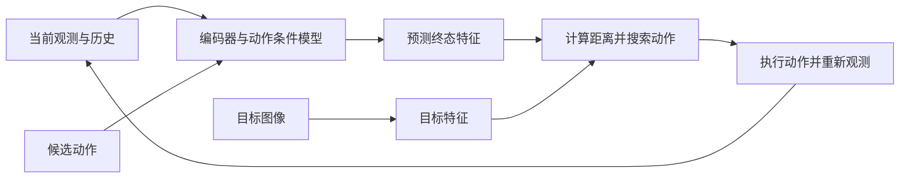

# 视觉目标规划：让动作后果接近目标图像

视觉目标规划用图像描述希望达到的状态：预测候选动作造成的特征变化，再搜索使预测终态接近目标的动作。**目标图像决定想达到什么，动作条件模型决定怎样行动可能达到它。** 这与先生成未来图像、再交给策略或逆模型产生动作的接口不同。[[dino-wm-pretrained-visual-features|DINO-WM]]、[[v-jepa-2-understanding-prediction-planning|V-JEPA 2-AC]]；另一类接口见 [[pi07-steerable-generalist-robotic-foundation-model|π0.7 的视觉子目标]]。

## 数学结构：表示、动力学与目标不能混为一体

令 $o_t$ 为当前图像，$o_g$ 为目标图像，$E$ 为视觉编码器，$z_t=E(o_t)$、$z_g=E(o_g)$ 为特征。图像块表示保留 $N$ 个空间位置、每个位置 $d$ 维特征，即 $z_t\in\mathbb R^{N\times d}$；它与把整张图压成一个全局向量具有不同信息保留方式。具体比较见 [[dino-wm-pretrained-visual-features|空间特征消融]]。

动作条件预测器 $F_\theta$ 接收长度 $h$ 的视觉历史与动作历史。以平方 L2 训练损失为例：

$$
\mathcal L_{\rm pred}=\left\|F_\theta(z_{t-h+1:t},a_{t-h+1:t})-E(o_{t+1})\right\|_2^2.
$$

$a_t$ 是动作，$\theta$ 是预测器参数。这是 DINO-WM 的教学简记，省略动作编码等实现细节；编码器冻结，预测器学习动作与后果的关系。V-JEPA 2-AC 则加入末端本体状态，使用 L1 误差，并结合真实中间状态输入与短程自回归训练。共同点是预测特征，具体监督和可用信息并不相同。[[dino-wm-pretrained-visual-features|特征动力学训练]]、[[v-jepa-2-understanding-prediction-planning|动作后训练]]

### 训练时看见什么，部署时还能看见吗

教师强制训练使用真实中间帧；规划使用自身预测。因果掩码必须阻止预测器读取未来真实帧，否则训练可以通过偷看答案降低误差，部署时却无法延续。短程自回归损失让模型在训练时也接触自己的预测，但不能保证长期误差消失。[[dino-wm-pretrained-visual-features|因果掩码消融]]、[[v-jepa-2-understanding-prediction-planning|滚动损失与局限]]

特征编码器来源也应分开看：从无动作视频学到可用视觉表示，不等于已学习控制命令的后果。动作模型仍需要同步状态—动作—观测信息；「不使用任务名称、奖励或成功标签」不能替换成「没有动作监督」。[[v-jepa-2-understanding-prediction-planning|无标注交互数据的定义]]

## 动作怎样由目标落地

$\hat z_{t+H}(a)$ 是沿候选动作序列滚动到时域 $H$ 后的特征，$D$ 是目标距离：

$$
a^*_{t:t+H-1}\in\arg\min_a D\!\left(\hat z_{t+H}(a),z_g\right).
$$

DINO-WM 采用平方 L2，V-JEPA 2-AC 采用 L1；两者用 [[CrossEntropyMethod|CEM]] 搜索并接入 [[ModelPredictiveControl|模型预测控制]]。**没有训练奖励预测器，仍然有目标函数**：特征距离被选作完成任务的代理。动作通过比较模型后果得到，因此可以不另学 [[InverseDynamicsModels|逆动力学模型]]；这只是接口选择，不能证明逆模型没有价值。

图中解码器不是执行必需组件；若另训解码器观察预测，应区分可视化误差、动力学误差和任务是否完成。来源中的可视化方法见 [[dino-wm-pretrained-visual-features|独立解码器]]、[[v-jepa-2-understanding-prediction-planning|预测解码诊断]]。

### 一个新目标如何复用同一模型

**教学例子。**模型已从桌面推物轨迹学会“末端向右移动后，接触物体会怎样变化”。现在分别给出“杯子在左”和“杯子在右”的目标照片：动力学参数不变，只需换 $z_g$，同一批候选动作就会得到不同代价排序，再由 [[CrossEntropyMethod|CEM]]重新搜索。这里复用的是动作后果模型，不是把目标照片直接解码为动作。

距离能否指导接触还取决于表示。对于图像块特征，平方 L2 实际为 $\sum_{i=1}^N\sum_{j=1}^d(\hat z_{ij}-z_{g,ij})^2$；它比较对应位置的各特征分量。若背景变化支配这项和，或关键接触状态没有被编码，距离降低未必表示任务更接近完成。这是目标代理的教学解释；DINO-WM 的表示消融与 V-JEPA 的相机实验分别检验其中部分条件。[[dino-wm-pretrained-visual-features|表示与目标规划]]、[[v-jepa-2-understanding-prediction-planning|相机敏感性]]

## 目标图像提供了哪些额外信息

图像可指定物体位置、姿态和夹爪状态，但只约束可见结果。**我们的解释：** 其距离能否保持“更近就更成功”的排序，依赖编码器是否保留任务关键变量，也依赖视角、遮挡和背景是否相容；距离本身不会补上接触力、稳定性或动作可达性约束。

单张最终目标与人工分段子目标是不同的信息条件。V-JEPA 2-AC 的抓放通过外部给定中间图像、按固定步数切换来组织过程；这不能记为模型自主分解任务，也不能把达到最终位置与自主决定何时切换子目标混为一谈。具体协议及成功率留在 [[v-jepa-2-understanding-prediction-planning|真机实验页]]。

「零样本目标规划」还需注明相对于什么为零：可能只是新目标未单独训练，也可能是目标实验室数据未用于训练或校准。DINO-WM 的训练仍包含环境动作轨迹，其中部分数据来自专家轨迹重放；V-JEPA 2-AC 仍有机器人动作后训练和人工相机位置选择。[[dino-wm-pretrained-visual-features|数据来源与零样本范围]]、[[v-jepa-2-understanding-prediction-planning|部署边界]]

## 来源支持的失效情形与实践含义

- **状态—动作覆盖不足。** 冻结感知表示不自动辨识未知形状或接触参数；模型预测失败可能来自缺少相应交互。[[dino-wm-pretrained-visual-features|未见配置与局限]]
- **视角与控制坐标错配。** 无显式标定的模型可能错误推断动作坐标轴，精细抓取还受夹爪开度与对齐误差影响。[[v-jepa-2-understanding-prediction-planning|相机敏感性与操作失败]]
- **优化和反馈预算不足。** 可微模型不保证梯度搜索容易；完整规划延迟远大于单次前向计算，执行反馈的频率也受影响。[[dino-wm-pretrained-visual-features|优化器与延迟实验]]、[[v-jepa-2-understanding-prediction-planning|阻塞式规划]]

**我们的归纳。** 将目标可达性、目标图像获取方式、子目标信息、相机条件、动作坐标和决策预算都视为方法接口。比较时先对齐这些条件，再看预测误差和闭环成功；详细数值在来源页维护，跨方法证据放在 [[WorldModelEvaluation|世界模型评估]]。

## 研究归属

[[topics/world-models-and-representations|世界模型与表征]] · [[topics/planning-and-control|规划与控制]] · [[topics/world-model-decision|世界模型如何用于决策]]。
