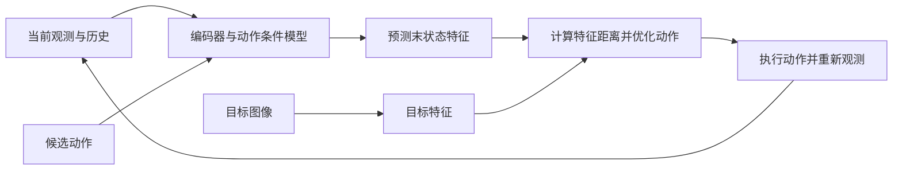

# 视觉目标规划：让动作后果接近目标图像

给出“希望物体最后在哪里”的图像，可以用它定义规划目标。DINO-WM 与 V-JEPA 2-AC 先预测候选动作造成的视觉特征，再搜索动作使预测接近目标。它们与“生成一张未来图，再交给策略”的视觉子目标路线不同：这里直接优化可执行动作。[[dino-wm-pretrained-visual-features|DINO-WM]]、[[v-jepa-2-understanding-prediction-planning|V-JEPA 2-AC]]、[[pi07-steerable-generalist-robotic-foundation-model|π0.7 的视觉子目标]]

## 数学结构

令 $o_t$ 为当前图像，$o_g$ 为目标图像，$E$ 为视觉编码器，$z_t=E(o_t)$、$z_g=E(o_g)$ 为特征。DINO-WM 保留 $N$ 个图像块、每块 $d$ 维，所以 $z_t\in\mathbb R^{N\times d}$，而非单一语义向量。

训练动作条件预测器 $F_\theta$，$h$ 为历史长度，$\theta$ 为模型参数；DINO-WM 的教学简记为：

$$
\mathcal L_{\rm pred}=\left\|F_\theta(z_{t-h+1:t},a_{t-h+1:t})-E(o_{t+1})\right\|_2^2.
$$

视觉编码器冻结，目标帧不更新其参数；帧间因果掩码阻止预测器训练时读取未来帧。V-JEPA 2-AC 加入末端本体状态，采用 L1 特征损失，并额外训练两步自回归预测；二者不能只按相同的“预测特征”归成同一训练目标。[[dino-wm-pretrained-visual-features|DINO-WM 的训练]]、[[v-jepa-2-understanding-prediction-planning|V-JEPA 2-AC 后训练]]

### 动作怎样落地

$\hat z_{t+H}(a)$ 表示沿候选动作序列预测的末状态，$H$ 为时域。动作由以下目标选出：

$$
a^*_{t:t+H-1}\in\arg\min_a D\!\left(\hat z_{t+H}(a),z_g\right).
$$

DINO-WM 使用平方 L2 特征距离，V-JEPA 2-AC 使用 L1。两者通过 CEM 搜索，并接入 [[ModelPredictiveControl|观测反馈与重规划]]。该距离是任务代理，能否保持“更近就更成功”的排序取决于表示、视角与目标；它没有自动加入力、接触稳定性或安全约束。

## 直觉

目标图像无需给出动作标签，但动力学训练通常仍要动作轨迹。目标能够换，不代表机器人形态、控制坐标或所有接触参数也能随意换。动作经过模型搜索获得，所以不必另学从未来图直接求动作的 [[InverseDynamicsModels|逆模型]]；这是一种接口选择，不是逆模型必然无用的证明。

## 失效情形

- **训练偷看未来。** DINO-WM 的因果掩码消融中，三帧历史无掩码成功率降到 0.08，有掩码为 0.92；多给历史前要检查可见信息。[[dino-wm-pretrained-visual-features|附录 A.4]]
- **见过外观不等于学准参数。** DINO-WM 未见形状的 PushObj 仍困难；冻结视觉特征与有限状态—动作覆盖无法自动辨识全部接触后果。[[dino-wm-pretrained-visual-features|形状泛化与局限]]
- **相机与控制坐标错配。** V-JEPA 2 的基坐标推断受相机位置影响，较大动作需要限制范围；抓取也受夹爪与精细对齐误差影响。[[v-jepa-2-understanding-prediction-planning|真机失败分析]]
- **规划延迟。** 两篇来源均报告约十余秒级的完整规划，而单步模型前向远快于这个数值；不能把前向速度当闭环频率。[[dino-wm-pretrained-visual-features|DINO-WM 的 15.89 秒]]、[[v-jepa-2-understanding-prediction-planning|V-JEPA 2-AC 的约 16 秒]]

## 实践含义

把目标可达性、相机条件、动作坐标、规划预算和执行反馈作为接口的一部分。视频演示可帮助比较预测与实际后果，但最终仍需 [[WorldModelEvaluation|动作干预、物理状态与闭环任务评估]]；学习仿真不自动提供物理引擎的状态与接触力接口。
