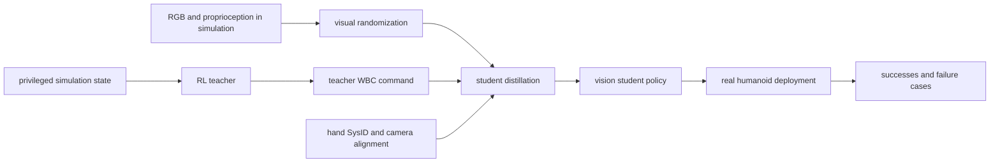

# Visual Sim-to-Real

Visual sim-to-real（视觉仿真到真实迁移）是在 simulation 中训练一个使用 visual observations 的 robot policy，并把它直接部署到真实硬件上。[[viral-visual-sim-to-real-at-scale-for-humanoid-loco-manipulation|VIRAL]] 给出一个 high-stakes case：policy 不只是 fixed-base tabletop manipulation，而是在 humanoid 上执行 walking、placing、grasping、turning 和 object transport 的 long-horizon loco-manipulation。

## 数学结构

可以把 VIRAL-style visual sim-to-real 写成三层学习问题。设 $x_t^{sim}$ 是 simulation 中 privileged state，包含 robot、object、table 和 task stage 等 full-state information；$o_t=(I_t,q_t)$ 是 real-available observation，其中 $I_t$ 是 RGB image，$q_t$ 是 proprioception；$a_t$ 是传给 whole-body controller（WBC）的 high-level command；$\eta$ 是 visual / sensor randomization parameters；$\phi$ 是 real-to-sim alignment parameters，例如 hand dynamics 和 camera extrinsics。

Teacher policy 使用 privileged state：

$$
\pi_T(a_t \mid x_t^{sim})
$$

Teacher training 是 RL objective，可抽象为：

$$
\max_{\theta_T}\ \mathbb{E}_{\tau \sim \pi_T, T_{sim}}\left[\sum_{t=0}^{H}\gamma^t r(x_t^{sim}, a_t)\right].
$$

VIRAL source 强调 teacher action 不是 raw torque，而是 WBC command 的 delta action。若 $c_t$ 是 WBC command state，$\Delta c_t$ 是 policy output，则可写成：

$$
c_t = c_{t-1} + \Delta c_t,\qquad a_t = c_t.
$$

这表示 policy 学的是对 locomotion velocity、yaw、arm/finger target 等 command 的增量，而不是每一步重新预测绝对 command。Reference state initialization（RSI）则把 episode reset 到 teleoperated / demonstrated trajectory 的中间状态，使 RL teacher 更早接触到 placing、grasping、turning 等 sparse-reward stages。

Student policy 只能看 real hardware 可用的 inputs：

$$
\pi_S(a_t \mid o_{t-T:t};\theta_S).
$$

Student distillation 可抽象成 teacher-action imitation：

$$
\min_{\theta_S}\ \mathbb{E}_{(o_t,a_t^T)\sim d_\alpha}\left[\left\|\pi_S(o_{t-T:t};\theta_S)-a_t^T\right\|_2^2\right],
$$

其中 $a_t^T=\pi_T(x_t^{sim})$ 是 teacher action，$d_\alpha$ 是 behavior cloning 与 online DAgger 混合产生的 state distribution：

$$
d_\alpha = \alpha d_{\pi_T} + (1-\alpha)d_{\pi_S}.
$$

Sim-to-real transfer 的训练数据经过 randomization 和 alignment：

$$
o_t^{train} = \left(R_\eta(I_t^{sim};\phi_{cam}), q_t^{sim}\right),
$$

其中 $R_\eta$ 表示 lighting、materials、camera parameters、image quality 和 sensor delay 等 perturbations；$\phi_{cam}$ 表示 camera / FOV alignment；hand SysID 则改变 simulator 中 dexterous hand parameters，使 simulated joint response 更接近 real hand。

## 直觉

Teacher 是 privileged solver：它在 simulation 中看见真实部署时看不到的 state，所以更容易学到 long-horizon behavior。Student 是 deployable policy：它只能从 RGB 和 proprioception 中恢复 enough state，然后 imitate teacher command。Domain randomization 让 student 不把某个 synthetic lighting、texture、camera pose 当成必要条件；real-to-sim alignment 则减少系统性偏差，例如手指动力学和相机视角不一致。

这个结构的关键 tradeoff 是：simulation 给了 cheap scale 和 privileged supervision，但部署时 policy 必须在 real images、real latencies、real hand mechanics 和 real contacts 下闭环运行。因此 visual sim-to-real 不是“train in sim once”；它是 teacher design、distillation distribution、randomization scope、hardware calibration 与 failure analysis 的组合工程。

## Failure Modes

- Low-compute failure：VIRAL page 明确说 compute scale critical；low-compute regimes often fail。这说明 visual student training 的 rendering / rollout distribution 不足时，policy 可能没有学到 robust perception-control mapping。
- Camera mismatch：source 把 FOV alignment 列为 key sim-to-real element。若 real camera extrinsics / intrinsics 与 rendered camera 不一致，student 看到的 object pose、reach geometry 和 table relation 都会偏移。
- Hand dynamics mismatch：source 把 finger SysID 列为 key element。Dexterous hand 的 stiffness、damping、armature 或 gear-ratio effects 不匹配时，grasp release timing 与 force response 会偏离 simulation。
- OOD object failure：页面展示 failed out-of-distribution object generalization，说明 object category randomization 不等于覆盖所有 shape、material、mass、grasp affordance。
- Mechanical execution failure：页面展示 unreliable deployment、hand stuck 和 accidental drop，表明 visual policy success 仍会被 low-level manipulation mechanics、contact state 和 recovery behavior 限制。

## 实践含义

对 RL，VIRAL 提示 teacher policy 可以在 privileged state space 中解决 hard long-horizon exploration，再把结果蒸馏到 deployable observation space。RSI 和 delta action space 的价值在于降低 sparse long-horizon humanoid task 的 exploration burden。

对 sim-to-real，domain randomization 需要和 real-to-sim alignment 同时看。Randomization 负责扩大 distribution support；alignment 负责消除已知 systematic mismatch。只做其中一个都容易留下 gap。

对 system evaluation，real-world videos 和 consecutive cycles 比 single-episode success 更有信息量，但仍不足以证明 generality。需要区分 success distribution、failure categories、OOD object coverage、camera/lighting perturbation 和 hardware-specific tuning。

相关页面：[[VIRAL]]、[[SimulationRealityGap]]、[[TaskGeneralistPolicyEvaluation]]、[[WorldModelsForEmbodiedAI]]。
