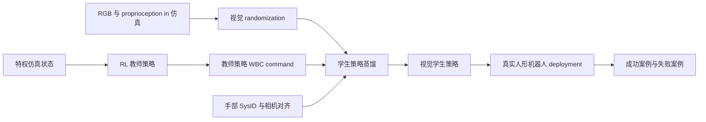

# 视觉仿真到现实迁移

视觉仿真到现实迁移（视觉仿真到真实迁移）是在仿真中训练一个使用视觉观测的机器人策略，并把它直接部署到真实硬件上。[[viral-visual-sim-to-real-at-scale-for-humanoid-loco-manipulation|VIRAL]] 给出一个高风险情形：策略不只是固定基座 tabletop 操作，而是在人形机器人上执行 walking、placing、抓取、turning 和物体 transport 的长时域移动操作。[[grail-generating-humanoid-loco-manipulation-from-3d-assets-and-video-priors|GRAIL]] 补充了上游数据生成视角：如果视觉学生策略的行为来自生成的 4D HOI 轨迹，那么仿真到现实迁移流程还要审计 VFM 先验、指标重建、重定向和任务一般性跟踪数据池。

## 数学结构

可以把 VIRAL-风格视觉仿真到现实迁移写成三层学习问题。设 $x_t^{sim}$ 是仿真中特权状态，包含机器人、物体、表格和任务阶段等完整状态信息；$o_t=(I_t,q_t)$ 是真实-可用观测，其中 $I_t$ 是 RGB 图像，$q_t$ 是本体感知；$a_t$ 是传给全身控制器（WBC）的高层指令；$\eta$ 是视觉 / 传感器随机化参数；$\phi$ 是真实到-sim 对齐参数，例如手部动力学和相机 extrinsics。

教师策略使用特权状态：

$$
\pi_T(a_t \mid x_t^{sim})
$$

教师策略训练是 RL 目标，可抽象为：

$$
\max_{\theta_T}\ \mathbb{E}_{\tau \sim \pi_T, T_{sim}}\left[\sum_{t=0}^{H}\gamma^t r(x_t^{sim}, a_t)\right].
$$

VIRAL 来源强调教师策略动作不是原始力矩，而是 WBC 指令的增量动作。若 $c_t$ 是 WBC 指令状态，$\Delta c_t$ 是策略输出，则可写成：

$$
c_t = c_{t-1} + \Delta c_t,\qquad a_t = c_t.
$$

这表示策略学的是对移动速度、偏航角、机械臂/手指目标等指令的增量，而不是每一步重新预测绝对指令。参考基准状态 initialization（RSI）则把回合重置到 teleoperated / demonstrated 轨迹的中间状态，使 RL 教师策略更早接触到 placing、抓取、turning 等 sparse-奖励阶段。

学生策略只能看真实硬件可用的输入：

$$
\pi_S(a_t \mid o_{t-T:t};\theta_S).
$$

学生策略 distillation 可抽象成教师策略动作模仿：

$$
\min_{\theta_S}\ \mathbb{E}_{(o_t,a_t^T)\sim d_\alpha}\left[\left\|\pi_S(o_{t-T:t};\theta_S)-a_t^T\right\|_2^2\right],
$$

其中 $a_t^T=\pi_T(x_t^{sim})$ 是教师策略动作，$d_\alpha$ 是行为克隆与在线 DAgger 混合产生的状态分布：

$$
d_\alpha = \alpha d_{\pi_T} + (1-\alpha)d_{\pi_S}.
$$

Sim-到真实迁移的训练数据经过随机化和对齐：

$$
o_t^{train} = \left(R_\eta(I_t^{sim};\phi_{cam}), q_t^{sim}\right),
$$

其中 $R_\eta$ 表示光照、材质、相机参数、图像质量和传感器延迟等扰动；$\phi_{cam}$ 表示相机 / FOV 对齐；手部 SysID 则改变仿真器中灵巧手部参数，使仿真的关节响应更接近真实手部。

GRAIL-风格流程让视觉策略的示范分布也成为变量。设 $D_{\mathrm{GRAIL}}$ 是由 3D 资产、VFM 生成的视频、4D HOI 重建、机器人重定向和任务一般性跟踪器组成的数据分布，则视觉学生策略学到的是：

$$
\pi_S(a_t \mid I_{t-k:t}, q_{t-k:t}) \leftarrow D_{\mathrm{GRAIL}}(\mathcal{M}_O,\mathcal{E},C,\tilde{\Theta}_{1:T},\tilde{q}_{1:T}).
$$

这表示迁移风险不只来自视觉渲染差距，也来自生成的参考基准是否物理上可执行的、重定向是否保持接触，以及跟踪器是否覆盖目标运动族。

## 直觉

教师策略是特权求解器：它在仿真中看见真实部署时看不到的状态，所以更容易学到长时域行为。学生策略是 deployable 策略：它只能从 RGB 和本体感知中恢复 enough 状态，然后 imitate 教师策略指令。Domain 随机化让学生策略不把某个合成光照、纹理、相机位姿当成必要条件；真实到-sim 对齐则减少系统性偏差，例如手指动力学和相机视角不一致。

```mermaid
flowchart LR
  A["特权仿真状态"] --> B["RL 教师策略"]
  B --> C["教师策略 WBC command"]
  D["RGB 与 proprioception in 仿真"] --> E["视觉 randomization"]
  E --> F["学生策略蒸馏"]
  C --> F
  G["手部 SysID 与相机对齐"] --> F
  F --> H["视觉学生策略"]
  H --> I["真实人形机器人 deployment"]
  I --> J["成功案例与失败案例"]
```

这个结构的关键取舍是：仿真给了低成本的规模和特权监督，但部署时策略必须在真实图像、真实延迟、真实手部 mechanics 和真实接触下闭环运行。因此视觉仿真到现实迁移不是“train in sim once”；它是教师策略设计、distillation 分布、随机化范围、硬件标定与失败分析的组合工程。

GRAIL 把这个取舍再往上游推一层：视觉策略之前的机器人动作数据可以来自 [[AssetConditionedHOIGeneration|资产条件化的 HOI 生成]]。这使数据规模不再完全受遥操作 / 动作捕捉限制，但也要求把生成的视频质量、4D 重建损失项、物理可执行性和现实世界策略成功分开验证。

## 失效情形

- 低计算失败：VIRAL 页面明确说计算规模关键；低算力 regimes often fail。这说明视觉学生策略训练的渲染 / 轨迹采样分布不足时，策略可能没有学到鲁棒感知控制映射。
- 相机不匹配：来源把 FOV 对齐列为 key 仿真到现实迁移 element。若真实相机 extrinsics / intrinsics 与渲染的相机不一致，学生策略看到的物体位姿、reach 几何和表格 relation 都会偏移。
- 手部动力学不匹配：来源把手指 SysID 列为 key element。灵巧手部的刚度、阻尼、armature 或 gear-比率 effects 不匹配时，抓取发布 timing 与力响应会偏离仿真。
- OOD 物体失败：页面展示失败的 out-的分布物体泛化，说明物体类别随机化不等于覆盖所有形状、材质、质量、抓取可供性。
- 机械执行失败：页面展示 unreliable 部署、手部 stuck 和 accidental drop，表明视觉策略成功仍会被低层操作 mechanics、接触状态和恢复行为限制。
- 生成的参考基准失败：GRAIL-风格数据可能在 VFM 产物、遮挡、快速运动、物体外观 inconsistency、指标重建错误或重定向/接触不匹配上失败；即使渲染的视频看似合理，也不一定是机器人有用轨迹。

## 实践含义

对 RL，VIRAL 提示教师策略可以在特权状态空间中解决硬长时域 exploration，再把结果蒸馏到 deployable 观测空间。RSI 和增量动作空间的价值在于降低 sparse 长时域人形机器人任务的 exploration 负担。

对仿真到现实迁移，域随机化需要和真实到-sim 对齐同时看。Randomization 负责扩大分布支撑；对齐负责消除已知 systematic 不匹配。只做其中一个都容易留下差距。

对系统评估，现实世界视频和连续的 cycles 比单一回合成功更有信息量，但仍不足以证明通用性。需要区分成功分布、失败 categories、OOD 物体覆盖范围、相机/光照扰动、生成的参考基准质量和硬件特定的调优。

相关页面：[[VIRAL]]、[[GRAIL]]、[[AssetConditionedHOIGeneration]]、[[SimulationRealityGap]]、[[TaskGeneralistPolicyEvaluation]]、[[WorldModelsForEmbodiedAI]]。
