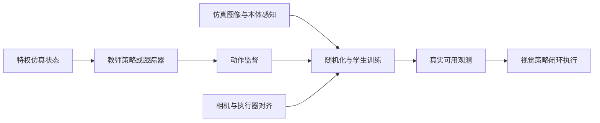

# Visual Sim-to-Real

视觉仿真到现实迁移研究如何把仿真训练的视觉模块或视觉策略用于真实机器人。必须先区分两类证据：[[tobin-domain-randomization|Tobin]] 迁移的是位置预测网络，抓取由现成规划器执行；[[viral-visual-sim-to-real-at-scale-for-humanoid-loco-manipulation|VIRAL]] 与 [[grail-generating-humanoid-loco-manipulation-from-3d-assets-and-video-priors|GRAIL]] 则让视觉策略在真实人形机器人上闭环执行动作。视觉定位精度不直接等于闭环操作成功率。

## 机制：特权教师转为可部署学生

仿真可以提供对象位姿、完整机器人状态等特权信息，而真实部署通常只能取得图像和本体感知。教师先用特权状态学会任务，学生再从可部署观测预测教师动作或高层指令。[[viral-visual-sim-to-real-at-scale-for-humanoid-loco-manipulation|VIRAL 的方法说明]] 将这一过程组织为教师训练、规模化学生蒸馏、视觉随机化与真实到仿真对齐。

用教学抽象表示：$x_t$ 是特权状态，$I_t$ 是图像，$q_t$ 是本体感知，$h_t$ 是可用观测历史，$a_t$ 是相应控制接口中的动作，则

$$
a_t^T=\pi_T(x_t),\qquad a_t^S=\pi_S(h_t),\qquad h_t=(I_{t-k:t},q_{t-k:t}).
$$

学生训练可概括为

$$
\min_\theta\;\mathbb E_{h_t\sim d}\bigl[\ell(\pi_{S,\theta}(h_t),a_t^T)\bigr].
$$

$\ell$ 是模仿目标，$d$ 是收集训练状态的分布。这里没有指定为均方误差，也没有把教师与学生的轨迹分布写成固定比例的混合：具体模型可使用不同动作表示与学习损失，在线收集过程还会改变后续访问的状态。公式是机制抽象，不是对任一论文实现的逐项复写。

行为克隆主要使用已有示范；在线 DAgger 让学生访问状态，再让教师提供动作监督，有助于覆盖学生自己的偏离。VIRAL 的归档项目说明明确同时使用二者。教师学会并不保证学生能从图像中恢复足够任务信息，学生在仿真学会也不保证能处理真实传感与接触。（前两句依据 VIRAL 方法说明；最后一句为本页的机制解释）

```mermaid
flowchart LR
  A["特权仿真状态"] --> B["教师策略或跟踪器"]
  B --> C["动作监督"]
  D["仿真图像与本体感知"] --> E["随机化与学生训练"]
  C --> E
  F["相机与执行器对齐"] --> E
  E --> G["真实可用观测"]
  G --> H["视觉策略闭环执行"]
```

图中“对齐”和“随机化”分工不同：对齐修正可测的系统偏差，随机化覆盖尚未确定或会变化的条件。两者都必须落实到实际观测与动作接口，不能只比较图像外观。

### 蒸馏受可观测性限制

教师能读到状态，并不意味着学生的图像历史能唯一决定同一个动作。用一个教学反例说明：两个被遮挡状态给出相同观测历史 $h$，教师在其中分别要求向左与向右。如果学生是确定函数 $\pi_S(h)$，它不可能对完全相同的输入同时给出两个不同输出；增加相同类型的数据不会消除这个信息缺口。

若教学例子进一步假设标量动作标签为 $-1$ 与 $+1$、各占一半，平方损失为 $\tfrac12(a+1)^2+\tfrac12(a-1)^2=a^2+1$，最小点是 $a=0$。这个平均动作未必能完成任一任务。该例子不声称 VIRAL 或 GRAIL 使用这项损失；它说明选择观测、历史和动作表示，应先判断学生能否区分教师需要区分的状态。可以增加可部署传感信息、延长有信息量的历史或改变控制层级，但是否有效仍需实验。

这与在线 DAgger 解决的问题不同：DAgger 改善学生访问状态的监督覆盖，不能从不可见信息中自动恢复正确动作。[[viral-visual-sim-to-real-at-scale-for-humanoid-loco-manipulation|VIRAL]] 提供在线监督的项目证据，[[grail-generating-humanoid-loco-manipulation-from-3d-assets-and-video-priors|GRAIL]] 则提供参考轨迹、物理教师再到视觉学生的实例；上面的不可观测反例是本页对共同接口的推理。

## 不同方法把困难放在哪里

| 来源 | 行为或监督从何而来 | 迁移需要保留的条件 |
|---|---|---|
| [[tobin-domain-randomization|Tobin，第 III–IV 节]] | 仿真直接生成物体位置标签 | 对象几何与尺度已知，桌高固定；外观与干扰物随机化训练的是定位能力 |
| [[viral-visual-sim-to-real-at-scale-for-humanoid-loco-manipulation|VIRAL]] | 特权强化学习教师；增量动作与参考状态初始化帮助长时域学习 | 学生模仿、规模化渲染、视觉随机化、手部系统辨识、相机视野对齐一起作用 |
| [[grail-generating-humanoid-loco-manipulation-from-3d-assets-and-video-priors|GRAIL，第 3 节]] | 已知三维场景约束生成视频，重建与重定向后由物理跟踪器产生动作 | 生成参考需能执行；物体感知跟踪器与地形跟踪器分别蒸馏为视觉策略 |

GRAIL 将数据问题前移：视频看起来合理，还需经过公制重建、接触对齐、机器人重定向和物理跟踪。其表 2 中去掉操作适配器后，身体跟踪误差更低却操作成功率更差，说明身体动作相似不能替代物体交互目标。专属损失和控制器结构见 [[grail-generating-humanoid-loco-manipulation-from-3d-assets-and-video-priors|论文页]]，不在本概念页重复定义。

## 失败来自哪些环节

- **视觉覆盖不足：** 材质、光照、遮挡或干扰物变化没有被训练覆盖。Tobin 的干扰物消融提供直接定位证据；VIRAL 的项目说明展示分布外对象失败，不能由成功示例推断所有对象都可迁移。
- **系统性相机偏差：** 实际视野、位姿和渲染设置不一致会改变空间线索。VIRAL 将视野对齐列为关键要素，但网页概述本身不足以量化其独立贡献。
- **执行器与接触偏差：** 手部卡住、意外掉落等失败可能出现在感知之后。VIRAL 的失败材料记录这些现象，精确归因仍需对照试验，不能单凭视频判定原因。
- **上游参考失真：** GRAIL 明确指出遮挡、快动作和视频中的物体外观变化会损害重建；几何接触损失也没有恢复真实接触力。
- **把不同评估层混为一谈：** GRAIL 的 88.9% 是物理人体逐帧跟踪指标，81.4% 是 G1 仿真操作跟踪回合指标，已见／未见物体真实抓取分别为 84%／80%，不能互相替代。

以上证据分别定位于 [[tobin-domain-randomization|Tobin 表 II]]、[[viral-visual-sim-to-real-at-scale-for-humanoid-loco-manipulation|VIRAL 的迁移要素与失败展示]]、[[grail-generating-humanoid-loco-manipulation-from-3d-assets-and-video-priors|GRAIL 第 4、6 节及表 1–3]]。

## 实践含义与证据边界

**我们的建议：** 顺着“参考是否可信 → 教师是否会做 → 学生在仿真是否闭环成功 → 真实观测和动作是否对齐 → 真实任务成功多少”逐层记录证据。每层使用自己的测试集、成功定义和失败分布；一次连续成功演示不等同于随机初态下的成功概率，少量物体测试也不代表数据集中全部资产。

“没有真实策略微调”与“完全没有真实信息”要分开。相机标定和手部辨识已经利用真实系统的信息；它们与用真实示范优化策略权重是不同步骤。这个区别有助于比较迁移成本，不改变各论文对零样本策略部署的原有用语。

跨论文关系见 [[DomainRandomization|域随机化]]、[[SystemIdentificationForSimulation|系统辨识]]、[[PolicyDeploymentContract|部署契约]]、[[SimulationRealityGap|Sim-to-Real Gap]] 与 [[TaskGeneralistPolicyEvaluation|策略评估]]。生成式世界模型的视觉质量与控制可信度区别见 [[WorldModelsForEmbodiedAI|World Models]]。

## 研究归属

[[topics/evaluation-and-transfer|评测与 Sim-to-Real]] · [[topics/simulation-transfer|Sim-to-Real]]。
