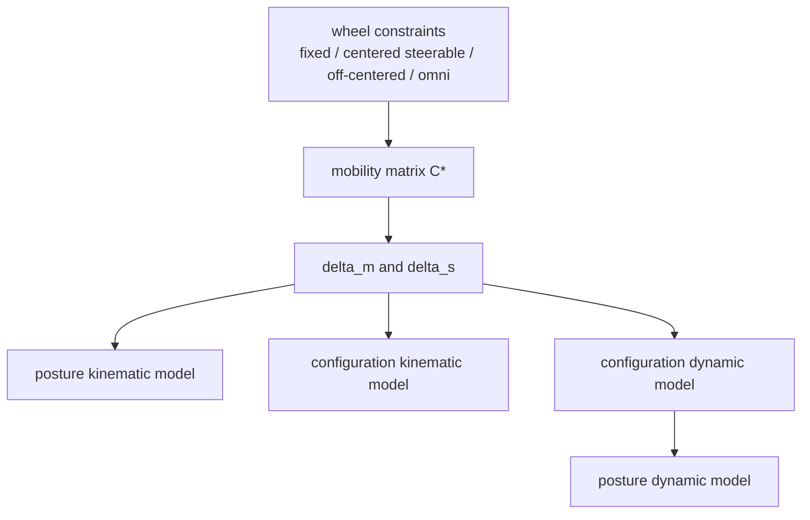

# Wheeled Mobile Robot Classification

Wheeled Mobile Robot Classification（轮式移动机器人分类）在 [[structural-properties-and-classification-of-wheeled-mobile-robots|Campion et al.]] 中不是按外观命名，而是按 wheel constraints 对 chassis mobility 的限制分类。核心指标是 degree of mobility $\delta_m$、degree of steerability $\delta_s$ 和 degree of maneuverability $\delta_M=\delta_m+\delta_s$。

## 数学结构

Campion et al. 把 conventional fixed wheels 与 centered steerable wheels 的 lateral no-slip constraints 写成矩阵 $C_1^*(\beta_c)$。其中 $\beta_c$ 是 centered steerable wheels 的 steering angles。底盘速度必须满足：

$$
R(\theta)\dot \xi \in N[C_1^*(\beta_c)]
$$

其中 $\xi=(x,y,\theta)^T$ 是 posture coordinates，$R(\theta)$ 是 body/world frame 的 rotation map，$N[\cdot]$ 表示 nullspace。

Degree of mobility 定义为：

$$
\delta_m=\dim N[C_1^*(\beta_c)]=3-\operatorname{rank}C_1^*(\beta_c)
$$

Degree of steerability 定义为：

$$
\delta_s=\operatorname{rank}C_{1c}(\beta_c)
$$

Degree of maneuverability 是：

$$
\delta_M=\delta_m+\delta_s
$$

直觉上，$\delta_m$ 是不重新定向 steerable wheels 时底盘能直接控制的 mobility；$\delta_s$ 是通过独立 steering DOFs 改变 constraint geometry 的能力。

## Five Types

| Type | Meaning | Typical Structure | Modeling Intuition |
| --- | --- | --- | --- |
| $(3,0)$ | fully mobile, no steering DOF needed | omniwheel / mecanum / certain off-centered wheel layouts | 直接控制 planar $x,y,\theta$ motion。 |
| $(2,0)$ | two direct mobility DOFs, no centered steering | diff-drive-like fixed conventional wheels on one axle | 可前进/转向，但不能直接侧移。 |
| $(2,1)$ | two direct mobility DOFs plus one steering DOF | no fixed conventional wheels, at least one centered steerable wheel | steering angle 改变可用 velocity distribution。 |
| $(1,1)$ | one direct mobility DOF plus one steering DOF | car-like / tricycle-like layouts with fixed axle and one centered steerable wheel | 典型 car-like nonholonomic behavior。 |
| $(1,2)$ | one direct mobility DOF plus two steering DOFs | two centered steerable wheels and no fixed wheels | maneuverability 强于 $(1,1)$，但仍不是 instant omnidirectional。 |

Campion 的关键点是：同样的 $\delta_M$ 不代表同样的行为。例如 $(3,0)$、$(2,1)$ 和 $(1,2)$ 都可以有 $\delta_M=3$，但 $(3,0)$ 的三个 mobility directions 直接可用；后两者必须通过 steering state 改变可用 directions。

## Model Layers

Source 区分四种模型：

- Posture kinematic model：描述整体 chassis posture 的运动，足够用于 position-level motion analysis。
- Configuration kinematic model：描述所有 configuration variables，包括 wheel rotations 和 steering/caster angles。
- Configuration dynamic model：加入 robot dynamics 与 actuator torques。
- Posture dynamic model：与 configuration dynamic model feedback-equivalent，但更适合 posture-level control analysis。

## 直觉

这套 taxonomy 适合设计早期使用。先问：普通 fixed wheels 的 lateral constraints 把底盘 velocity space 压缩到几维？再问：有多少 steering angles 可以独立改变这些 constraints？这比“是不是四个轮子”“是不是看起来像车”更稳定。

对实际工程，$\delta_m$ 越高，instantaneous maneuver 越直接；$\delta_s$ 越高，机器人可以通过 steering preparation 增加 maneuverability，但会引入 steering dynamics、module synchronization 和 low-speed singularities。

## Failure Modes

- Naming ambiguity：同样叫 omnidirectional，可能来自 omni/mecanum rollers，也可能来自多个 steerable modules；它们的 contact 和 actuator limits 不同。
- Degenerate wheel layout：fixed wheel axes 若不满足 nondegenerate assumptions，可能把 robot 限制到固定 instant center of rotation 或完全不可动。
- Steering coordination burden：当 steerable wheels 多于 $\delta_s$，额外 wheels 的 steering must be coordinated，否则 constraints 互相冲突。
- Kinematic/dynamic mismatch：kinematic controls 是 velocity-like variables；dynamic controls 是 torques 或 accelerations，不能混用。
- Modern mapping gap：skid-steer、tracked platforms、swerve modules 和 deformable tire vehicles 需要额外 source 来映射到这套 taxonomy。

## 实践含义

对 [[WheeledRobotKinematics]]，这套分类给出 geometry matrix 的 rank/nullspace 解释。对 [[SteerableWheels]]，它说明 steering DOFs 不等于 instant translation DOFs。对 [[NonholonomicMobileRobots]]，它把 car-like、diff-drive-like 和 steerable-wheel robots 放进统一 mobility/steerability 坐标系。
