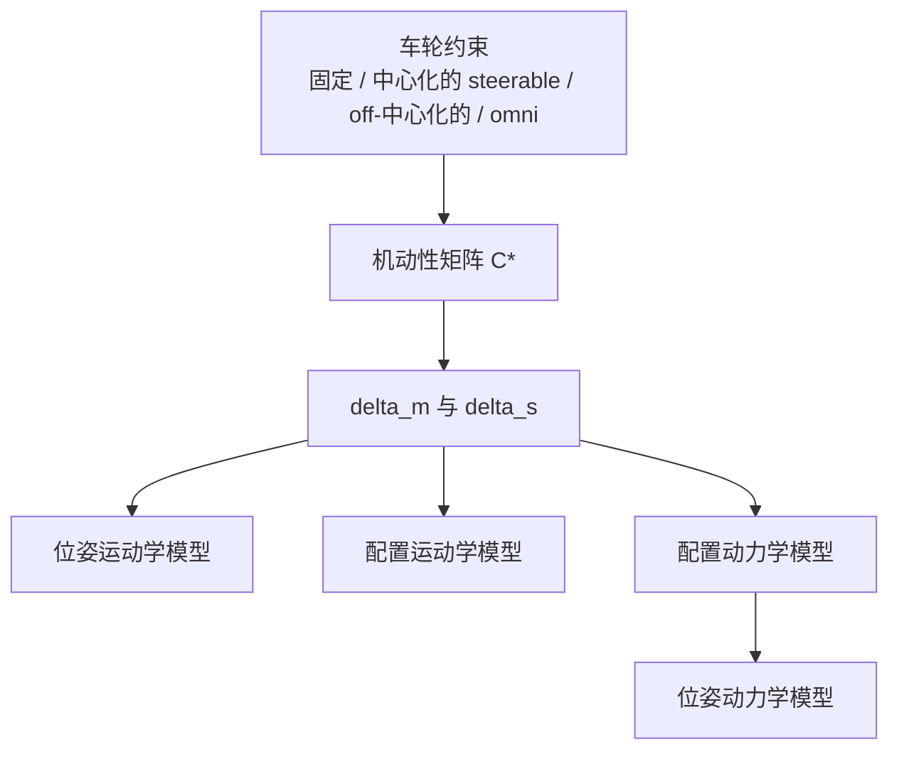

# 轮式移动机器人分类

[[structural-properties-and-classification-of-wheeled-mobile-robots|Campion 等人]]提出的轮式移动机器人分类，不按外观命名，而按车轮约束对底盘机动性的限制分类。核心指标是机动度 $\delta_m$、可转向度 $\delta_s$ 和操纵度 $\delta_M=\delta_m+\delta_s$。

## 数学结构

Campion et al. 把传统固定车轮与中心化的 steerable 车轮的横向无滑移约束写成矩阵 $C_1^*(\beta_c)$。其中 $\beta_c$ 是中心化的 steerable 车轮的转向角度。底盘速度必须满足：

$$
R(\theta)\dot \xi \in N[C_1^*(\beta_c)]
$$

其中 $\xi=(x,y,\theta)^T$ 是位姿坐标，$R(\theta)$ 是刚体/世界帧的旋转映射图，$N[\cdot]$ 表示零空间。

度的机动性定义为：

$$
\delta_m=\dim N[C_1^*(\beta_c)]=3-\operatorname{rank}C_1^*(\beta_c)
$$

可转向度定义为：

$$
\delta_s=\operatorname{rank}C_{1c}(\beta_c)
$$

操纵度定义为：

$$
\delta_M=\delta_m+\delta_s
$$

直觉上，$\delta_m$ 是不重新定向 steerable 车轮时底盘能直接控制的机动性；$\delta_s$ 是通过独立转向 DOFs 改变约束几何的能力。

## 五种类型

| 类型 | Meaning | Typical 结构 | 建模直觉 |
| --- | --- | --- | --- |
| $(3,0)$ | 完全移动式，不需要转向自由度 | 全向轮、麦克纳姆轮或某些偏置轮布局 | 直接控制平面上的 $x,y,\theta$ 运动。 |
| $(2,0)$ | two 直接机动性 DOFs, no 中心化的转向 | diff-驱动-like 固定传统车轮在同一车轴 | 可前进/转向，但不能直接侧移。 |
| $(2,1)$ | two 直接机动性 DOFs plus one 转向 DOF | no 固定传统车轮, 在 least one 中心化的 steerable 车轮 | 转向角度改变可用速度分布。 |
| $(1,1)$ | one 直接机动性 DOF plus one 转向 DOF | 类汽车 / tricycle-like 布局带有固定 axle 与 one 中心化的 steerable 车轮 | 典型类汽车非完整约束行为。 |
| $(1,2)$ | 一个直接机动自由度，加两个转向自由度 | 两个中心式可转向轮，没有固定轮 | 操纵能力强于 $(1,1)$，但仍不能瞬时全向移动。 |

Campion 的关键点是：同样的 $\delta_M$ 不代表同样的行为。例如 $(3,0)$、$(2,1)$ 和 $(1,2)$ 都可以有 $\delta_M=3$，但 $(3,0)$ 的三个机动性方向直接可用；后两者必须通过转向状态改变可用方向。

## 模型层次

```mermaid
flowchart TD
  A["车轮约束<br/>固定 / 中心化的 steerable / off-中心化的 / omni"] --> B["机动性矩阵 C*"]
  B --> C["delta_m 与 delta_s"]
  C --> D["位姿运动学模型"]
  C --> E["配置运动学模型"]
  C --> F["配置动力学模型"]
  F --> G["位姿动力学模型"]
```

来源区分四种模型：

- 位姿运动学模型：描述整体底盘位姿的运动，足够用于位置层级运动分析。
- 构型运动学模型：描述所有配置变量，包括车轮 rotations 和转向/脚轮角度。
- 构型动力学模型：加入机器人动力学与执行器 torques。
- 位姿动力学模型：与配置动力学模型 feedback-等价的，但更适合位姿层级控制分析。

## 直觉

这套分类体系适合设计早期使用。先问：普通固定车轮的横向约束把底盘速度空间压缩到几维？再问：有多少转向角度可以独立改变这些约束？这比“是不是四个轮子”“是不是看起来像车”更稳定。

对实际工程，$\delta_m$ 越高，瞬时机动越直接；$\delta_s$ 越高，机器人越能通过预先转向增加操纵能力，但也会引入转向动力学、模块同步和低速奇异性。

## 失效情形

- 命名歧义：同样叫全向，可能来自 omni/mecanum rollers，也可能来自多个 steerable 模块；它们的接触和执行器限制不同。
- Degenerate 车轮布局：固定车轮轴若不满足非退化的假设，可能把机器人限制到固定 instant center 的旋转或完全不可动。
- 转向 coordination 负担：当 steerable 车轮多于 $\delta_s$，额外车轮的转向 must be coordinated，否则约束互相冲突。
- 运动学/动力学不匹配：运动学 controls 是速度-like 变量；动力学 controls 是 torques 或加速度，不能混用。
- Modern 映射差距：skid-steer、履带式 platforms、swerve 模块和可变形轮胎车辆需要额外来源来映射到这套分类体系。

## 实践含义

对 [[WheeledRobotKinematics]]，这套分类给出几何矩阵的秩/零空间解释。对 [[SteerableWheels]]，它说明转向 DOFs 不等于 instant 平移 DOFs。对 [[NonholonomicMobileRobots]]，它把类汽车、diff-驱动-like 和 steerable-车轮机器人放进统一机动性/steerability 坐标系。
