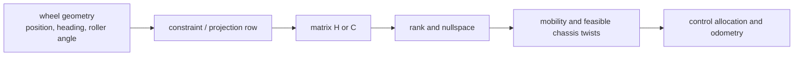

# Wheeled Robot Kinematics

Wheeled robot kinematics（轮式机器人运动学）描述 wheel speeds、steering angles 和 chassis velocity 之间的几何关系。[[modern-robotics-chapter-13-wheeled-mobile-robots|Modern Robotics Chapter 13]] 把这个问题作为入门主线：先忽略 dynamics，假设 hard flat ground 上 rolling without skidding。[[structural-properties-and-classification-of-wheeled-mobile-robots|Campion et al.]] 则给出更一般的 structural view：不同 wheel constraints 通过矩阵 rank 和 nullspace 决定 robot mobility。

## 数学结构

底盘在平面中的 configuration 写成：

$$
q=(\phi,x,y)
$$

其中 $\phi$ 是 chassis heading，$x,y$ 是底盘参考点在 world frame 中的位置。底盘速度既可以写成 $\dot q=(\dot\phi,\dot x,\dot y)$，也可以写成 chassis frame 中的 body twist：

$$
V_b =
\begin{bmatrix}
\omega_{bz}\\
v_{bx}\\
v_{by}
\end{bmatrix}
=
\begin{bmatrix}
1 & 0 & 0\\
0 & \cos\phi & \sin\phi\\
0 & -\sin\phi & \cos\phi
\end{bmatrix}
\begin{bmatrix}
\dot\phi\\
\dot x\\
\dot y
\end{bmatrix}
$$

对第 $i$ 个轮子，若其接触点在 body frame 中为 $(x_i,y_i)$，则接触点的平面速度为：

$$
v_i =
\begin{bmatrix}
v_{bx}-\omega_{bz}y_i\\
v_{by}+\omega_{bz}x_i
\end{bmatrix}
$$

普通 conventional wheel 可以近似成一个 rolling direction $t_i$ 与 lateral direction $n_i$：

$$
t_i^T v_i = r_i \dot\theta_i,\qquad n_i^T v_i = 0
$$

其中 $r_i$ 是 wheel radius，$\dot\theta_i$ 是 wheel angular speed。第一条约束给出 wheel spin speed；第二条是 lateral no-slip constraint。Omniwheel 和 mecanum wheel 通过 rollers 释放某个方向的相对运动，因此只保留一个 no-slip direction，并把 wheel speed 写成 chassis twist 的线性投影。

对 properly constructed omnidirectional robot，wheel speeds 与 body twist 的关系是：

$$
u = H(0)V_b
$$

其中 $u\in\mathbb{R}^m$ 是 $m$ 个 wheel driving speeds，$H(0)\in\mathbb{R}^{m\times 3}$ 由 wheel positions、driving directions 和 roller/free-sliding directions 决定。若 $H(0)$ rank 为 3，底盘可以在平面内生成任意 $V_b$。

## 直觉

每个轮子都不是简单地“提供一个 motor”，而是在底盘 twist space 中添加 projection 或 constraint。一个 conventional fixed wheel 会禁止 lateral slip；一个 omni/mecanum wheel 会允许某个 passive direction 的 motion，但仍要求 motor direction 与 contact velocity 匹配；一个 steerable wheel 让 constraint direction 随 steering angle 改变。

因此 wheeled base 的能力不是由 motor count 单独决定，而是由 wheel geometry matrix 的 rank、nullspace、conditioning 和 actuator limits 决定。对 over-actuated bases，$u=H(0)V_b$ 可能没有 exact inverse，odometry 和 control allocation 需要 pseudo-inverse 或 constrained optimization。

## Failure Modes

- Rank deficiency：wheel layout 看似对称，但 $H(0)$ rank 不足，无法生成全部 planar twist。
- Poor conditioning：rank 为 3 但 condition number 很差，wheel speed noise 会被放大成 odometry 或 control error。
- Saturation mismatch：pseudo-inverse 输出可行速度，但某些 wheel speed 超出 motor limit，需要统一缩放或重新优化。
- No-slip assumption failure：加速、转弯、低摩擦地面或载荷偏置会破坏 rolling without skidding。
- Contact-level mismatch：kinematic equations 不包含 normal load、Coulomb friction、compliance 和 [[ContactSolvers|contact solver]] residual；这些会进入 [[SimulationRealityGap]]。

## 实践含义

建模顺序应先写清楚 frame convention 和 wheel sign convention，再推导 $H(0)$ 或 constraint matrix。不要从网上直接复制 mecanum 或 omni 公式；轮序、坐标系、roller angle 和正方向一变，矩阵符号就会变。

仿真中可以分三层：kinematic controller 层验证 $u\leftrightarrow V_b$；physics joint 层加入 mass、inertia、actuator limits；contact 层再处理 friction、slip、roller geometry 和 solver settings。相关页面：[[OmnidirectionalWheels]]、[[NonholonomicMobileRobots]]、[[SteerableWheels]]、[[MobileRobotOdometry]]、[[WheeledMobileRobotClassification]]。
