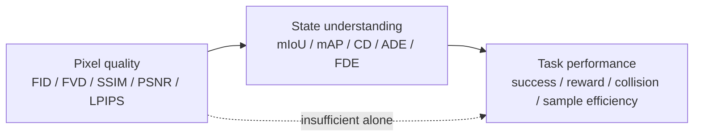

# World Model Evaluation

World model evaluation 不能只问 generated frames 像不像。[[a-comprehensive-survey-on-world-models-for-embodied-ai|A Comprehensive Survey on World Models for Embodied AI]] 把 evaluation 分成三层：Pixel Prediction Quality、State-level Understanding 和 Task Performance。这个层次很重要，因为 embodied AI 的最终目标是 action quality，而不是 isolated visual fidelity。

## 数学结构

Pixel-level metrics 衡量 sensory reconstruction 或 generation quality。FID 用 feature embeddings 的 Gaussian statistics 比较 real/generated distributions：

$$
\operatorname{FID}(x,y)=\lVert\mu_x-\mu_y\rVert_2^2+\operatorname{Tr}\left(\Sigma_x+\Sigma_y-2(\Sigma_x\Sigma_y)^{1/2}\right).
$$

FVD 使用 video feature network，把同样的 Fréchet distance 扩展到 temporal consistency。SSIM、PSNR 和 LPIPS 则分别关注 structure similarity、pixel distortion 与 learned perceptual distance。它们能衡量 visual fidelity，但不是 physical correctness。

State-level metrics 关注 object、layout、geometry 和 trajectory。mIoU 对每个 semantic class $c$ 计算 overlap：

$$
\operatorname{IoU}_c=\frac{\operatorname{TP}}{\operatorname{TP}+\operatorname{FP}+\operatorname{FN}}, \quad \operatorname{mIoU}=\frac{1}{|C|}\sum_{c\in C}\operatorname{IoU}_c.
$$

Chamfer Distance 用 nearest-neighbor distance 衡量 point set 或 surface geometry：

$$
\operatorname{CD}(S_1,S_2)=\sum_{x\in S_1}\min_{y\in S_2}\|x-y\|_2^2+\sum_{y\in S_2}\min_{x\in S_1}\|x-y\|_2^2.
$$

Task-level metrics 直接衡量 downstream behavior：Success Rate、Sample Efficiency、Episode Return、collision rate、L2 planning error、ADE/FDE 等。它们更接近 embodied AI 的目标，但更受 protocol、task distribution 和 simulator/hardware setup 影响。

## 直觉

三层 metrics 对应三种问题。Pixel metrics 问“看起来像不像”；state metrics 问“结构和状态对不对”；task metrics 问“用这个 model 决策是否更好”。一个 world model 可以在第一层好、第二层弱、第三层失败。例如 driving video FVD 很低，不代表预测的 actor trajectories 符合 traffic causality，也不代表 planner collision rate 会下降。

## Failure Modes

- Pixel fidelity overclaim：FID/FVD 可能忽略 physical consistency、causality、object permanence、contact plausibility 和 action controllability。
- Protocol mismatch：DMC、RLBench、nuScenes planning、Occ3D-nuScenes 等 benchmarks 的 input modality、auxiliary supervision、resolution、episode budget 和 task subset 不一致，导致 averaged scores 只能粗略比较。
- Privileged input leakage：occupancy、GT ego trajectory、semantic LiDAR 或 auxiliary labels 可能显著改变 results；若不分开报告，会误读 model architecture 的贡献。
- Short-horizon bias：短 clip generation 或 open-loop prediction 可能掩盖 long-horizon error accumulation 和 closed-loop instability。
- Task-specific metrics fragmentation：EWM-Bench 之类新 benchmark 改进了部分维度，但 source 指出 cross-domain standards 仍不足。

## Visual Subgoal Evaluation

[[pi07-steerable-generalist-robotic-foundation-model|π0.7]] 把 world model 用作 visual subgoal generator，这让 evaluation 多了一层中间指标。Subgoal image 的视觉质量本身不够；真正要问的是它是否让 VLA 更好地 follow instruction、break dataset bias、transfer across embodiments 或完成 coached long-horizon tasks。

因此 visual subgoal generator 至少需要两类评估：一类是 image/semantic quality，例如是否对齐 subtask instruction、是否保持 current observation 的 object identities；另一类是 policy-conditioning value，即加入 $g^\star$ 后 closed-loop success 是否提高，且失败时是否来自 hallucinated goal、stale goal、kinematically unreachable goal 或 VLA grounding failure。

## 实践含义

评估 world model 时至少要报告三件事：model 是 [[WorldModelTaxonomy|taxonomy]] 中哪一类；evaluation 使用哪些 inputs、supervision 和 horizons；metric 是否真的对应目标 workflow。对 robotics，优先关心 real-time inference、closed-loop success、sample efficiency 和 [[SimulationRealityGap|sim-to-real]] behavior。对 autonomous driving，除了 FVD/FID，还要看 occupancy forecasting、trajectory L2、collision rate 与 causal scenario response。

对于本 wiki 的后续 ingest，[[AwesomeWorldModels]] 中的 papers 不应只按 title 收录。更有用的 metadata 是：benchmark、horizon、input modality、是否用 GT state/occupancy、是否有 real-robot or closed-loop validation、是否提供 code/dataset。

相关页面：[[WorldModelsForEmbodiedAI]]、[[WorldModelTaxonomy]]、[[AwesomeWorldModels]]、[[RobotContextConditioning]]、[[VisionLanguageActionModels]]。
