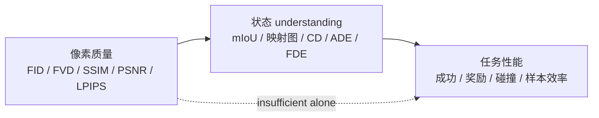

# 世界模型评估

世界模型评估不能只问生成的帧像不像。[[a-comprehensive-survey-on-world-models-for-embodied-ai|A Comprehensive Survey on World Models for Embodied AI]] 把评估分成三层：像素预测质量、状态层级 Understanding 和任务性能。这个层次很重要，因为具身 AI 的最终目标是动作质量，而不是 isolated 视觉保真度。

## 数学结构

像素层级指标衡量 sensory 重建或生成质量。FID 用特征嵌入的高斯 statistics 比较真实/生成的分布：

$$
\operatorname{FID}(x,y)=\lVert\mu_x-\mu_y\rVert_2^2+\operatorname{Tr}\left(\Sigma_x+\Sigma_y-2(\Sigma_x\Sigma_y)^{1/2}\right).
$$

FVD 使用视频特征网络，把同样的 Fréchet 距离扩展到时间一致性。SSIM、PSNR 和 LPIPS 则分别关注结构 similarity、像素 distortion 与学得的 perceptual 距离。它们能衡量视觉保真度，但不是物理正确性。

状态层级指标关注物体、布局、几何和轨迹。mIoU 对每个语义类 $c$ 计算重叠：

$$
\operatorname{IoU}_c=\frac{\operatorname{TP}}{\operatorname{TP}+\operatorname{FP}+\operatorname{FN}}, \quad \operatorname{mIoU}=\frac{1}{|C|}\sum_{c\in C}\operatorname{IoU}_c.
$$

Chamfer 距离用 nearest-neighbor 距离衡量点设置或表面几何：

$$
\operatorname{CD}(S_1,S_2)=\sum_{x\in S_1}\min_{y\in S_2}\|x-y\|_2^2+\sum_{y\in S_2}\min_{x\in S_1}\|x-y\|_2^2.
$$

任务层级指标直接衡量下游行为：成功比率、样本效率、回合 Return、碰撞比率、L2 规划错误、ADE/FDE 等。它们更接近具身 AI 的目标，但更受规程、任务分布和仿真器/硬件设置影响。

## 直觉

三层指标对应三种问题。像素指标问“看起来像不像”；状态指标问“结构和状态对不对”；任务指标问“用这个模型决策是否更好”。一个世界模型可以在第一层好、第二层弱、第三层失败。例如驱动视频 FVD 很低，不代表预测的 actor 轨迹符合 traffic causality，也不代表 planner 碰撞比率会下降。

```mermaid
flowchart LR
  A["像素质量<br/>FID / FVD / SSIM / PSNR / LPIPS"] --> B["状态 understanding<br/>mIoU / 映射图 / CD / ADE / FDE"]
  B --> C["任务性能<br/>成功 / 奖励 / 碰撞 / 样本效率"]
  A -. "insufficient alone" .-> C
```

## 失效情形

- 像素保真度 overclaim：FID/FVD 可能忽略物理一致性、causality、物体 permanence、接触合理性和动作可控性。
- 规程不匹配：DMC、RLBench、nuScenes 规划、Occ3D-nuScenes 等基准的输入 modality、auxiliary 监督、分辨率、回合预算和任务 subset 不一致，导致 averaged 得分只能粗略比较。
- 特权输入 leakage：occupancy、GT ego 轨迹、语义 LiDAR 或 auxiliary 标签可能显著改变结果；若不分开报告，会误读模型架构的贡献。
- 短时域偏差：短截断生成或开环预测可能掩盖长时域错误 accumulation 和闭环不稳定。
- 任务特定指标 fragmentation：EWM-Bench 之类新基准改进了部分维度，但来源指出跨域 standards 仍不足。

## 视觉子目标评估

[[pi07-steerable-generalist-robotic-foundation-model|π0.7]] 把世界模型用作视觉子目标生成器，这让评估多了一层中间指标。子目标图像的视觉质量本身不够；真正要问的是它是否让 VLA 更好地 follow 指令、break 数据集偏差、迁移 across 本体或完成 coached 长时域任务。

因此视觉子目标生成器至少需要两类评估：一类是图像/语义质量，例如是否对齐子任务指令、是否保持当前观测的物体 identities；另一类是策略条件化价值，即加入 $g^\star$ 后闭环成功是否提高，且失败时是否来自 hallucinated 目标、stale 目标、kinematically unreachable 目标或 VLA 语义落地失败。

## 实践含义

评估世界模型时至少要报告三件事：模型是 [[WorldModelTaxonomy|taxonomy]] 中哪一类；评估使用哪些输入、监督和 horizons；指标是否真的对应目标工作流。对机器人学，优先关心实时推理、闭环成功、样本效率和 [[SimulationRealityGap|仿真到现实迁移]] 行为。对自主驱动，除了 FVD/FID，还要看 occupancy 预测、轨迹 L2、碰撞比率与因果场景响应。

对于本知识库的后续收录，[[AwesomeWorldModels]] 中的论文不应只按 title 收录。更有用的元数据是：基准、时域长度、输入 modality、是否用 GT 状态/occupancy、是否有真实机器人或闭环验证、是否提供代码/数据集。

相关页面：[[WorldModelsForEmbodiedAI]]、[[WorldModelTaxonomy]]、[[AwesomeWorldModels]]、[[RobotContextConditioning]]、[[VisionLanguageActionModels]]。
