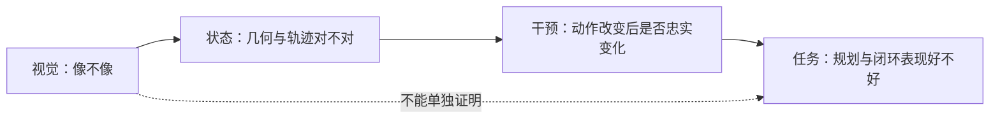

# 世界模型评估

评估需要区分四个问题：看起来像不像、状态结构对不对、**是否忠实响应动作**、用于决策是否更好。[[a-comprehensive-survey-on-world-models-for-embodied-ai|世界模型综述]] 区分像素预测、状态理解与任务性能；[[worldecho-worldsync-action-following|WorldEcho 的近期预印本]] 把非专家动作下的遵循程度独立检验。前一层得分好，不保证后一层成功。

## 数学结构

### 像素与特征分布

FID 比较真实样本 $x$ 与生成样本 $y$ 的特征分布高斯近似。$\mu_x,\mu_y$ 是特征均值，$\Sigma_x,\Sigma_y$ 是协方差，$\operatorname{Tr}$ 为矩阵迹：

$$
\operatorname{FID}(x,y)=\|\mu_x-\mu_y\|_2^2+
\operatorname{Tr}\left(\Sigma_x+\Sigma_y-2\left(\Sigma_x^{1/2}\Sigma_y\Sigma_x^{1/2}\right)^{1/2}\right).
$$

这里用对称矩阵平方根写法解释协方差项；特征提取器、样本数和估计方式必须一致，分数才适合比较。FVD 改用视频特征。SSIM、PSNR 和 LPIPS 分别偏向结构相似、像素误差与感知距离；它们都不直接约束接触或动作后果。指标范围见 [[a-comprehensive-survey-on-world-models-for-embodied-ai|具身世界模型综述]]。

### 状态与几何

语义分割中，$\operatorname{TP}_c,\operatorname{FP}_c,\operatorname{FN}_c$ 分别是类别 $c$ 的真阳性、假阳性与假阴性像素数，$C$ 为评估类别集合：

$$
\operatorname{IoU}_c=\frac{\operatorname{TP}_c}{\operatorname{TP}_c+\operatorname{FP}_c+\operatorname{FN}_c},\qquad
\operatorname{mIoU}=\frac{1}{|C|}\sum_{c\in C}\operatorname{IoU}_c.
$$

点集 $S_1,S_2$ 的 Chamfer 距离用双向最近邻误差比较几何。一种未归一化的平方距离写法是：

$$
\operatorname{CD}(S_1,S_2)=\sum_{x\in S_1}\min_{y\in S_2}\|x-y\|_2^2+
\sum_{y\in S_2}\min_{x\in S_1}\|x-y\|_2^2.
$$

点的数量、采样、单位，以及是否除以点数、是否平方，都改变数值。跨论文先对齐定义。上述变量说明是对综述指标的教学展开，不是新增评测结果。

### 闭环任务

成功率、回合回报、样本效率、碰撞率，以及轨迹平均／最终位移误差（ADE/FDE）更接近决策目标，但受任务、初态、输入和预算影响。不能脱离协议把不同系统的平均分排成一个能力序列。[[a-comprehensive-survey-on-world-models-for-embodied-ai|具身世界模型综述]]

## 直觉

```mermaid
flowchart LR
  A[视觉：像不像] --> B[状态：几何与轨迹对不对]
  B --> C[干预：动作改变后是否忠实变化]
  C --> D[任务：规划与闭环表现好不好]
  A -.不能单独证明.-> D
```

教学反例：两段生成视频背景几乎相同，但一个预测把手可抓、另一个把关键接触位置画错。平均像素误差可能差别很小，执行结果却不同。这是解释指标边界的假想算例，不能当作某个模型已被观察到的失败。

## 失效情形

综述明确提醒：视觉保真度不等于物理一致性；不同输入模态、辅助监督、分辨率和任务子集会混淆比较；使用真实状态、占据真值或未来轨迹等特权输入改变问题难度；短预测时域可能掩盖长期漂移；跨域标准仍不充分。[[a-comprehensive-survey-on-world-models-for-embodied-ai|具身世界模型综述]]

## 视觉子目标怎样评估

[[pi07-steerable-generalist-robotic-foundation-model|π0.7]] 中，视觉子目标进入策略上下文。因此应同时记录目标的视觉／语义质量与加入目标后的闭环收益，而非只检查图像。

以下是依据其机制提出的**评测建议**，不表示来源已经系统报告全部失败类型：固定策略与初态，对比有／无视觉目标，区分目标与指令不一致、目标无法到达、目标过期和动作落地失败。变量和控制条件见 [[RobotContextConditioning|机器人上下文条件化]]、[[VisionLanguageActionModels|视觉—语言—动作模型]]。

## 动作遵循：别只测试成功演示

WorldEcho 在同一初态下实际执行给定动作，比较生成视频与动作对应的真值。除了专家动作，还查询跨状态重放、局部扰动、当前策略和广泛可行动作。意义是检验“动作会失败时模型是否也预测失败”，而非只证明能复现熟悉的成功片段。训练覆盖与测试查询分布必须分别记录。[[worldecho-worldsync-action-following|WorldEcho 的查询协议]]

### 轨迹正确，但视频坏了怎么办

WorldEcho 先计算视觉完整性门 $G_{\rm vis}\in\{0,1\}$，同时检查质量、平滑、末端可见和机械臂完整。位姿差异同时考虑平移与旋转。令 $p_i,\hat p_i$ 为真值和预测末端三维位置，$R_i,\hat R_i\in SO(3)$ 为旋转，$w_p,w_R$ 为两种误差的权重，$\angle(R,\hat R)$ 为相对旋转角：

$$
d(i,j)=\sqrt{w_p^2\|\hat p_i-p_j\|_2^2+w_R^2\angle(\hat R_i,R_j)^2}.
$$

动态时间规整（DTW）寻找累计位姿差异最小的帧配对路径，再按路径长度平均，得到 $D_{\rm NDTW}$。对样本 $n$ 的总体误差为：

$$
S_n=\begin{cases}
D_{{\rm NDTW},n},&G_{{\rm vis},n}=1,\\
\kappa,&G_{{\rm vis},n}=0.
\end{cases}
$$

$\kappa$ 是对所有模型固定的失败惩罚；多末端先按有效末端平均，任务内平均后再跨任务宏平均。门通过率、所有样本的未门控误差和组合误差都要报告。只给有效视频的位姿误差，会隐藏视频崩溃；只给组合误差，又难分清是画质还是动作错了。论文未充分披露阈值、权重与具体惩罚，所以这些定义比某个点估计的排名更适合直接复用。[[worldecho-worldsync-action-following|WorldEcho §3.3]]

SE(3) 末端轨迹仍不直接测接触力、摩擦或所有物体状态，DTW 允许一定时序拉伸也会弱化对真实控制延迟的约束。这是**由指标定义推得的限制**，不能当作来源已测得的额外失败。作为控制评估时，再单独记录接触与真实时间误差。

## 看似矛盾的成绩，先对齐协议

| 比较 | 实际改变的条件 | 可以支持的判断 |
| --- | --- | --- |
| TD-MPC2 论文与 Nature DreamerV3 | 早期约 20M 与后期默认约 200M 的 Dreamer、任务集合、经验重放与实现 | 各自设置下的控制结果；不能推出统一算法排名 |
| DINO-WM 与 TD-MPC2／Dreamer 基线 | 无奖励离线训练后统一做视觉目标 MPC；Dreamer 使用第三方实现 | 这一离线任务接口的表示与规划效果；不是原始在线 RL 对比 |
| WorldSync 与扩展数据基线 | 60k 与 40k 次训练，组合指标接近且未给差异显著性 | 指定训练终点的点估计；不能归因于同预算下全面领先 |
| V-JEPA 2-AC 的视觉理解与机器人任务 | 冻结特征的分类探针、动作类别预判、真机规划是不同系统与协议 | 理解和控制能力各自成立，不能互换成功率 |

依据分别见 [[td-mpc2-scalable-robust-world-models|TD-MPC2]]、[[dreamerv3-mastering-diverse-control|DreamerV3]]、[[dino-wm-pretrained-visual-features|DINO-WM]]、[[worldecho-worldsync-action-following|WorldSync]] 与 [[v-jepa-2-understanding-prediction-planning|V-JEPA 2]]。结果条件不同应并列保留，不用平均分“消除矛盾”。

## 实践含义：一张评测卡

| 字段 | 必须写清的内容 |
| --- | --- |
| 模型角色 | [[WorldModelTaxonomy|三个分类轴]]、未来怎样进入决策 |
| 可用信息 | 输入模态、动作条件、特权状态与辅助标签 |
| 预测范围 | 时间步长、时域、开环或闭环 |
| 指标定义 | 特征网络、样本数、单位、归一化、统计方式 |
| 任务协议 | 固定初态、任务覆盖、控制频率、训练与适应预算 |
| 部署证据 | 推理延迟、真实机器人验证、失败分类 |
| 动作干预 | 专家／非专家查询分布、可执行性过滤、动作与视频／状态对齐 |
| 统计与成本 | 随机种子、试验数、置信区间、训练更新量和完整规划耗时 |

这张卡是阅读与实验的整理工具。补充资料时按这些字段收录，比只增加论文标题更能支撑复用。接着读 [[WorldModelsForEmbodiedAI|具身智能世界模型]]、[[TaskGeneralistPolicyEvaluation|通用任务策略评估]]、[[SimulationRealityGap|仿真—现实差距]]。
