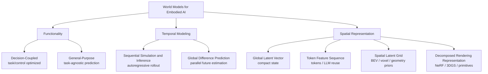

# World Model Taxonomy

[[a-comprehensive-survey-on-world-models-for-embodied-ai|A Comprehensive Survey on World Models for Embodied AI]] 提出一个三轴 taxonomy，用来把 robotics、autonomous driving、navigation 和 video generation 中的 world model literature 放到统一坐标系中。[[awesome-world-models|AwesomeWorldModels]] README 则把这个 taxonomy 实例化成持续维护的 paper list。

## 数学结构

可以把一个 method 的 taxonomy label 写成三元组：

$$
c(m) = (f, \tau, \rho)
$$

其中 $m$ 是 method，$f$ 是 functionality，$\tau$ 是 temporal modeling paradigm，$\rho$ 是 spatial representation。论文使用：

- $f \in \{\text{Decision-Coupled}, \text{General-Purpose}\}$
- $\tau \in \{\text{Sequential Simulation and Inference}, \text{Global Difference Prediction}\}$
- $\rho \in \{\text{Global Latent Vector}, \text{Token Feature Sequence}, \text{Spatial Latent Grid}, \text{Decomposed Rendering Representation}\}$

## 直觉

Functionality 问的是 model 为谁优化。Decision-Coupled models 直接服务某个 control 或 planning task，例如 policy imagination、robot manipulation 或 autonomous driving planning。General-Purpose models 更像 task-agnostic simulators，强调 broad prediction 与 downstream transfer。

Temporal Modeling 问的是未来怎么生成。Sequential Simulation and Inference 像传统 simulator 一样逐步推进 $z_t \to z_{t+1}$，适合 closed-loop interaction，但容易 error accumulation。Global Difference Prediction 直接估计一段 future state 或 future sequence，能并行、能加强全局 coherence，但通常更重，也更难在每一步接入 new action feedback。

Spatial Representation 问的是 state 怎么表示。Global Latent Vector 把世界压缩到一个 compact vector，适合实时控制。Token Feature Sequence 把 state 变成 tokens，适合 Transformer、multimodal dependency 和 LLM-style planning。Spatial Latent Grid 用 BEV、voxel 或 feature map 保留 locality 与 geometry priors。Decomposed Rendering Representation 用 NeRF、3D Gaussian Splatting 或 primitives 表达可渲染 3D scene，适合 view-consistent prediction 与 digital twins。

## Failure Modes

- 名称漂移：video generator、policy model、scene representation 和 simulator 都可能被叫作 world model，但 taxonomy 迫使它们说明 function、temporal rollout 和 spatial state。
- Sequential vs Global tradeoff 被忽略：只报告短 horizon pixel quality 会掩盖 sequential drift；只报告 global generation quality 会掩盖 closed-loop interactivity 不足。
- Spatial representation 与 downstream task mismatch：Global Latent Vector 对 contact-rich manipulation 或 geometry-aware planning 可能太粗；Decomposed Rendering Representation 对 real-time control 可能太重。
- Cell imbalance：论文和 repo 都显示 Global Latent Vector 很少用于 Global Difference Prediction，因为 compact vector 会丢失细粒度 spatiotemporal details。

## 实践含义

选择 world model 时应先定任务坐标，而不是先选 backbone。Real-time robot control 通常更偏 Decision-Coupled、Sequential、compact representations；long-horizon driving video synthesis 更常落在 General-Purpose 或 Global Difference Prediction；需要 geometry consistency 的 planning 则会偏向 Spatial Latent Grid 或 Decomposed Rendering Representation。

读 [[AwesomeWorldModels]] 时，这个 taxonomy 也能防止 bibliography 变成无结构 paper dump：先定位 taxonomy cell，再比较 data、metrics、input modality、code availability 和 real-robot validation。

相关页面：[[WorldModelsForEmbodiedAI]]、[[WorldModelEvaluation]]、[[AwesomeWorldModels]]。
