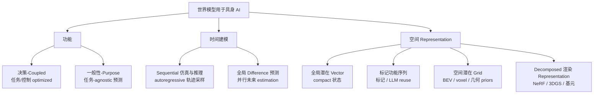

# 世界模型分类体系

[[a-comprehensive-survey-on-world-models-for-embodied-ai|A Comprehensive Survey on World Models for Embodied AI]] 提出一个三轴分类体系，用来把机器人学、自主驱动、导航和视频生成中的世界模型 literature 放到统一坐标系中。[[awesome-world-models|AwesomeWorldModels]] README 则把这个分类体系实例化成持续维护的论文列表。

## 数学结构

可以把一个方法的分类体系标签写成三元组：

$$
c(m) = (f, \tau, \rho)
$$

其中 $m$ 是方法，$f$ 是功能，$\tau$ 是时间建模 paradigm，$\rho$ 是空间表示。论文使用：

- $f \in \{\text{Decision-Coupled}, \text{General-Purpose}\}$
- $\tau \in \{\text{Sequential Simulation and Inference}, \text{Global Difference Prediction}\}$
- $\rho \in \{\text{Global Latent Vector}, \text{Token Feature Sequence}, \text{Spatial Latent Grid}, \text{Decomposed Rendering Representation}\}$

```mermaid
flowchart TD
  A["世界模型用于具身 AI"] --> B["功能"]
  A --> C["时间建模"]
  A --> D["空间 Representation"]
  B --> B1["决策-Coupled<br/>任务/控制 optimized"]
  B --> B2["一般性-Purpose<br/>任务-agnostic 预测"]
  C --> C1["Sequential 仿真与推理<br/>autoregressive 轨迹采样"]
  C --> C2["全局 Difference 预测<br/>并行未来 estimation"]
  D --> D1["全局潜在 Vector<br/>compact 状态"]
  D --> D2["标记功能序列<br/>标记 / LLM reuse"]
  D --> D3["空间潜在 Grid<br/>BEV / voxel / 几何 priors"]
  D --> D4["Decomposed 渲染 Representation<br/>NeRF / 3DGS / 基元"]
```

## 直觉

功能问的是模型为谁优化。决策-耦合的模型直接服务某个控制或规划任务，例如策略 imagination、机器人操作或自主驱动规划。一般性-Purpose 模型更像任务-agnostic 仿真器，强调 broad 预测与下游迁移。

时间建模问的是未来怎么生成。顺序式的仿真与推理像传统仿真器一样逐步推进 $z_t \to z_{t+1}$，适合闭环交互，但容易错误 accumulation。全局差异预测直接估计一段未来状态或未来序列，能并行、能加强全局 coherence，但通常更重，也更难在每一步接入新动作 feedback。

空间表征问的是状态怎么表示。全局潜在表征 Vector 把世界压缩到一个 compact vector，适合实时控制。标记功能序列把状态变成标记，适合 Transformer、multimodal 依赖和 LLM-风格规划。空间潜在表征 Grid 用 BEV、voxel 或特征映射图保留 locality 与几何先验。Decomposed 渲染表征用 NeRF、3D 高斯 Splatting 或基元表达可渲染 3D 场景，适合视角一致的预测与 digital twins。

## 失效情形

- 名称漂移：视频生成器、策略模型、场景表示和仿真器都可能被叫作世界模型，但分类体系迫使它们说明函数、时间轨迹采样和空间状态。
- 顺序式的与全局取舍被忽略：只报告短时域长度像素质量会掩盖顺序式的漂移；只报告全局生成质量会掩盖闭环 interactivity 不足。
- 空间表示与下游任务不匹配：全局潜在表征 Vector 对接触丰富操作或几何感知规划可能太粗；Decomposed 渲染表征对实时控制可能太重。
- Cell imbalance：论文和代码仓库都显示全局潜在表征 Vector 很少用于全局差异预测，因为 compact vector 会丢失细粒度 spatiotemporal 细节。

## 实践含义

选择世界模型时应先定任务坐标，而不是先选主干网络。真实时间机器人控制通常更偏决策-耦合的、顺序式的、compact 表征；长时域驱动视频综合整理更常落在一般性-Purpose 或全局差异预测；需要几何一致性的规划则会偏向空间潜在表征 Grid 或 Decomposed 渲染表征。

读 [[AwesomeWorldModels]] 时，这个分类体系也能防止 bibliography 变成无结构论文 dump：先定位分类体系 cell，再比较数据、指标、输入 modality、代码可用性和真实机器人验证。

相关页面：[[WorldModelsForEmbodiedAI]]、[[WorldModelEvaluation]]、[[AwesomeWorldModels]]。
