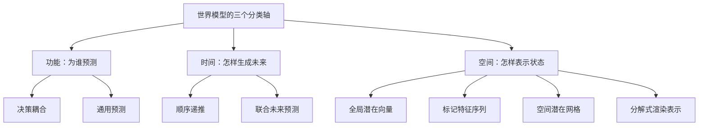

# World Model 分类

[[a-comprehensive-survey-on-world-models-for-embodied-ai|世界模型综述]] 用功能、时间建模和空间表示三个轴组织方法。[[awesome-world-models|配套文献清单]] 是对应的资料入口。这个坐标系帮助比较机制，不是模型排行榜；其中“全局差异预测”是该综述的组织术语，不应假定所有论文都采用同一定义。

## 数学结构

记方法 $m$ 的分类为：

$$
c(m)=(f,\tau,\rho),
$$

$f$ 表示功能角色，$\tau$ 表示未来生成方式，$\rho$ 表示空间状态的表示形式。下表保留原文术语供检索，正文使用中文。

| 轴 | 类别 | 要回答的问题 |
| --- | --- | --- |
| 功能 $f$ | 决策耦合（Decision-Coupled）；通用（General-Purpose） | 预测直接服务某个决策目标，还是面向广泛任务复用？ |
| 时间 $\tau$ | 顺序仿真与推断（Sequential Simulation and Inference）；全局差异预测（Global Difference Prediction） | 逐步递推，还是联合预测一段未来？ |
| 空间 $\rho$ | 全局潜在向量；标记特征序列；空间潜在网格；分解式渲染表示 | 状态如何压缩、保留局部几何或表达可渲染场景？ |

```mermaid
flowchart TD
  A[世界模型的三个分类轴] --> B[功能：为谁预测]
  A --> C[时间：怎样生成未来]
  A --> D[空间：怎样表示状态]
  B --> B1[决策耦合]
  B --> B2[通用预测]
  C --> C1[顺序递推]
  C --> C2[联合未来预测]
  D --> D1[全局潜在向量]
  D --> D2[标记特征序列]
  D --> D3[空间潜在网格]
  D --> D4[分解式渲染表示]
```

三个轴独立记录；不要把某种空间表示和某种用途绑定为唯一组合。来源的分类也可能随混合架构发展而需要细分。

## 直觉

顺序模型像一步步推进的仿真器：下一步使用上一步预测，因此易积累误差，也方便描述交互。联合预测整段未来允许跨时刻共享计算和约束，但是否改善时间一致性取决于具体模型与训练。训练时联合预测、执行时滚动递推可以同时存在，闭环接入新观测或修改动作的方式仍需单独记录。不能仅凭“并行预测”推断控制延迟更低。[[a-comprehensive-survey-on-world-models-for-embodied-ai|具身世界模型综述]]

空间表示各保留不同信息：全局向量紧凑；标记序列适配 Transformer 的多模态建模；空间网格借助鸟瞰图（BEV）、体素或特征图保留局部结构；NeRF、3DGS 等分解式渲染表示强调几何与视角一致性。特征令牌可以是连续向量，不等于离散码本；空间特征网格也不自动具备度量几何或物理状态。它们的计算与动态场景适用性不同。[[a-comprehensive-survey-on-world-models-for-embodied-ai|具身世界模型综述]]

## 分类以后还缺哪些信息

三个轴描述模型的用途与组织，却没有唯一决定训练或执行。例如“序列预测＋空间网格”既可能预测 RGB 编码，也可能预测占据；既可能以动作作条件，也可能只延续视频。还需另列一张接口记录：输入包含哪些实际可用信息、预测标签是什么、哪些参数被学习、执行时是否搜索动作。监督数据中的真实未来不能误写成部署输入。

这是基于分类框架的使用方法。若两个方法轴标签相同，但一个在执行时搜索候选动作、另一个只在训练时使用未来损失，它们的计算成本和证据需求仍然不同；机制分别见 [[ModelPredictiveControl|模型预测控制]] 与 [[sources/lda-1b-scaling-latent-dynamics-action-model|LDA-1B]]。

## 失效情形

- 把视频生成器、策略、场景表示都按名称视作同一种世界模型，遗漏动作条件和下游用途。
- 短时预测指标掩盖顺序递推的漂移；整体生成指标掩盖在线交互能力不足。
- 只比较主干网络，忽视状态压缩导致的信息损失或渲染表示的计算成本。

这些风险来自综述的范围与取舍分析。它还指出“全局潜在向量＋全局差异预测”在其收录方法中较少出现；这是文献分布观察，不是该组合不可能有效的定理。[[a-comprehensive-survey-on-world-models-for-embodied-ai|具身世界模型综述]]

## 实践含义

先定位三个轴，再记录数据、输入模态、动作耦合、预测时域、闭环验证与延迟。在同一任务和协议下比较，才能检验表示与决策需求是否匹配。继续读 [[WorldModelsForEmbodiedAI|World Models]]、[[WorldModelEvaluation|World Model 评测]]。

算法的状态估计、训练目标和决策接口应分开记录；进一步读 [[LatentStateSpaceModels|状态估计]]、[[ModelPredictiveControl|执行时搜索]]、[[ImaginedPolicyLearning|训练时想象]] 与 [[VisualGoalPlanning|视觉目标接口]]。具体方法比较见 [[topics/world-model-decision|世界模型决策专题]]，避免把综述标签当成原论文机制的替代品。

## 研究归属

[[topics/world-models-and-representations|World Models]] · [[topics/evaluation-and-transfer|评测与 Sim-to-Real]] · [[topics/world-model-evaluation|World Model 评测]]。
