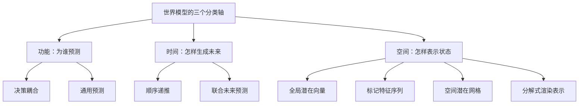

# 世界模型分类体系

[[a-comprehensive-survey-on-world-models-for-embodied-ai|世界模型综述]] 用功能、时间建模和空间表示三个轴组织方法。[[awesome-world-models|配套文献清单]] 是对应的资料入口。这个坐标系帮助比较机制，不是模型排行榜。

## 数学结构

记方法 $m$ 的分类为：

$$
c(m)=(f,\tau,\rho),
$$

$f$ 表示功能角色，$\tau$ 表示未来生成方式，$\rho$ 表示空间状态的表示形式。下表保留原文术语供检索，正文使用中文。

| 轴 | 类别 | 要回答的问题 |
| --- | --- | --- |
| 功能 $f$ | 决策耦合（Decision-Coupled）；通用（General-Purpose） | 预测直接服务某个决策目标，还是面向广泛任务复用？ |
| 时间 $\tau$ | 顺序仿真与推断（Sequential Simulation and Inference）；全局差异预测（Global Difference Prediction） | 逐步递推，还是联合预测一段未来？ |
| 空间 $\rho$ | 全局潜在向量；标记特征序列；空间潜在网格；分解式渲染表示 | 状态如何压缩、保留局部几何或表达可渲染场景？ |

```mermaid
flowchart TD
  A[世界模型的三个分类轴] --> B[功能：为谁预测]
  A --> C[时间：怎样生成未来]
  A --> D[空间：怎样表示状态]
  B --> B1[决策耦合]
  B --> B2[通用预测]
  C --> C1[顺序递推]
  C --> C2[联合未来预测]
  D --> D1[全局潜在向量]
  D --> D2[标记特征序列]
  D --> D3[空间潜在网格]
  D --> D4[分解式渲染表示]
```

三个轴独立记录；不要把某种空间表示和某种用途绑定为唯一组合。来源的分类也可能随混合架构发展而需要细分。

## 直觉

顺序模型像一步步推进的仿真器：下一步使用上一步预测，因此易积累误差，也方便描述交互。联合预测整段未来可以加强时间整体一致性，但闭环接入新观测或修改动作的方式仍需看具体架构。不能仅凭“并行预测”推断控制延迟更低。[[a-comprehensive-survey-on-world-models-for-embodied-ai|具身世界模型综述]]

空间表示各保留不同信息：全局向量紧凑；标记序列适配 Transformer 的多模态建模；空间网格借助鸟瞰图（BEV）、体素或特征图保留局部结构；NeRF、3DGS 等分解式渲染表示强调几何与视角一致性。它们的计算与动态场景适用性不同。[[a-comprehensive-survey-on-world-models-for-embodied-ai|具身世界模型综述]]

## 失效情形

- 把视频生成器、策略、场景表示都按名称视作同一种世界模型，遗漏动作条件和下游用途。
- 短时预测指标掩盖顺序递推的漂移；整体生成指标掩盖在线交互能力不足。
- 只比较主干网络，忽视状态压缩导致的信息损失或渲染表示的计算成本。

这些风险来自综述的范围与取舍分析。它还指出“全局潜在向量＋全局差异预测”在其收录方法中较少出现；这是文献分布观察，不是该组合不可能有效的定理。[[a-comprehensive-survey-on-world-models-for-embodied-ai|具身世界模型综述]]

## 实践含义

先定位三个轴，再记录数据、输入模态、动作耦合、预测时域、闭环验证与延迟。在同一任务和协议下比较，才能检验表示与决策需求是否匹配。继续读 [[WorldModelsForEmbodiedAI|具身智能世界模型]]、[[WorldModelEvaluation|世界模型评估]]。

### 用具体算法检查分类是否有用

下表是依据原论文机制增加的阅读坐标，**不是更改综述原始分类或给出性能排名**。同为潜在转移模型，决策接口仍可能不同。

| 方法 | 表示与训练信号 | 未来进入决策的位置 | 换任务的条件 |
| --- | --- | --- | --- |
| [[planet-learning-latent-dynamics|PlaNet]] | RSSM、图像重建、奖励 | 每步在线 CEM 搜索 | 需相应环境交互与奖励学习 |
| [[dreamerv3-mastering-diverse-control|DreamerV3]] | RSSM、重建、奖励与继续标记 | 训练演员和价值评估器；执行无搜索 | 固定算法配置可以复用，权重仍按任务学习 |
| [[td-mpc2-scalable-robust-world-models|TD-MPC2]] | 无解码器的任务价值与潜在转移 | 短 MPC、终端 Q 与策略先验 | 奖励与任务嵌入，多任务动作维度显式对齐 |
| [[dino-wm-pretrained-visual-features|DINO-WM]] | 冻结图像块特征、离线动作转移 | 以目标特征距离搜索动作 | 可换目标；仍需动作数据覆盖对应环境 |
| [[v-jepa-2-understanding-prediction-planning|V-JEPA 2-AC]] | 视频预训练表征＋机器人动作后训练 | 图像目标的潜在 MPC | 有限真机形态与相机设置下测试迁移 |

读法分成 [[LatentStateSpaceModels|状态估计]]、[[ModelPredictiveControl|执行时搜索]]、[[ImaginedPolicyLearning|训练时想象]] 与 [[VisualGoalPlanning|视觉目标接口]]。只有明确这些条件，才能说两个模型是否在解决同一个问题。
