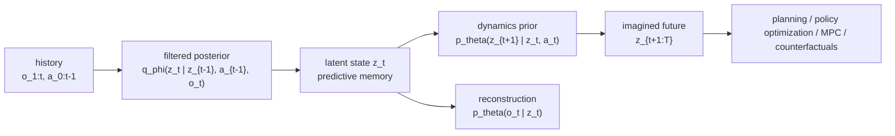

# World Models for Embodied AI

World model（世界模型）在 embodied AI 中是 learned internal simulator：它把 observations 和 actions 压缩成 predictive latent state，并 rollout future states 来支持 perception、prediction、planning、control 和 counterfactual reasoning。[[a-comprehensive-survey-on-world-models-for-embodied-ai|A Comprehensive Survey on World Models for Embodied AI]] 明确把 scope 限定在能产生 actionable predictions 的 models，而不是单纯 static scene descriptors 或不受 action 控制的 visual generators。

## 数学结构

论文用 POMDP formalization 描述 embodied interaction。变量含义如下：$o_t$ 是第 $t$ 步 observation，$a_t$ 是 action，$s_t$ 是不可直接观测的 true state，$z_t$ 是 learned latent state，$\theta$ 是 generative model parameters，$\phi$ 是 inference model parameters。

核心 world model 由三部分组成：

$$
\begin{array}{ll}
\text{Dynamics Prior:} & p_\theta(z_t \mid z_{t-1}, a_{t-1}) \\
\text{Filtered Posterior:} & q_\phi(z_t \mid z_{t-1}, a_{t-1}, o_t) \\
\text{Reconstruction:} & p_\theta(o_t \mid z_t)
\end{array}
$$

Joint distribution 写成 action-conditioned latent transition 与 observation decoder 的乘积：

$$
p_\theta(o_{1:T}, z_{0:T} \mid a_{0:T-1}) = p_\theta(z_0)\prod_{t=1}^{T} p_\theta(z_t \mid z_{t-1}, a_{t-1})p_\theta(o_t \mid z_t).
$$

真实 posterior $p_\theta(z_{0:T} \mid o_{1:T}, a_{0:T-1})$ 不可直接求，论文使用 time-factorized variational posterior：

$$
q_\phi(z_{0:T} \mid o_{1:T}, a_{0:T-1}) = q_\phi(z_0 \mid o_1)\prod_{t=1}^{T} q_\phi(z_t \mid z_{t-1}, a_{t-1}, o_t).
$$

Training objective 是 ELBO（evidence lower bound）：

$$
\log p_\theta(o_{1:T} \mid a_{0:T-1}) \ge \mathbb{E}_{q_\phi}\left[\log \frac{p_\theta(o_{1:T}, z_{0:T} \mid a_{0:T-1})}{q_\phi(z_{0:T} \mid o_{1:T}, a_{0:T-1})}\right] = \mathcal{L}(\theta,\phi).
$$

在 Markov factorization 下，ELBO 可理解为 reconstruction objective 加上 KL regularization：

$$
\mathcal{L}(\theta,\phi)=\sum_{t=1}^{T}\mathbb{E}_{q_\phi(z_t)}[\log p_\theta(o_t \mid z_t)] - D_{\mathrm{KL}}\left(q_\phi(z_{0:T}\mid o_{1:T},a_{0:T-1})\,\|\,p_\theta(z_{0:T}\mid a_{0:T-1})\right).
$$

## 直觉

Filtered posterior $q_\phi$ 是 recognition side：它看见当前 observation $o_t$，把 history 压进 latent state $z_t$。Dynamics prior $p_\theta$ 是 imagination side：它在没有未来 observation 的情况下，根据 $z_{t-1}$ 和 action $a_{t-1}$ 推进 latent future。Reconstruction $p_\theta(o_t \mid z_t)$ 让 latent state 不只是任意 embedding，而是保留可预测 observation 的信息。

ELBO 的两个 terms 对应一个 tension：reconstruction term 希望 $z_t$ 对 observations 足够 informative；KL term 希望 filtered posterior 不要偏离 action-conditioned dynamics prior 太远。若 KL 太弱，model 可能只学到 posterior encoding 而不会 rollout；若 reconstruction 太弱，latent dynamics 可能可 rollout 但失去可解释的 state fidelity。

## 作为 Visual Subgoal Generator

[[pi07-steerable-generalist-robotic-foundation-model|π0.7]] 给了一个更窄但很实用的 world-model role：world model 不直接输出 robot action，也不一定 rollout long-horizon trajectory，而是把 current observation $o_t$、semantic subtask $\hat{\ell}_t$ 和 metadata $m$ 转成 near-future visual goal：

$$
g^\star \sim p_\psi(g^\star \mid o_t,\hat{\ell}_t,m).
$$

这个 $g^\star$ 是 multi-view subgoal images，随后进入 [[VisionLanguageActionModels|VLA]] 的 context $C_t$，condition action chunk prediction。直觉上，它把 language 中难以说明的 spatial details 转成 visual target，例如 gripper 应该如何接近 handle、cloth 应该折到什么形状、或 object 应该出现在什么 view 中。

这说明 world model 可以作为 decision-coupled intermediate representation：它未必自己完成 planning，但会改变 policy 的 action distribution。因此 evaluation 也不能只看 generated image fidelity，而要看 subgoal images 是否提升 closed-loop instruction following、cross-embodiment transfer 或 [[CompositionalGeneralizationInRobotics|compositional generalization]]。

## Failure Modes

- Long-horizon error accumulation：Sequential Simulation and Inference 一步步 rollout，早期 state error 会进入后续 inputs，导致 temporal drift。
- Weak physical consistency：FID、FVD、LPIPS 等 pixel-level metrics 可能给出高分，但不检查 dynamics、causality 或 physical constraints。
- Real-time latency：Transformer 和 Diffusion backbones 表现强，但 inference cost 可能不满足 robot control loop 或 autonomous driving planning 的时限。
- Dataset fragmentation：manipulation、navigation、driving 和 video pretraining 使用不同 modality、scale 与 protocol，限制 cross-domain generalization。
- Spatial bottleneck：Global Latent Vector 高效但丢失细节；Token Feature Sequence 表达力强但 sequence length 变重；Spatial Latent Grid 依赖 geometry priors；NeRF/3DGS-style Decomposed Rendering Representation 保真但 dynamic scene scalability 较弱。
- Evaluation heterogeneity：benchmark comparisons 常被 input modality、auxiliary supervision、resolution、episode budget 和 task subset 差异混淆。

## 实践含义

对 MPC 和 model-based RL，world model 的价值在于可 rollout 的 transition model，而不是漂亮的 reconstruction。评估时需要检查 imagined future 是否能改变 action choice，并且在 closed-loop setting 下仍然稳定。

对 robotics sim-to-real，learned world model 可能缓解 hand-designed simulator 的 mismatch，也可能把 dataset bias 或 pixel-level artifacts 变成新的 [[SimulationRealityGap|simulation reality gap]]。因此需要把 real-robot validation、physical consistency 和 causal intervention metrics 放进 evaluation loop。

对 foundation-model style embodied agents，[[WorldModelTaxonomy]] 提示不要把所有 video predictors 都叫 world models。只有当 representation、temporal rollout 和 action coupling 能支持 downstream decisions 时，它才是 embodied AI 意义上的 world model。

相关页面：[[WorldModelTaxonomy]]、[[WorldModelEvaluation]]、[[AwesomeWorldModels]]、[[SimulationRealityGap]]、[[DifferentiablePhysics]]、[[RobotContextConditioning]]。
