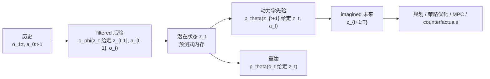

# 具身智能世界模型

世界模型（世界模型）在具身 AI 中是学得的内部仿真器：它把观测和动作压缩成预测式潜在状态，并轨迹采样未来状态来支持感知、预测、规划、控制和反事实推理。[[a-comprehensive-survey-on-world-models-for-embodied-ai|A Comprehensive Survey on World Models for Embodied AI]] 明确把范围限定在能产生 actionable 预测的模型，而不是单纯静态场景描述文件或不受动作控制的视觉 generators。

## 数学结构

论文用 POMDP formalization 描述具身交互。变量含义如下：$o_t$ 是第 $t$ 步观测，$a_t$ 是动作，$s_t$ 是不可直接观测的真实状态，$z_t$ 是学得的潜在状态，$\theta$ 是 generative 模型参数，$\phi$ 是推理模型参数。

核心世界模型由三部分组成：

$$
\begin{array}{ll}
\text{Dynamics Prior:} & p_\theta(z_t \mid z_{t-1}, a_{t-1}) \\
\text{Filtered Posterior:} & q_\phi(z_t \mid z_{t-1}, a_{t-1}, o_t) \\
\text{Reconstruction:} & p_\theta(o_t \mid z_t)
\end{array}
$$

关节分布写成动作条件化的潜在转移与观测解码器的乘积：

$$
p_\theta(o_{1:T}, z_{0:T} \mid a_{0:T-1}) = p_\theta(z_0)\prod_{t=1}^{T} p_\theta(z_t \mid z_{t-1}, a_{t-1})p_\theta(o_t \mid z_t).
$$

真实后验 $p_\theta(z_{0:T} \mid o_{1:T}, a_{0:T-1})$ 不可直接求，论文使用时间-factorized variational 后验：

$$
q_\phi(z_{0:T} \mid o_{1:T}, a_{0:T-1}) = q_\phi(z_0 \mid o_1)\prod_{t=1}^{T} q_\phi(z_t \mid z_{t-1}, a_{t-1}, o_t).
$$

训练目标是 ELBO（证据较低边界）：

$$
\log p_\theta(o_{1:T} \mid a_{0:T-1}) \ge \mathbb{E}_{q_\phi}\left[\log \frac{p_\theta(o_{1:T}, z_{0:T} \mid a_{0:T-1})}{q_\phi(z_{0:T} \mid o_{1:T}, a_{0:T-1})}\right] = \mathcal{L}(\theta,\phi).
$$

在 Markov 分解下，ELBO 可理解为重建目标加上 KL 正则化：

$$
\mathcal{L}(\theta,\phi)=\sum_{t=1}^{T}\mathbb{E}_{q_\phi(z_t)}[\log p_\theta(o_t \mid z_t)] - D_{\mathrm{KL}}\left(q_\phi(z_{0:T}\mid o_{1:T},a_{0:T-1})\,\|\,p_\theta(z_{0:T}\mid a_{0:T-1})\right).
$$

## 直觉

Filtered 后验 $q_\phi$ 是识别侧：它看见当前观测 $o_t$，把历史压进潜在状态 $z_t$。动力学先验 $p_\theta$ 是想象侧：它在没有未来观测的情况下，根据 $z_{t-1}$ 和动作 $a_{t-1}$ 推进潜在未来。重建 $p_\theta(o_t \mid z_t)$ 让潜在状态不只是任意嵌入，而是保留可预测观测的信息。

ELBO 的两个项对应一个 tension：重建项希望 $z_t$ 对观测足够 informative；KL 项希望滤波后验不要偏离动作条件化的动力学先验太远。若 KL 太弱，模型可能只学到后验编码而不会轨迹采样；若重建太弱，潜在动力学可能可轨迹采样但失去可解释的状态保真度。

```mermaid
flowchart LR
  A["历史<br/>o_1:t, a_0:t-1"] --> B["filtered 后验<br/>q_phi(z_t 给定 z_{t-1}, a_{t-1}, o_t)"]
  B --> C["潜在状态 z_t<br/>预测式内存"]
  C --> D["动力学先验<br/>p_theta(z_{t+1} 给定 z_t, a_t)"]
  D --> E["imagined 未来<br/>z_{t+1:T}"]
  C --> F["重建<br/>p_theta(o_t 给定 z_t)"]
  E --> G["规划 / 策略优化 / MPC / counterfactuals"]
```

## 作为视觉子目标生成器

[[pi07-steerable-generalist-robotic-foundation-model|π0.7]] 给了一个更窄但很实用的世界模型角色：世界模型不直接输出机器人动作，也不一定轨迹采样长时域轨迹，而是把当前观测 $o_t$、semantic 子任务 $\hat{\ell}_t$ 和元数据 $m$ 转成近期未来视觉目标：

$$
g^\star \sim p_\psi(g^\star \mid o_t,\hat{\ell}_t,m).
$$

这个 $g^\star$ 是多视角子目标图像，随后进入 [[VisionLanguageActionModels|VLA]] 的上下文 $C_t$，条件动作块预测。直觉上，它把语言中难以说明的空间细节转成视觉目标，例如夹爪应该如何接近把手、布料应该折到什么形状、或物体应该出现在什么视角中。

这说明世界模型可以作为决策-耦合的中间表示：它未必自己完成规划，但会改变策略的动作分布。因此评估也不能只看生成的图像保真度，而要看子目标图像是否提升闭环指令 following、跨本体迁移或 [[CompositionalGeneralizationInRobotics|组合式泛化]]。

## 用于潜在动力学预训练

[[lda-1b-scaling-latent-dynamics-action-model|LDA-1B]] 给出另一种决策-耦合的世界模型角色：世界模型不生成 RGB 子目标图像，也不单独做 MPC，而是在 DINO 潜在空间中 cotrain 策略、正向动力学、逆动力学和视觉预测。未来观测目标被表示为 $z_{t+1:t+k}=f_{\mathrm{DINO}}(o_{t+1:t+k})$，然后与动作块 $a_{t+1:t+k}$ 一起进入扩散风格 denoising 目标。

这个设计把世界模型的价值放在表示学习和策略预训练上。高质量示范数据可以训练动作策略；低质量轨迹仍可训练动作条件化的动力学；无动作标注的第一视角视频则训练视觉预测。相比像素空间 UWM，LDA-1B 来源的核心主张是结构化的 DINO 潜在能减少外观建模，扩大混合质量具身数据的可用范围。

## 失效情形

- 长时域错误 accumulation：顺序式的仿真与推理一步步轨迹采样，早期状态错误会进入后续输入，导致时间漂移。
- 弱物理一致性：FID、FVD、LPIPS 等像素层级指标可能给出高分，但不检查动力学、causality 或物理约束。
- 真实时间延迟：Transformer 和扩散 backbones 表现强，但推理成本可能不满足机器人控制循环或自主驱动规划的时限。
- 数据集 fragmentation：操作、导航、驱动和视频预训练使用不同 modality、规模与规程，限制跨域泛化。
- 空间瓶颈：全局潜在表征 Vector 高效但丢失细节；标记功能序列表达力强但序列长度变重；空间潜在表征 Grid 依赖几何先验；NeRF/3DGS-风格 Decomposed 渲染表征保真但动力学场景可扩展性较弱。
- 评估异构性：基准比较常被输入 modality、auxiliary 监督、分辨率、回合预算和任务 subset 差异混淆。
- 冻结的潜在瓶颈：LDA-1B 说明 DINO 潜在有助于规模扩展，但也承认固定 DINO 视觉特征是局限；如果下游控制需要的力、触觉或材质状态不在潜在中，世界模型可能预测看似合理未来特征却缺少控制变量。

## 实践含义

对 MPC 和基于模型的强化学习，世界模型的价值在于可供轨迹采样的转移模型，而不是漂亮的重建。评估时需要检查想象出的未来是否能改变动作选择，并且在闭环场景下仍然稳定。

对机器人学仿真到现实迁移，学得的世界模型可能缓解手部-designed 仿真器的不匹配，也可能把数据集偏差或像素层级产物变成新的 [[SimulationRealityGap|仿真—现实差距]]。因此需要把真实机器人验证、物理一致性和因果 intervention 指标放进评估循环。

对基础模型风格具身智能体，[[WorldModelTaxonomy]] 提示不要把所有视频 predictors 都叫世界模型。只有当表示、时间轨迹采样和动作耦合能支持下游决策时，它才是具身 AI 意义上的世界模型。

相关页面：[[WorldModelTaxonomy]]、[[WorldModelEvaluation]]、[[AwesomeWorldModels]]、[[SimulationRealityGap]]、[[DifferentiablePhysics]]、[[RobotContextConditioning]]、[[LatentDynamicsActionModels]]。
